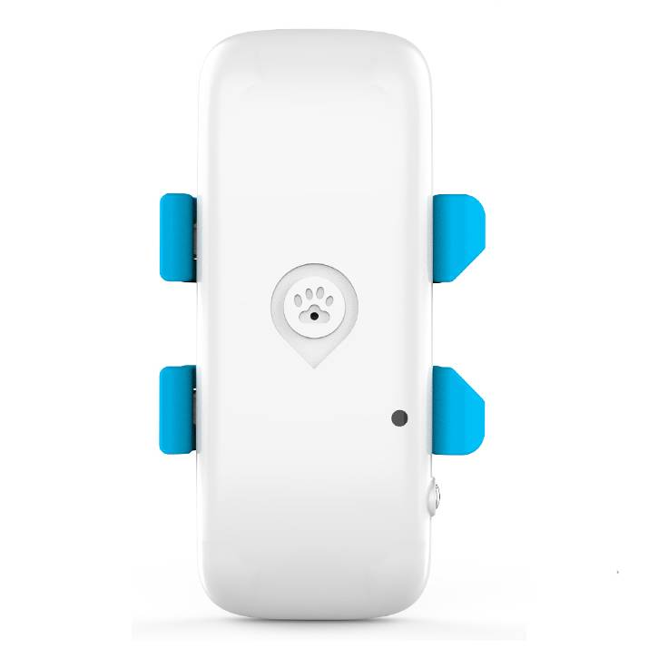

# iStartek - PT32

El PT32 es un rastreador GPS 4G compacto diseñado para el seguimiento confiable de mascotas y la recuperación rápida. Combina comunicación 4G LTE con posicionamiento dual GPS y BDS, además de varios modos de localización, para ofrecer datos de ubicación y actividad precisos en tiempo real, optimizados para collares y animales pequeños. Pensado para el uso diario, el dispositivo equilibra resistencia y gestión de energía en un formato reducido adecuado para mascotas y flujos de trabajo móviles de cuidado animal.

Como dispositivo compatible con Plaspy, el PT32 se integra en flujos de trabajo centralizados para aportar visibilidad en vivo, alertas y reproducción histórica. Los usuarios de Plaspy pueden ver actualizaciones de ubicación, recibir alarmas específicas para mascotas y gestionar los datos del dispositivo desde la plataforma, lo que hace del PT32 una opción práctica para dueños, refugios y servicios para mascotas que necesitan rastreo confiable y supervisión remota sencilla.

## Características destacadas

- Compatible con Plaspy para integración rápida y seguimiento centralizado en tiempo real entre dispositivos
- Posicionamiento dual GPS y BDS para actualizaciones de ubicación estables y precisas
- Comunicación 4G LTE con soporte de red en múltiples regiones
- Diseño compacto y liviano con resistencia a salpicaduras IP65, optimizado para montaje en collar
- Larga autonomía con modos de energía inteligentes y puerto magnético de carga rápida en el dispositivo
- Alarmas enfocadas en mascotas, incluyendo alerta por vibración, sonido y luz para la búsqueda remota
- Retención de seguimiento histórico para reproducción de rutas y revisión de incidentes

## Cómo funciona con Plaspy

El PT32 transmite la ubicación y el estado del dispositivo a Plaspy para que usted pueda monitorear mascotas en mapas, configurar alertas y revisar rutas históricas desde una sola plataforma. Plaspy procesa la información de posicionamiento y estado del equipo para presentar vistas en tiempo real, notificaciones automáticas y el historial de ubicaciones retenido para análisis y apoyo en la recuperación.

- Actualizaciones de ubicación en tiempo real y estado del dispositivo mostrados en los mapas y paneles de Plaspy
- Alertas de movimiento y vibración enviadas a través de los canales de Plaspy para notificaciones inmediatas
- Notificaciones de geocercas y batería baja para proteger a las mascotas y gestionar los dispositivos
- Controles remotos de búsqueda de mascotas para activar sonido y luz en el dispositivo desde Plaspy o mediante mensajería del operador donde esté soportado
- Reproducción de rutas históricas y retención de datos para revisión e informes
- Configuración remota y actualizaciones de firmware cuando el dispositivo soporta FOTA

## Casos de uso típicos

- Localización y recuperación rápida de mascotas perdidas o extraviadas usando mapas en vivo y alertas
- Monitoreo de actividad para observar patrones de ejercicio y movimiento en beneficio del bienestar animal
- Operaciones de refugios y rescates que rastrean múltiples animales y conservan el historial de adopciones
- Servicios para mascotas y guarderías que gestionan el estado de los dispositivos y notificaciones de zonas seguras
- Búsqueda remota de mascotas y verificaciones de ubicación bajo demanda durante salidas o viajes

## Por qué elegir este rastreador con Plaspy

El PT32 está diseñado específicamente para la seguridad y recuperación de mascotas: su tamaño reducido, resistencia a salpicaduras y alarmas orientadas a animales lo hacen ideal para collares y mascotas activas. Al combinarlo con Plaspy, el dispositivo gana visibilidad a nivel de plataforma, capacidades de alerta y reportes históricos, permitiendo que organizaciones y dueños gestionen los datos de ubicación de forma consistente y eficiente.

Plaspy aporta el panel central y las herramientas de notificación, mientras que el PT32 ofrece posicionamiento preciso y funciones enfocadas en mascotas. Para usuarios que buscan un rastreador compacto, compatible con Plaspy, con hardware robusto y buena retención histórica, el PT32 representa una opción equilibrada para el seguimiento diario y los flujos de trabajo de recuperación.

Aprenda más sobre Plaspy en el sitio principal https://www.plaspy.com. Las especificaciones del producto, la disponibilidad y los datos del fabricante pueden cambiar con el tiempo; confirme la información técnica y la compatibilidad actuales en el sitio oficial del fabricante https://istartek.com/.
