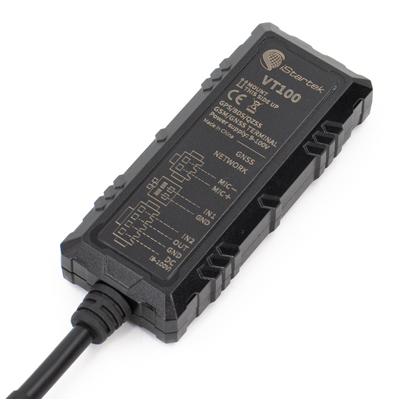

# iStartek - VT100

# VT100 Vehicle GPS Tracker

El VT100 es un rastreador GPS 2G GSM compacto diseñado para monitoreo profesional de vehículos y despliegues compatibles con Plaspy. Construido para un seguimiento confiable en tiempo real y una protección anti-robos robusta, el VT100 transmite continuamente la ubicación y el estado del vehículo a plataformas de rastreo a través de redes celulares. Su amplio rango de tensión de entrada y su carcasa con certificación IP66 lo hacen apto para una amplia gama de vehículos y entornos operativos.

Optimizado para la gestión de flotas, supervisión del transporte público, operaciones de taxi y uso de anti-robo en automóviles privados, el VT100 ofrece un conjunto amplio de funciones telemáticas —desde una posición GNSS precisa \(GPS + BEIDOU\) y detección de movimiento integrada hasta corte remoto de motor y monitorización de combustible cuando se combina con sensores opcionales. Como rastreador compatible con Plaspy, el VT100 se integra sin problemas en paneles de seguimiento en tiempo real, alertas y flujos de generación de informes utilizados por los equipos de despacho y operaciones.

## Puntos Clave

- Rastreador GPS compatible con Plaspy para seguimiento en tiempo real y paneles de flota.
- GNSS de alta precisión \(GPS + BEIDOU\) con sensibilidad de rastreo de hasta -165 dBm y CEP &lt;2.5 m.
- Conectividad GSM 2G cuádruple banda \(850/900/1800/1900 MHz\) con subida a dos servidores y comandos configurables por SMS/GPRS.
- Carcasa robusta con IP66 y entrada DC 9–100V para soportar entornos severos y todo tipo de vehículos.
- Acelerómetro 3D integrado para detección de colisiones/vibraciones y monitorización del comportamiento del conductor \(aceleración/bruscas frenadas, giros bruscos, exceso de velocidad, fatiga\).
- Alarma SOS, escucha remota \(micrófono\) y corte remoto de motor/energía para anti-robos y control del inmovilizador.
- Memoria flash interna \(16 Mbit\) para registro fuera de línea en zonas sin señal con reenvío automático cuando se restablezca la conectividad.
- Soporta funciones de gestión avanzadas como FOTA \(firmware over-the-air\) para actualizaciones remotas.

## Cómo Funciona con Plaspy

Cuando se integra con Plaspy, el VT100 pasa a ser una fuente de datos para ubicación en tiempo real, telemetría y alertas basadas en eventos. El dispositivo transmite coordenadas GNSS, movimientos y eventos de estado a través de GSM a los servidores de Plaspy, donde los datos se normalizan en mapas en tiempo real, históricos de rutas, notificaciones de geocercas y reportes de flota. La integración compatible con Plaspy garantiza que los operadores de despacho y los equipos de operaciones reciban actualizaciones constantes y de baja latencia que respaldan la toma de decisiones y los flujos de seguridad.

- Actualizaciones de ubicación y telemetría en tiempo real enviadas a Plaspy vía GPRS/SMS.
- Detección de ignición/ACC y corte remoto de motor/energía \(inmovilizador\) para respuesta ante robo y control de la flota.
- Generación de eventos para SOS/pánico, colisiones/vibración y comportamiento del conductor, posibilitando alertas automáticas en Plaspy.
- Monitoreo de combustible y alarmas de robo o bajo nivel de combustible cuando se empareja con sensores capacitivos o ultrasonidos opcionales; Plaspy ingiere la telemetría de combustible para informes de consumo.
- Sensores Bluetooth: la descripción del VT100 no especifica Bluetooth a bordo. El ecosistema de Plaspy admite sensores BLE para telemetría ampliada si se utiliza junto a un gateway compatible o un dispositivo con BLE compatible con VT100.

## Resumen Técnico

| Conectividad | módulo GSM 2G \(M25 / Quectel\) |
| --- | --- |
| Bandas | GSM cuádruple banda: 850 / 900 / 1800 / 1900 MHz |
| Alimentación & Batería | Entrada DC 9–100V; batería de respaldo Li‑ion de 55 mAh |
| Interfaces | 2 entradas digitales configurables \(una como detección ACC / AD1\), 1 salida digital, 1 puerto de micrófono, Micro-USB 2.0, ranura Nano SIM, 2 LEDs de estado, antena GSM FPC integrada, antena GPS cerámica integrada \(25×25×4 mm\); opcional: 2 AD, RS232 |
| GNSS | Módulo: L76K \(modo dual GPS + BEIDOU\), receptor de 33 canales; sensibilidad -165 dBm; precisión de posicionamiento CEP &lt;2.5 m; hot start &lt;1 s, cold start &lt;35 s |
| Bluetooth | No especificado en la descripción del dispositivo |
| Gestión Remota | FOTA \(actualización de firmware por aire\), subida a servidor dual, comandos configurables por SMS/GPRS |
| Forma & Entorno | Compacto: 80×34×15 mm, ≈48 g; Operación: -20°C a 80°C, 5%–95% de humedad no condensante; IP66 protección de ingreso |
| Memoria | Flash integrada de 16 Mbit para registro de posiciones fuera de línea |

## Casos de Uso

- Gestión de flotas: seguimiento en tiempo real, reproducción de rutas, monitorización del comportamiento del conductor e integración de despacho centralizada vía Plaspy.
- Transporte público y supervisión de autobuses escolares: cumplimiento de ruta, alertas de seguridad de pasajeros y manejo de eventos SOS.
- Taxis y servicios de movilidad: compartir ubicación en tiempo real, telemetría de viajes y protección contra robo mediante controles de inmovilizador.
- Leasing de vehículos y seguimiento de seguros: informes de kilometraje, inmovilización remota y telemetría de incidentes para reclamaciones y cumplimiento.
- Anti-robos en coches privados: botón SOS, escucha remota y corte remoto del motor para proteger activos y disuadir el robo.

## Por Qué Elegir Este Rastreador con Plaspy

El VT100 combina hardware de grado profesional con las capacidades de la plataforma Plaspy para ofrecer telemetría de vehículos fiable y accionable. Su diseño compacto y robusto, su amplio rango de tensión \(DC 9–100V\) y la certificación IP66 permiten menores restricciones de instalación y reducen las fallas en campo. El almacenamiento fuera de línea integrado preserva el historial de viajes durante caídas de la red, mientras que FOTA y la configuración remota reducen la carga de mantenimiento. Para gestores de flotas y equipos de seguridad que requieren un seguimiento en tiempo real consistente, controles anti-robos \(acciones de ignición/inmovilizador\), soporte de monitoreo de combustible y datos detallados de comportamiento del conductor, el VT100 ofrece una solución equilibrada, compatible con Plaspy, que enfatiza la disponibilidad, escalabilidad y una integración sencilla en los flujos de despacho e informes existentes.

