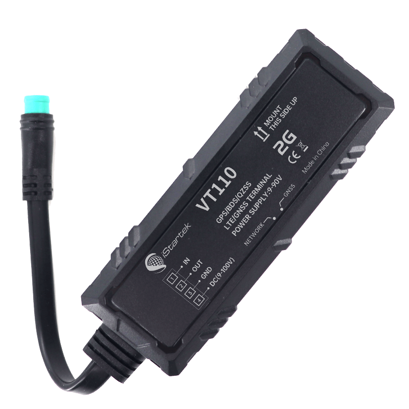

# iStartek - VT110

El VT110 es un rastreador GPS compacto de iStartek diseñado para ofrecer seguimiento y telemetría vehicular en tiempo real. Orientado a la gestión de flotas y a la protección antirrobo, combina posicionamiento GNSS multiconstelación con ubicación por estaciones base GSM para proporcionar informes de ubicación consistentes, alarmas configurables y funciones de control remoto aptas para vehículos comerciales y privados.

Como dispositivo compatible con Plaspy, el VT110 envía datos de posición, kilometraje, rumbo y eventos a Plaspy para monitoreo en vivo, generación de alertas e informes históricos. Su diseño robusto y compacto, la batería de respaldo y el soporte para comandos remotos y expansión con accesorios lo hacen una opción práctica para operadores que requieren visibilidad continua y control remoto básico desde la plataforma Plaspy.

## Características principales

- Unidad compatible con Plaspy, pensada para seguimiento vehicular en tiempo real y gestión de flotas, con posicionamiento GNSS multiconstelación y localización por estaciones base GSM.
- Amplio conjunto de alarmas incluyendo geocerca, exceso de velocidad, pérdida de señal, corte de alimentación externa, batería baja, cambios en estado del motor y puertas, inactividad prolongada y detección de impacto o remolque.
- Capacidades de control remoto como corte de combustible o corte eléctrico para escenarios de inmovilización y alarma sonora opcional como respuesta antirrobo.
- Factor de forma compacto y resistente con protección IP66, antenas integradas y una pequeña batería interna de respaldo que permite seguir enviando datos durante cortes de energía.
- Modos de reporte configurables por intervalo de tiempo, distancia, cambio de rumbo y kilometraje para ajustar las necesidades operativas y reducir datos innecesarios.
- Expansible mediante accesorios como sensores de combustible, lectores RFID y relés para soportar monitoreo de combustible, identificación de conductor y funciones de control remoto.

## Cómo funciona con Plaspy

Al conectarse a Plaspy, el VT110 transmite posiciones y telemetría basada en eventos a la plataforma, permitiendo que los equipos supervisen activos en tiempo real, desencadenen alertas y generen reportes operativos. Plaspy procesa las actualizaciones de ubicación y estado del dispositivo y las integra en paneles, reglas de geocerca y canales de notificación para respaldar la supervisión de flotas y flujos de trabajo antirrobo.

- Actualizaciones en vivo de ubicación y telemetría desde GNSS y posicionamiento por estaciones base GSM para visibilidad continua.
- Informes de eventos y estado como kilometraje, cambios de rumbo y eventos de ignición para completar registros de viajes y control de conductores.
- Integración de alarmas por violaciones de geocerca, exceso de velocidad, inactividad y pérdida de energía que se conectan a los mecanismos de alerta y notificación de Plaspy.
- Inmovilización remota y control de relés gestionados a través de Plaspy para respuestas coordinadas ante robos cuando la configuración del dispositivo lo permite.
- Seguimiento histórico y generación de reportes para analizar rutas, uso y cumplimiento dentro de su flota.

## Casos de uso típicos

- Gestión de flotas para vehículos de reparto, servicios y comerciales ligeros que requieren localización y registro de kilometraje en tiempo real.
- Protección antirrobo para autos particulares y flotas, con detección de impacto o remolque e opciones de inmovilización remota.
- Supervisión de transporte público o unidades escolares mediante alertas de geocerca y monitoreo de estado para mejorar la seguridad y el seguimiento de rutas.
- Operaciones de taxi y servicios de transporte para registro de viajes, detección de cambios de rumbo y reportes basados en tiempo o distancia.
- Monitoreo para seguros y arrendamientos donde los registros de kilometraje, alertas por manipulación y el monitoreo de combustible opcional respaldan políticas y contratos.

## Por qué elegir este rastreador con Plaspy

El VT110 ofrece un conjunto equilibrado de funciones para organizaciones que necesitan telemática confiable sin complejidad excesiva. Su posicionamiento multiconstelación con respaldo por estaciones base GSM proporciona reportes de ubicación resilientes, mientras que las alarmas y modos de reporte configurables permiten a los operadores adaptar el comportamiento del dispositivo a sus necesidades operativas y de consumo de datos. La posibilidad de ampliar su funcionalidad con sensores y relés opcionales permite comenzar con lo esencial y escalar hacia monitoreo de combustible o identificación de conductores según evolucione la demanda.

Integrado con Plaspy, el VT110 forma parte de una plataforma gestionada que centraliza alertas, mapas en vivo e informes históricos para una supervisión eficiente. Para equipos que valoran un equipo compacto, resistente y de integración sencilla en los paneles y reglas de Plaspy, el VT110 es una opción práctica que cubre tanto las operaciones diarias de flota como las medidas antirrobo.

Conozca más sobre Plaspy y cómo dispositivos compatibles como el VT110 trabajan con la plataforma en el sitio web de Plaspy https://www.plaspy.com. Las especificaciones del producto, la disponibilidad y los datos del fabricante pueden cambiar con el tiempo, por lo que le pedimos verificar la información más reciente del VT110 en el sitio oficial de iStartek https://istartek.com/ antes de tomar decisiones de compra o despliegue.
