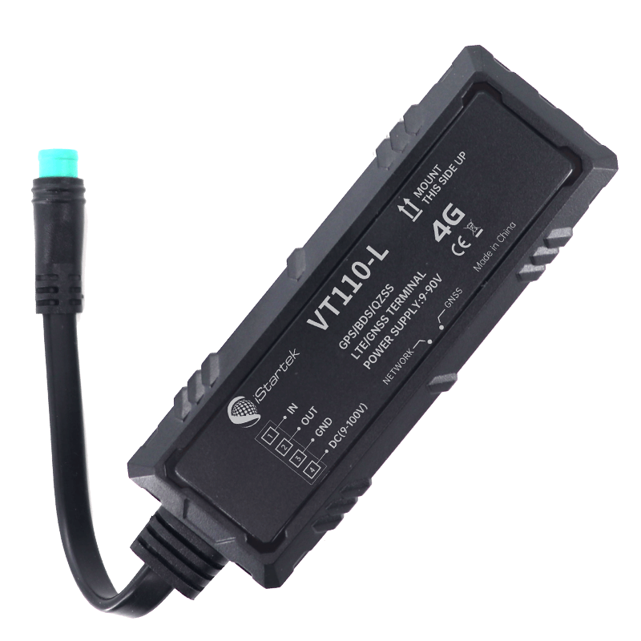

# iStartek - VT110-L

El VT110-L es un dispositivo de rastreo vehicular 4G y de tamaño compacto fabricado por iStartek, pensado para ofrecer localización confiable en tiempo real y reporte de eventos. Combina posicionamiento GNSS de alta precisión con conmutación a estaciones base celulares para mantener el flujo de telemetría en entornos variados. Su tamaño reducido y sus entradas y salidas diseñadas para uso automotriz hacen del VT110-L una opción práctica tanto para gestión de flotas como para monitoreo de vehículos particulares.

Como dispositivo compatible con Plaspy, el VT110-L se integra en los flujos de trabajo de la plataforma para visualización en vivo, alertas y control remoto. Su reporte de eventos —estado de ignición y puertas, detección de impactos y fatiga, y soporte para comandos de inmovilizador remoto— cubre requisitos habituales de flotas y soluciones antirrobo. Esta compatibilidad lo convierte en una alternativa adecuada para incorporar vehículos rastreados en Plaspy para despacho, informes y supervisión operativa.

## Puntos clave

- Rastreador GPS 4G compatible con Plaspy para seguimiento en tiempo real y telemetría continua
- Soporte GNSS multiconstelación para mejor posicionamiento en zonas urbanas y rurales
- Conjunto amplio de eventos y alarmas incluyendo geocercas, exceso de velocidad, ralentí, pérdida de GPS, detección de impacto y de fatiga
- Soporte para inmovilizador remoto que permite corte de combustible o energía como parte de flujos antirrobo
- Amplio rango de voltaje de entrada y batería de respaldo integrada para funcionamiento limitado ante pérdida de alimentación
- Carcasa compacta con clasificación IP66 para operación robusta en vehículos e instalaciones discretas
- Soporte para actualización remota de firmware y memoria flash a bordo para retención local de datos

## Cómo funciona con Plaspy

Cuando está conectado a Plaspy, el VT110-L envía posiciones, eventos de estado y alarmas generadas por sensores a la plataforma, lo que permite monitoreo en vivo, reproducción histórica y notificaciones automatizadas. Plaspy correlaciona los datos del equipo con perfiles de flota y reglas de negocio para que los equipos operativos puedan actuar sobre eventos y telemetría basados en ubicación.

- Las actualizaciones de ubicación y telemetría en tiempo real permiten despacho y vistas de seguimiento en vivo dentro de Plaspy
- Los eventos de entradas digitales, como estado de ignición y puertas, respaldan reportes de viaje y flujos de seguridad
- Eventos de impacto, exceso de velocidad, ralentí y fatiga disparan alertas y alimentan análisis de comportamiento del conductor
- Usted puede emitir comandos de inmovilizador remoto desde Plaspy como parte de los procedimientos de respuesta antirrobo
- Las notificaciones de actualización de firmware y la configuración de servidores duales facilitan el mantenimiento de dispositivos y la entrega confiable de datos

## Casos de uso típicos

- Gestión de flotas con despacho en vivo, reproducción de rutas e informes de kilometraje para vehículos comerciales
- Flujos antirrobo y recuperación de unidades mediante inmovilizador remoto y alertas basadas en eventos
- Monitoreo de seguridad operativa con detección de fatiga, alertas por impacto y supervisión de puertas o ignición
- Seguros basados en uso y control de arrendamientos mediante informes de kilometraje e incidentes
- Supervisión de transporte público y rutas escolares con cumplimiento de trayectos y notificaciones de seguridad para pasajeros

## Por qué elegir este rastreador con Plaspy

El VT110-L ofrece un conjunto equilibrado de capacidades que responde a requisitos habituales de gestión de flotas y seguridad vehicular. Su combinación de posicionamiento GNSS multiconstelación, conmutación celular y un amplio conjunto de alarmas proporciona datos de ubicación y eventos resilientes que Plaspy utiliza para monitoreo, generación de informes y respuestas automatizadas. Características prácticas como el amplio rango de entrada, su tamaño compacto y la protección impermeable hacen al VT110-L adaptable a distintos tipos de vehículos.

Integrado con Plaspy, el VT110-L convierte la telemetría vehicular en información accionable para operaciones, seguridad y prevención de robos. Para obtener más información sobre cómo Plaspy soporta el rastreo de flotas y la integración de dispositivos visite https://www.plaspy.com. Las especificaciones del producto y la disponibilidad pueden cambiar con el tiempo, por lo que le recomendamos verificar los detalles técnicos actuales y la compatibilidad en el sitio del fabricante en https://istartek.com/.
