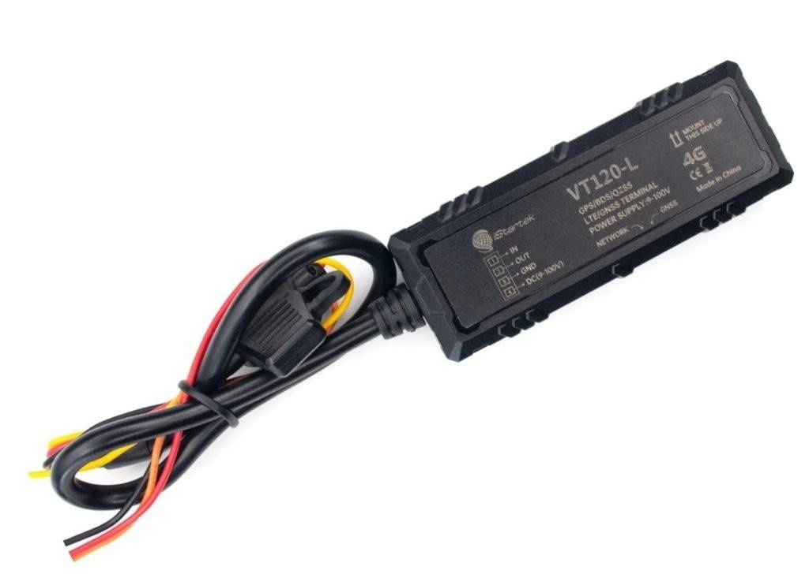

# iStartek - VT120-L

El VT120-L es un rastreador GPS compacto de iStartek diseñado para proporcionar seguimiento en tiempo real y telemetría vehicular confiable. Ideal para instalaciones prolongadas en motocicletas, autos y camiones, el VT120-L integra posicionamiento GNSS multiconstelación, amplio rango de voltaje de operación y una carcasa resistente para soportar reportes continuos de ubicación, registro de kilometraje y detección de alarmas en condiciones de campo exigentes.

Como dispositivo compatible con Plaspy, el VT120-L se integra con la plataforma para entregar en un mismo lugar la ubicación en vivo, el kilometraje y las alertas. El almacenamiento en búfer a bordo y las rutas de carga redundantes ayudan a mantener la continuidad del recorrido y reportes consistentes durante problemas temporales de conectividad, lo que hace al equipo una opción práctica cuando el seguimiento ininterrumpido y la supervisión de la flota son prioritarios.

## Características principales

- Compatible con Plaspy para una integración sencilla en flujos de trabajo de monitoreo y gestión de flotas existentes.
- Posicionamiento GNSS de alta precisión con soporte multiconstelación para ubicación en tiempo real más fiable.
- Amplio rango de voltaje operativo adecuado para diversos sistemas eléctricos de vehículo y una pequeña batería de respaldo para reportes durante cortes de energía.
- Memoria flash con búfer y carga dual a servidores para preservar la continuidad del seguimiento cuando las redes son intermitentes.
- Entradas vehiculares prácticas y una salida digital para detección de encendido y escenarios simples de control remoto.
- Diseño robusto con protección IP66 y rango de temperatura extendido, pensado para entornos exigentes de transporte y logística.

## Cómo funciona con Plaspy

Una vez provisto el VT120-L, transmite posiciones, telemetría y eventos de alarma a Plaspy, donde esos datos se traducen en mapas en vivo, reproducción histórica y alertas operativas. Plaspy procesa los mensajes del dispositivo y los presenta mediante paneles e informes que los gestores de flota pueden usar para supervisión y toma de decisiones.

- Actualizaciones de ubicación y telemetría en vivo mostradas en Plaspy para seguimiento en tiempo real y visualización en mapas.
- Detección de encendido y mensajes de estado que permiten identificar inicio y fin de viaje, registrar automáticamente el kilometraje y obtener información básica de actividad del conductor.
- Alarmas como vibración, corte de cable y ACC on/off reenviadas a Plaspy para soportar la monitorización antirrobo y alertas de seguridad.
- Datos en búfer y subida dual garantizan que Plaspy reciba historiales de rutas completos incluso cuando la conectividad es intermitente.
- Soporte para actualización remota de firmware y flujos de gestión de dispositivos compatibles con Plaspy para mantener las unidades desplegadas al día.

## Casos de uso típicos

- Gestión de flotas pequeñas y medianas que requieren seguimiento en tiempo real y reproducción de rutas.
- Monitoreo de transporte público y autobuses escolares para supervisión central del estado del vehículo y cumplimiento de rutas.
- Operaciones de taxi, transporte por aplicación y alquiler de vehículos donde se valora el formato compacto y el registro continuo de viajes.
- Aplicaciones de seguros y antirrobo que dependen de la detección de vibración, corte de cable y encendido para identificar incidentes.
- Seguimiento de motocicletas y scooters donde la tolerancia a distintos voltajes y el reducido tamaño facilitan las instalaciones.

## Por qué elegir este rastreador con Plaspy

El VT120-L ofrece un equilibrio entre posicionamiento GNSS preciso, diseño físico resistente e inputs vehiculares prácticos que se alinean con las necesidades básicas de telemetría de flota. En conjunto con Plaspy, el dispositivo proporciona seguimiento en tiempo real confiable, alertas automatizadas e informes históricos que ayudan a los operadores a mantener visibilidad y responder rápidamente ante incidentes.

Para organizaciones que planean ampliar capacidades de seguimiento con el tiempo, el almacenamiento en búfer del VT120-L, su comportamiento de subida redundante y las funciones de gestión remota facilitan la evolución desde el seguimiento básico de ubicación hacia escenarios más completos de telemetría y control a través de los flujos de trabajo de Plaspy. Su factor de forma compacto y la amplia aceptación de voltaje también lo hacen una opción flexible para distintos tipos de vehículos.

Para saber más sobre cómo el VT120-L puede trabajar con Plaspy visite https://www.plaspy.com. Las especificaciones del producto, la disponibilidad y los detalles del fabricante pueden cambiar con el tiempo, por lo que le recomendamos verificar las especificaciones actuales en el sitio oficial del fabricante https://istartek.com/.
