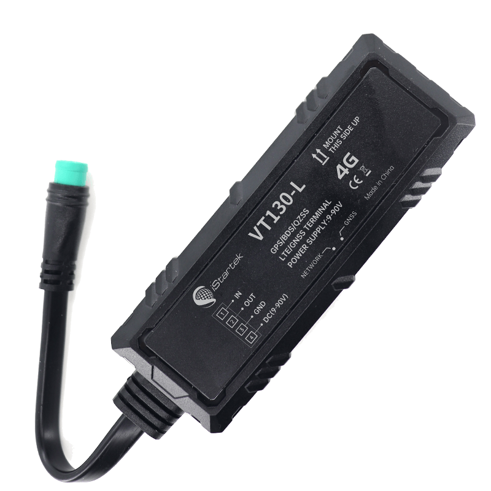

# iStartek - VT130-L

El VT130-L es un rastreador GPS 4G compacto diseñado para ofrecer seguimiento en tiempo real y telemetría vehicular confiables. Proporciona posicionamiento GNSS multiconstelación y transmite la ubicación y el estado del vehículo para supervisión en vivo y control operativo. El dispositivo está pensado para despliegues en flotas mixtas, con una carcasa resistente con clasificación IP66 y un factor de forma pequeño que permite una instalación discreta o flexible en vehículos de pasajeros y activos comerciales ligeros.

Como dispositivo compatible con Plaspy desde fábrica, el VT130-L envía coordenadas GNSS de alta precisión y un amplio conjunto de alarmas de estado a Plaspy para visualización, notificaciones e informes. Su telemetría y el reenvío de eventos se integran con los paneles y flujos de trabajo de Plaspy para apoyar la gestión de flotas, la respuesta ante robos y las operaciones de despacho sin necesidad de middleware personalizado.

## Características principales

- Rastreador GPS 4G compatible con Plaspy para localización en tiempo real y gestión de flotas en vehículos mixtos
- Posicionamiento GNSS multiconstelación de alta precisión para mayor cobertura y exactitud
- Amplio conjunto de alarmas que incluye geocercas, exceso de velocidad, pérdida de señal GPS, pérdida de alimentación externa, eventos de puertas y motor, y detección de impactos
- Funciones de control remoto para intervenciones tipo inmovilizador y salida de buzzer opcional para apoyar procesos de recuperación
- Diseño compacto y robusto con clasificación IP66 y un tamaño reducido, apto para vehículos de pasajeros y comerciales ligeros
- Actualizaciones de firmware FOTA y redundancia con servidores duales para facilitar la gestión del ciclo de vida del dispositivo y reducir pérdidas de datos
- Almacenamiento a bordo y detección de eventos basada en acelerómetro 3D para registro temporal cuando la conectividad es limitada

## Integración con Plaspy

Cuando se usa con Plaspy, el VT130-L entrega flujos continuos de ubicación y telemetría que alimentan las funciones de mapas, alertas e informes de Plaspy. Plaspy procesa las fijaciones GNSS, las alarmas de eventos y las entradas de estado del dispositivo y las muestra en vistas de seguimiento en vivo y paneles operativos para los equipos de flota.

- Actualizaciones de ubicación y telemetría en tiempo real que alimentan los mapas y pantallas de seguimiento en vivo de Plaspy para despacho y supervisión
- Reenvío de alarmas a Plaspy por incumplimiento de geocerca, exceso de velocidad, pérdida de alimentación y eventos de impacto para activar notificaciones y flujos de trabajo
- El reporte de estado de motor y puertas permite monitorear la conducta de los conductores y ofrecer vistas de seguridad para pasajeros en Plaspy
- Los comandos remotos tipo inmovilizador y sus salidas se visualizan en los flujos de trabajo de Plaspy para apoyar la recuperación y la intervención
- Agregación de telemetría para kilometraje, tiempo en ralentí y registro basado en eventos que Plaspy utiliza para informes y análisis

## Casos de uso típicos

- Gestión de flotas comerciales para seguimiento de rutas, despacho e informes de kilometraje
- Monitoreo de transporte público y de buses escolares con alertas de puertas y motor para seguridad de pasajeros
- Operaciones de taxi y ride-hailing para telemetría en cabina, alertas de incidentes y visibilidad operativa
- Gestión de flotas en seguros y arrendamiento donde se requiere kilometraje, tiempos de ralentí y datos de conducción brusca para control de riesgo
- Protección antirrobo para vehículos particulares mediante instalación compacta, alarmas por vibración y funciones de corte remoto

## Por qué elegir este rastreador con Plaspy

El VT130-L es una opción práctica para organizaciones que necesitan un rastreador GPS compacto y resistente que se integre directamente con Plaspy para seguimiento en tiempo real, alertas y reportes de telemetría. Su posicionamiento GNSS multiconstelación, detección de eventos a bordo y opciones de conectividad redundante ayudan a mantener la visibilidad en flotas mixtas y reducir brechas en los datos operativos.

Si está evaluando dispositivos para Plaspy, el VT130-L ofrece un conjunto equilibrado de telemetría y funciones antirrobo que se alinean con las necesidades comunes de flotas y vehículos de pasajeros. Para saber más sobre cómo Plaspy puede utilizar los datos del VT130-L para monitoreo, alertas e informes visite https://www.plaspy.com. Las especificaciones del producto y su disponibilidad pueden cambiar con el tiempo, por lo que le recomendamos verificar los detalles técnicos actuales y la compatibilidad en el sitio del fabricante https://istartek.com/.
