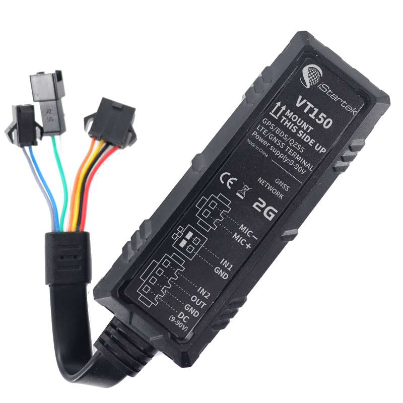

# iStartek - VT150-L

El VT150-L es un rastreador GPS 4G compacto diseñado para motocicletas, pensado para ofrecer seguimiento en tiempo real y seguridad del vehículo. Orientado a uso en motos y vehículos livianos, combina posicionamiento GNSS multi constelación con conectividad celular para reportar ubicación, telemetría y eventos de alarma. El equipo se presenta como robusto, con clasificación IP66 y un amplio rango de voltaje de entrada, e incluye funciones como alertas por eventos, control remoto del inmovilizador y soporte para actualizaciones de firmware.

Como dispositivo compatible con Plaspy, el VT150-L puede enviar datos de posición y eventos en vivo a la plataforma para respaldar la supervisión de flotas, flujos de trabajo antirobo y reportes telemáticos. La configuración de doble servidor y las capacidades de gestión remota simplifican la integración y la administración continua cuando se utiliza con Plaspy para visibilidad operativa y respuesta ante incidentes de seguridad.

## Aspectos destacados

- Rastreador GPS 4G compatible con Plaspy, diseñado para motocicletas y vehículos pequeños, orientado a seguimiento en tiempo real y seguridad.
- Soporte GNSS multi constelación y posicionamiento dual con GPS y por estación base GSM para mejorar la fiabilidad de la ubicación.
- Conjunto de eventos y alarmas que incluye geocerca, exceso de velocidad, detección de impacto o vibración, conducción brusca y alertas por corte de alimentación.
- Soporte de inmovilizador remoto para corte de combustible o electricidad, facilitando una respuesta rápida ante robos a través de la plataforma.
- Carcasa compacta y robusta con grado IP66 y amplio rango de voltaje, adecuada para instalaciones en espacios reducidos y entornos exigentes.
- Actualizaciones FOTA y soporte de doble servidor para gestión remota de dispositivos y mayor resiliencia en notificaciones.

## Cómo funciona con Plaspy

Cuando el VT150-L se integra con Plaspy, el dispositivo transmite mensajes de posición, estado y eventos a la plataforma para que usted y su equipo puedan ver mapas en tiempo real, recibir alertas y generar reportes. Plaspy procesa mensajes por intervalo, distancia o activados por eventos y expone esos puntos de datos para monitoreo, alertas y acciones administrativas como comandos de inmovilizador remoto o actualizaciones de firmware.

- Ubicación y telemetría en tiempo real entregadas a Plaspy para seguimiento en vivo y visualización en mapas.
- Integración de eventos y alarmas para que violaciones de geocerca, impactos, conducción brusca y pérdida de energía generen notificaciones en la plataforma.
- Control de inmovilizador remoto disponible a través de Plaspy para respaldar flujos de trabajo de respuesta ante robos.
- Reproducción histórica de rutas, reportes y registros de kilometraje para supervisión operativa y análisis.
- Funciones de gestión de dispositivos como actualizaciones FOTA y registro en doble servidor para simplificar mantenimiento y mejorar la fiabilidad.

## Casos de uso típicos

- Gestión de flotas de dos ruedas y vehículos livianos que requieren monitoreo continuo de ubicación y eventos.
- Protección antirobo y procesos de recuperación que utilizan alertas de impacto y control de inmovilizador remoto.
- Operaciones de taxi, renta o leasing que necesitan detección de encendido, registro de viajes y notificaciones remotas.
- Servicios de entrega y última milla donde los rastreadores compactos y el posicionamiento confiable son esenciales.
- Seguro y monitoreo basado en uso que depende de reportes de eventos y kilometraje para análisis.

## Por qué elegir este rastreador con Plaspy

El VT150-L combina un formato pequeño y resistente con capacidades de posicionamiento y alarma que se alinean bien con los casos de uso de Plaspy para seguimiento de motocicletas y vehículos ligeros. Su enfoque GNSS multi constelación y el posicionamiento GPS más estación base GSM buscan mejorar la fiabilidad de la ubicación en zonas con recepción complicada, mientras que las opciones de FOTA y doble servidor ayudan a mantener los dispositivos y los canales de notificación a lo largo del tiempo. Para organizaciones que necesitan hardware compacto junto con visibilidad desde la plataforma, el VT150-L es una opción práctica para integrar con Plaspy.

Aprenda más sobre cómo Plaspy puede usar los datos del dispositivo VT150-L y explore las características de la plataforma en https://www.plaspy.com. Las especificaciones del producto, la disponibilidad y los detalles del fabricante pueden cambiar con el tiempo, por lo que le recomendamos verificar la información técnica actual y los recursos de soporte en el sitio del fabricante https://istartek.com/.
