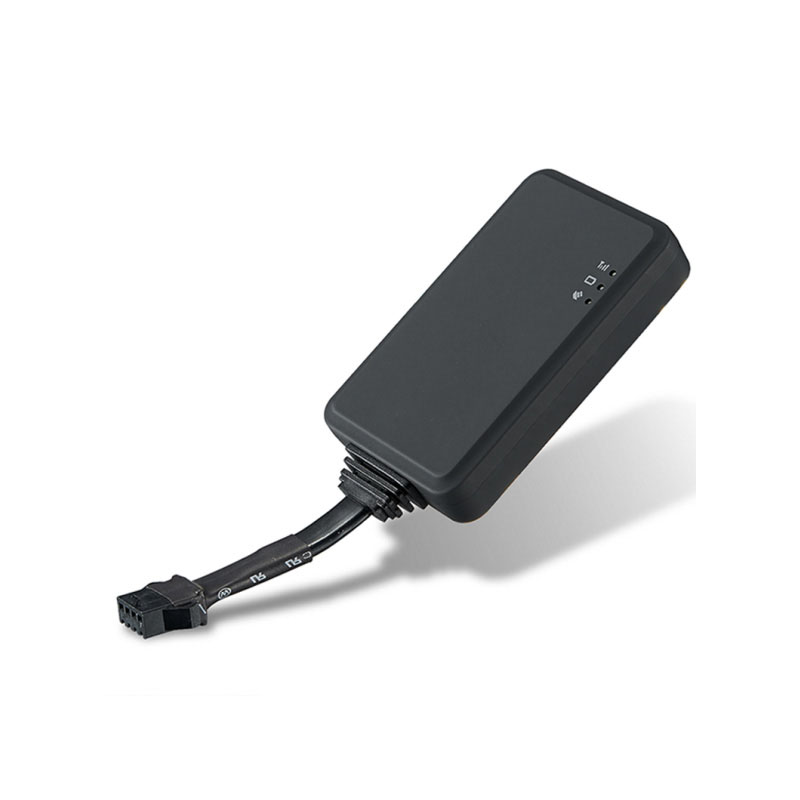

# iStartek - VT202

El iStartek VT202 es un rastreador GPS mini y compacto diseñado para motocicletas, bicicletas eléctricas y automóviles. Combina un módulo GPS integrado con un rango de alimentación flexible para poder instalarse en distintos tipos de vehículos, incluidos camiones ligeros, remolques y transportes de dos ruedas. El VT202 envía datos de posición a un teléfono móvil o servidor designado, ofreciendo localización en tiempo real y funciones básicas de gestión remota adecuadas para uso personal y flotas pequeñas.

Como dispositivo compatible con Plaspy, el VT202 puede alimentar datos de ubicación y alarmas en Plaspy para obtener visibilidad centralizada y supervisión operativa. Sus alertas antirrobo, la capacidad de corte remoto y los múltiples métodos de reporte lo hacen una opción práctica para organizaciones e individuos que desean integrar hardware compacto en su plataforma Plaspy sin depender de configuraciones complejas por dispositivo.

## Características principales

- Factor de forma miniatura ideal para motocicletas, bicicletas eléctricas y automóviles
- Posicionamiento GPS integrado con soporte para posicionamiento suplementario basado en red
- Entrada de alimentación de amplio rango de voltaje para uso en diversos tipos de vehículos
- Varias alarmas antirrobo que incluyen alarma por vibración, alarma por corte de cable y alarma ACC
- Función de corte remoto para interrumpir el suministro de combustible como respuesta ante robo
- Reporte de posición vía SMS, aplicación móvil e interfaces web para monitoreo flexible

## Cómo funciona con Plaspy

Al integrarse con Plaspy, el VT202 envía actualizaciones de ubicación y eventos de alarma a los paneles y canales de notificación de Plaspy, de modo que los equipos puedan supervisar los activos en tiempo real. Plaspy consolida los datos del dispositivo y ofrece herramientas para supervisión, alertas y revisión histórica.

- Visualización de la ubicación en tiempo real en los mapas de Plaspy para unidades VT202 individuales
- Reenvío de alarmas para que eventos de vibración, corte de cable y ACC aparezcan en las notificaciones de Plaspy
- Visibilidad a nivel de flota para monitorear múltiples dispositivos VT202 desde una única interfaz
- Rutas históricas e informes básicos en Plaspy para revisión de recorridos y análisis operativo
- Soporte de comandos remotos a través de Plaspy para activar capacidades del dispositivo, como corte remoto, cuando el equipo y la configuración lo permitan

## Casos de uso típicos

- Monitorización antirrobo y recuperación de motocicletas y bicicletas eléctricas
- Rastreo y gestión de automóviles para flotas pequeñas o vehículos individuales
- Seguimiento de remolques y activos ligeros en operaciones con vehículos mixtos
- Supervisión de vehículos de alquiler y bloqueo remoto como medida de prevención de pérdidas
- Servicios de mensajería o repartos que requieren rastreadores compactos para bicicletas y vehículos ligeros

## Por qué elegir este rastreador con Plaspy

El VT202 es una opción práctica cuando necesita un rastreador pequeño y adaptable que pueda desplegarse en distintos tipos de vehículos. Su amplio rango de voltaje y tamaño compacto facilitan la instalación en motocicletas, bicicletas, autos y remolques ligeros, mientras que las funciones de alarma y corte remoto ofrecen controles operativos concretos para mitigar robos.

Al combinarlo con Plaspy, el VT202 forma parte de un entorno de monitoreo y reportes más amplio que centraliza ubicación, alertas e información histórica. Esta combinación resulta útil para operadores que desean comportamientos de dispositivo sencillos y herramientas a nivel de plataforma para gestionar visibilidad y respuesta sin una complejidad excesiva a nivel de hardware.

Para conocer más sobre cómo Plaspy puede trabajar con dispositivos compatibles como el iStartek VT202 visite https://www.plaspy.com. Las especificaciones del producto y la disponibilidad pueden cambiar con el tiempo, por lo que le recomendamos verificar los detalles técnicos actuales en el sitio del fabricante https://istartek.com/.
