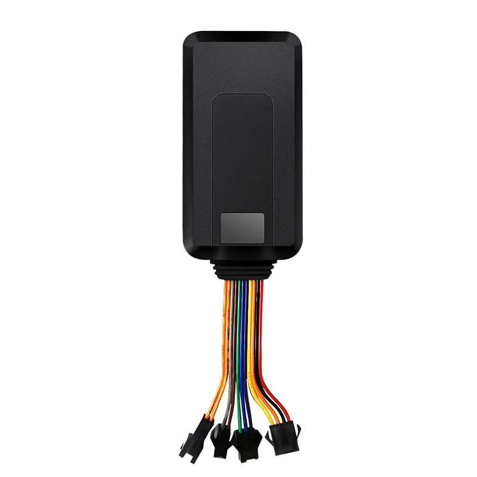

# iStartek - VT206

El VT206 de iStartek es un rastreador GPS oculto GPRS y de tamaño compacto, diseñado principalmente para motocicletas y bicicletas eléctricas, aunque admite un amplio rango de voltaje que lo hace compatible con camiones ligeros, remolques y bicicletas. Integra una antena GPS y una antena GSM internas para ofrecer datos de posición adecuados para el seguimiento en tiempo real y la supervisión básica de flotas. El equipo es ligero y de dimensiones reducidas para una instalación discreta e incluye funciones habituales de seguridad vehicular como corte remoto, detección de ACC, botón de emergencia SOS y posicionamiento por GPS y LBS.

Como dispositivo compatible con Plaspy, el VT206 puede enviar ubicación y estado a la plataforma Plaspy para que usted centralice el seguimiento de motocicletas y vehículos pequeños junto con otros activos de la flota. Usted podrá ver la posición en vivo, monitorear el estado de encendido y eventos SOS, y emplear las herramientas de Plaspy para alertas e informes aprovechando las funciones hardware del VT206 como el corte remoto y el monitoreo de entradas y salidas cuando estén disponibles.

## Características principales

- Diseñado para motocicletas y bicicletas eléctricas con un amplio rango de alimentación de 9 a 36 V apto para distintos vehículos ligeros.
- Antenas GPS y GSM internas que permiten una instalación oculta y reportes de posición confiables.
- Función de corte remoto para inmovilizar el vehículo en casos de robo o uso no autorizado.
- Detección de ACC para supervisar el estado de encendido y obtener información operativa básica.
- Botón de emergencia SOS para llamadas urgentes y alertas rápidas.
- Posicionamiento por GPS y LBS y múltiples interfaces para monitoreo flexible vía SMS, app y web.

## Cómo funciona con Plaspy

Al conectarse a Plaspy, el VT206 transmite actualizaciones de ubicación y estado que permiten la supervisión de flotas de motocicletas y vehículos pequeños. El uso conjunto del dispositivo y la plataforma mejora la visibilidad situacional, facilita la respuesta ante incidentes y apoya los informes operativos rutinarios.

- Seguimiento de ubicación en tiempo real mostrado en los mapas de Plaspy para máxima visibilidad.
- Alertas y notificaciones por eventos SOS, cambios de encendido y otros disparadores operativos definidos.
- Control de inmovilización remota mediante la función de corte del rastreador gestionada desde Plaspy cuando la configuración del equipo lo permite.
- Registro histórico de rutas y eventos para revisión posterior y reportes básicos.
- Señales de entradas y salidas y marcadores de estado disponibles en la plataforma para supervisión operativa y puntos de control externos.

## Casos de uso típicos

- Prevención y recuperación de robos en motocicletas y bicicletas eléctricas mediante corte remoto y seguimiento en vivo.
- Gestión de flotas de reparto o mensajería basadas en motocicletas que requieren rastreo compacto y discreto.
- Operaciones de alquiler y de uso compartido de scooters o bicicletas que necesitan monitoreo de encendido y función SOS.
- Supervisión de flotas mixtas de vehículos pequeños donde se prefiere un rastreador de reducidas dimensiones.
- Monitoreo de remolques y vehículos comerciales ligeros cuando se requiere compatibilidad con voltajes bajos.

## Por qué elegir este rastreador con Plaspy

El VT206 es una opción práctica para operaciones que necesitan un rastreador discreto orientado a motocicletas con funciones esenciales de seguridad y supervisión. Su diseño compacto y su amplia tolerancia de voltaje lo hacen adaptable a distintos tipos de vehículos pequeños, y la combinación de detección de ACC, SOS y corte remoto se alinea con los flujos de trabajo comunes de seguridad y mitigación de robos en flotas.

Integrado con Plaspy, el VT206 permite a los gestores de flota incorporar motocicletas y activos similares en un entorno de seguimiento unificado. Plaspy proporciona la visibilidad, las alertas y las herramientas de informes que hacen que las funciones del dispositivo sean operativas en la gestión diaria sin necesidad de integraciones complejas.

Para saber más sobre cómo Plaspy puede trabajar con el VT206 y otros dispositivos compatibles visite https://www.plaspy.com. Las especificaciones del producto, la disponibilidad y los datos del fabricante pueden cambiar con el tiempo, por lo que le recomendamos verificar la información técnica actual en el sitio oficial del fabricante https://istartek.com/.
