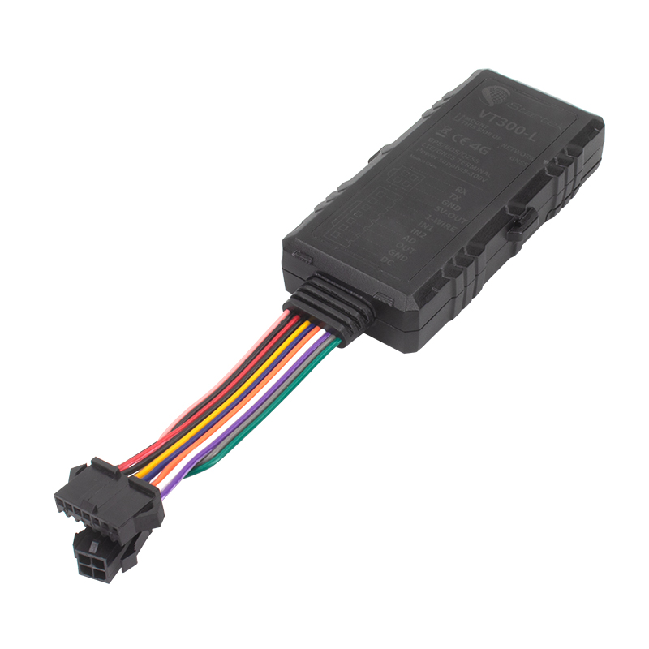

# iStartek - VT300

El iStartek VT300 (variante VT300-L) es un rastreador GPS 4G de nivel básico diseñado para vehículos como camiones, remolques y bicicletas. Integra posicionamiento multiconstelación (GPS, BDS, QZSS), un amplio rango de voltaje de operación, batería interna de respaldo y protección IP66, lo que lo convierte en una opción práctica para necesidades simples de seguimiento de vehículos y activos. Además, el equipo soporta monitoreo de combustible, sensores de temperatura, alertas por manipulación y almacenamiento en búfer local para mantener la continuidad cuando se pierde la conectividad.

Como dispositivo compatible con Plaspy, el VT300 puede enviar datos de ubicación y sensores a la plataforma de gestión de flotas de Plaspy para ofrecer visibilidad en tiempo real, alertas e informes históricos. Su diseño económico y las opciones de sensores lo hacen adecuado para organizaciones que requieren seguimiento sencillo con información sobre combustible y temperatura, mientras Plaspy se encarga de la agregación, visualización y los flujos operativos.

## Puntos clave

- Rastreador 4G económico diseñado para el seguimiento de vehículos y activos en distintos tipos de transporte
- Posicionamiento multi GNSS con GPS, BDS y QZSS para mejorar la precisión de la ubicación
- Soporta monitoreo de combustible y hasta ocho sensores de temperatura para supervisión de flotas y cadena de frío
- Batería interna de respaldo para operación a corto plazo durante cortes de energía y 16MB de memoria flash para almacenamiento en búfer
- Carga dual a servidores para redundancia y alarma automática por manipulación para eventos de seguridad
- Carcasa resistente IP66 y amplio rango de operación de 9–100V, adecuado para diferentes entornos vehiculares
- Múltiples opciones de entradas/salidas para integraciones y necesidades prácticas de monitoreo

## Cómo funciona con Plaspy

Al integrarse con Plaspy, el VT300 suministra ubicaciones y lecturas de sensores a la plataforma, donde los datos se normalizan, almacenan y presentan mediante las herramientas de monitoreo e informes de Plaspy. La plataforma puede utilizar esa información para ofrecer visibilidad operativa y notificaciones automatizadas según las reglas definidas por su organización.

- Seguimiento de ubicación en tiempo real y visualización en mapas dentro de Plaspy para la supervisión de la flota
- Alertas y notificaciones por eventos de manipulación, anomalías en combustible y umbrales de temperatura
- Reconstrucción histórica de rutas usando datos en búfer cuando se restaura la conectividad
- Resúmenes de comportamiento de conducción y eventos disponibles para informes y revisión operativa
- La redundancia mediante carga a servidores duales ayuda a mantener la continuidad de los datos mostrados en Plaspy
- Paneles agregados a nivel de flota e informes exportables para análisis y cumplimiento

## Casos de uso típicos

- Seguimiento de flotas de vehículos ligeros y pesados, incluidos camiones y remolques
- Programas de monitoreo de combustible para detectar patrones de consumo o pérdidas potenciales
- Transporte en cadena de frío donde se requiere monitoreo de temperatura en múltiples sensores
- Seguimiento de activos como remolques y bicicletas cuando se prefiere un rastreador compacto y de bajo costo
- Flotas de renta y operaciones logísticas que necesitan visibilidad de ubicación y alertas básicas de comportamiento de conducción

## Por qué elegir este rastreador con Plaspy

El VT300 es una opción práctica para organizaciones que buscan un rastreador GPS económico que ofrezca posicionamiento multiconstelación y soporte básico de sensores. Su combinación de monitoreo de combustible, soporte para múltiples sensores de temperatura, alertas por manipulación y almacenamiento en búfer se alinea con las necesidades comunes de gestión de flotas, y Plaspy proporciona las capacidades de plataforma para convertir esos datos en información accionable.

Dado que la información disponible del producto se centra en las características principales y el soporte de sensores, este rastreador debe evaluarse en función de sus requisitos operativos específicos, como el conjunto de sensores esperado, la retención de datos y las reglas de alerta. La plataforma flexible de Plaspy facilita la incorporación de dispositivos VT300 para visibilidad, monitoreo e informes en flotas mixtas.

Para obtener más información sobre Plaspy y cómo puede integrar datos del dispositivo en sus flujos de trabajo de flota visite https://www.plaspy.com. Las especificaciones y la disponibilidad del producto pueden cambiar con el tiempo; verifique los detalles técnicos actuales y el soporte de accesorios en el sitio del fabricante https://istartek.com/ antes de tomar una decisión de compra.
