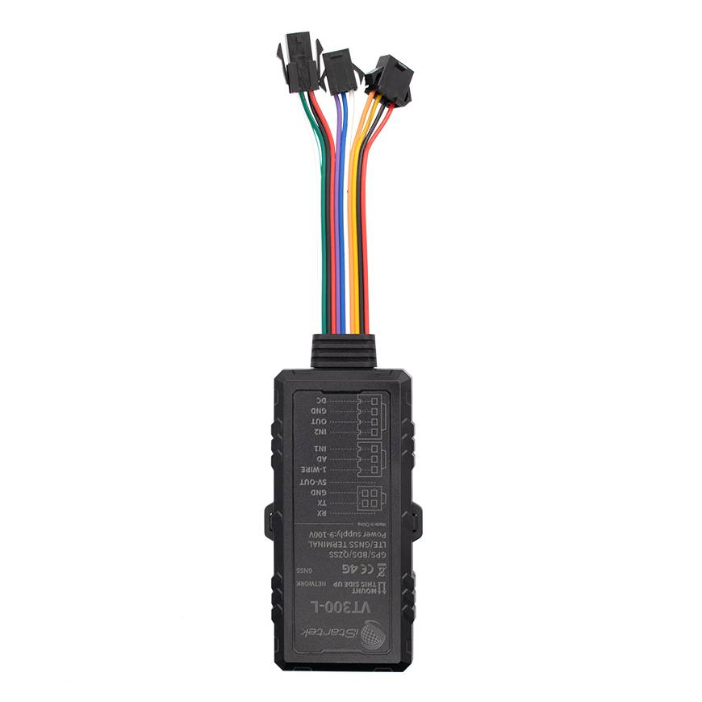

# iStartek - VT300-L

# VT300-L

El VT300-L es un rastreador GPS compacto compatible con Plaspy, que utiliza 4G LTE, diseñado para un seguimiento en tiempo real fiable, telemetría y protección antirrobo para camiones, remolques, motocicletas y automóviles privados. Diseñado para gestión de flotas y seguridad de vehículos individuales, el VT300-L combina posicionamiento GNSS de múltiples constelaciones con comunicaciones 4G robustas y subida IP a través de dos servidores para redundancia, de modo que los datos de ubicación y de eventos lleguen a Plaspy de forma constante incluso en condiciones de red desafiantes.

El dispositivo está construido para uso resiliente en campo: una carcasa con clasificación IP66, un rango amplio de entrada de 9–100 V y una batería de respaldo interna de 300 mAh permiten un funcionamiento continuo en diversos tipos de vehículos y entornos adversos. Con almacenamiento local de historial, múltiples E/S e interfaces periféricas, y sensores de comportamiento de conducción, el VT300-L ofrece la telemetría y las opciones de control que esperan los operadores de flotas de un rastreador GPS compatible con Plaspy.

## Puntos Clave

- Rastreador GPS compatible con Plaspy para rastreo en tiempo real y gestión de flotas con una mezcla de vehículos.
- Conectividad 4G LTE con variantes regionales de hardware \(CN/EU/LA\) y subida IP a dos servidores para redundancia.
- GNSS de múltiples constelaciones \(GPS/BDS/QZSS\) con módulo L76K para actualizaciones de ubicación de alta precisión.
- Carcasa robusta IP66 y entrada de alimentación amplia de 9–100 V para camiones, remolques, motocicletas y automóviles.
- Batería de respaldo interna de 300 mAh y memoria flash de 32 Mbit para buffering de datos sin conexión y reenvío automático al reconectarse.
- Conjunto de E/S completo: 2 entradas digitales, 1 analógica \(AD\), 1 salida de drenaje abierto \(500 mA, tensión soportada 100 V\), 1-Wire \(iButton/temperatura\) y RS232 para telemetría y periféricos.
- Acelerómetro 3D integrado para monitoreo del comportamiento de conducción \(aceleración brusca, frenado, curvas\) y alarmas de manipulación y geocerca.

## Cómo funciona con Plaspy

Cuando se integra con Plaspy, el VT300-L transmite ubicación, estado y telemetría a la plataforma Plaspy a través de 4G en tiempo real, habilitando mapas en vivo, alertas e informes históricos. La subida IP a través de dos servidores añade una capa adicional de garantía de entrega, mientras que el almacenamiento local incorporado conserva el historial de ubicación durante interrupciones de red para su posterior carga en Plaspy.

- Actualizaciones de ubicación y telemetría en tiempo real a Plaspy a través de 4G LTE para rastreo en vivo e informes.
- Encendido e alarmas de puertas mediante entradas digitales: Plaspy recibe datos de eventos discretos para alertas e informes inmediatos.
- Soporte de monitorización de combustible para sensores de combustible capacitivos o ultrasonidos retransmitidos a Plaspy para supervisión de combustible y análisis de consumo.
- Inmovilizador remoto y control del vehículo pueden implementarse utilizando la salida de drenaje abierto; Plaspy puede activar salidas o alertas como parte de flujos de trabajo antirrobo.
- Soporte 1-Wire y RS232 para sensores iButton o de temperatura \(soporta hasta ocho sondas de temperatura\) para telemetría de cadena de frío y flujos de identificación del conductor.
- Funciona junto con ecosistemas de sensores más amplios de Plaspy \(incluidos sensores Bluetooth gestionados por Plaspy\), de modo que las implementaciones con sensores mixtos son soportadas a nivel de plataforma.

## Resumen Técnico

| Conectividad | Módulo de comunicación 4G LTE con variantes regionales de hardware y subida IP a dos servidores para redundancia |
| --- | --- |
| Bandas / Variantes Regionales | Soporte amplio de bandas LTE regionales con variantes de hardware CN/EU/LA \(varias variantes disponibles\) |
| Alimentación & Batería | Rango de tensión de entrada 9–100 V; batería de respaldo de polímero de litio de 300 mAh integrada |
| Memoria | 32 Mbit de memoria flash para almacenamiento local de ubicación/historial durante caídas de red |
| Interfaces | 2 entradas digitales, 1 analógica \(AD\), 1 salida de drenaje abierto \(500 mA, tensión soportada 100 V\), 1-Wire \(iButton/temperatura\), RS232, ranura Nano SIM, puerto de depuración micro USB, interruptor de encendido |
| GNSS | Módulo GNSS L76K con posicionamiento multiconstelación \(GPS/BDS y soporte para recepción QZSS, como se describe\) |
| Sensores | Acelerómetro 3D para monitoreo del comportamiento de conducción; monitoreo de temperatura con soporte para hasta ocho sensores de temperatura; alarma de manipulación/geocerca |
| Antenas | Antena GSM integrada tipo FPC y antena GPS cerámica \(25×25×4 mm\) |
| Indicadores & Depuración | Indicadores LED visibles \(uno azul, uno verde\) y puerto de depuración micro USB |
| Formato & Durabilidad | Rastreador compacto para vehículos con carcasa IP66 a prueba de polvo/agua, apta para camiones, remolques, motocicletas y automóviles |
| Procesador | MCU Cortex-M4 \(AT32F415CBT7\) |

## Casos de Uso

- Gestión de flotas y despacho: seguimiento en tiempo real, monitorización de rutas y telemetría de comportamiento de conducción para mejorar la eficiencia operativa.
- Antirrobo e inmovilización: alertas disparadas por Plaspy y control de drenaje abierto para respuestas remotas y flujos de recuperación de vehículos.
- Monitoreo de combustible y control de consumo: integración con sensores de combustible capacitivos o ultrasonidos para reducir pérdidas y detectar anomalías.
- Logística de cadena de frío y monitoreo de temperatura: soporte para hasta ocho sensores de temperatura para proteger cargas perecederas.
- Telemática para alquiler, arrendamiento y seguros: datos históricos de ubicación, alertas de manipulación/geocerca y registros de comportamiento de conducción para la gestión de riesgos.

## Por qué elegir este rastreador con Plaspy

El VT300-L es un rastreador GPS compatible con Plaspy, diseñado para fiabilidad y una integración flexible. Su combinación de operación a voltaje amplio, carcasa con clasificación IP66, batería de respaldo integrada y buffering local de datos garantiza telemetría continua incluso durante interrupciones de energía o red. La subida a dos servidores y variantes regionales 4G de múltiples regiones aumentan la fiabilidad de entrega en distintos mercados, mientras que un conjunto completo de E/S \(1-Wire, RS232, entradas digitales/analógicas y una salida de drenaje abierto de alta corriente\) posibilita monitoreo de combustible, estado de encendido/puerta, identificación del conductor y flujos de trabajo de inmovilizador. Para operadores de flotas y usuarios que buscan seguimiento en tiempo real, protección antirrobo y telemetría detallada, el VT300-L ofrece un dispositivo robusto y escalable que se integra a la perfección con la plataforma de Plaspy y ecosistemas de sensores más amplios.

