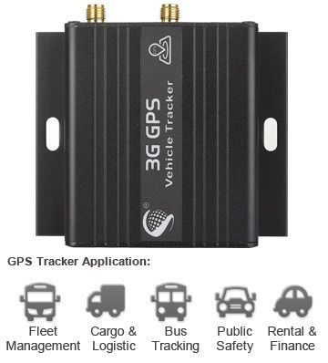

# iStartek - VT900

El rastreador GPS iStartek VT900 es un dispositivo de seguimiento de vehículos que ofrece una amplia gama de características y funcionalidades. Con soporte para UMTS / HSDPA y GSM / GPRS, el VT900 es compatible con diferentes frecuencias y bandas, lo que le permite funcionar en diferentes regiones y redes móviles.

Una de las características destacadas del VT900 es su capacidad de seguimiento a través de SMS y GPRS. Esto significa que puede recibir actualizaciones de ubicación en tiempo real a través de mensajes de texto o mediante una conexión de datos. También puede realizar un seguimiento bajo demanda, establecer intervalos de tiempo para el seguimiento automático o incluso rastrear la ubicación directamente desde su teléfono móvil.

El VT900 también cuenta con una memoria interna de 8MB para el registro de datos, lo que le permite almacenar información de seguimiento incluso cuando no hay una conexión disponible. Además, está equipado con un sensor de temblor incorporado, una batería de reserva interna y varias alarmas, como SOS, Geo-fence, batería baja y velocidad, que le mantendrán informado sobre cualquier evento o situación inusual.

En cuanto a las especificaciones técnicas, el VT900 tiene una fuente de alimentación de 10.6V - 36V / 1.5A y una batería de reserva de 500mAh. Tiene un consumo de energía normal de 55mA / h y dimensiones de 65 mm x 61 mm x 26 mm, lo que lo hace compacto y fácil de instalar en cualquier vehículo. También es resistente, con una temperatura de funcionamiento de -20 a 65 grados y una humedad de 5% a 95% sin condensación.

En resumen, el rastreador GPS iStartek VT900 es una opción confiable y versátil para el seguimiento de vehículos. Con su amplia gama de características, especificaciones técnicas sólidas y facilidad de uso, es una herramienta valiosa para cualquier empresa o individuo que necesite mantener un control preciso y seguro de sus activos.

### Características destacadas:

- Seguimiento por SMS / GPRS
- Pista bajo demanda
- Seguimiento por intervalo de tiempo
- Pista en el teléfono móvil
- Memoria interna de 8MB para registro
- Sensor de temblor incorporado
- Batería de reserva interna
- Alarma SOS
- Alarma Geo-fence
- Alarma de zona ciega GPS
- Alarma de batería baja
- Alarma de velocidad
- Alarma de Corte de Energía Externa
- Corte del motor \(inmovilización del motor\)
- Control de combustible
- 1RS232 ++ 2OUTPUT + 3INPUT
- 1 Detección de entrada analógica

### Especificaciones técnicas:

- Fuente de alimentación: 10.6V - 36V / 1.5A
- Batería de reserva: 500mAh
- Consumo de energía normal: 55mA / h
- Dimensión: 65 mm x 61 mm x 26 mm
- Peso: 90 g
- Tiempo de trabajo: 30 horas en modo de ahorro de energía y 7,5 horas en modo normal
- Temperatura de funcionamiento: -20 a 65 grados
- Humedad: 5% a 95% Sin condensación
- Frecuencia: UMTS / HSDPA: 850/2100 MHz \(VT900 T\), 850/1900 MHz \(VT900 A\), 900 / 2100MHz \(VT900 E\); GSM / GPRS: 850/900/1800/1900 MHz
- Módulo GPS: Quectel L70
- Sensibilidad del GPS: -159Db
- Frecuencia GPS: L1, 1575,42 MHz
- C / A Código: Tasa de chip de 1,023 MHz
- Canales: 20 canales de seguimiento de todo en la vista
- Precisión de posición: 10 metros, 2D RMS
- Precisión de la velocidad: 0,1 m / s
- Precisión de tiempo: 1 nosotros sincronizados con el tiempo GPS
- Dato predeterminado: WGS-84
- Reacquisición: 0,1 seg., Promedio
- Arranque en caliente: 1 seg., Promedio
- Arranque en caliente: 38 seg., Promedio
- Inicio fresco: 42 seg., Promedio
- Límite de Altitud: 18.000 metros \(60.000 pies\) máximo
- Límite de velocidad: 515 metros / segundo \(1000 nudos\) máx.
- LED: 2 luces LED para mostrar el estado GPS / GSM
- Memoria flash: 8MB
- Interfaz: Puerto 1RS232 para conectar con lector de tarjetas magnéticas, 3 entradas digitales, 2 salidas, 1 entrada analógica

### Accesorios incluidos:

- VT900 3G Tracker
- Antena GSM
- Antena GPS
- Cable de energía

### Accesorios opcionales:

- Cable de datos USB
- Sensor de combustible
- Lector de tarjetas magnéticas
- Interruptor de clavija
- Relé
- IButton
- Tarjeta RFID
- Temperatura. Sensor

