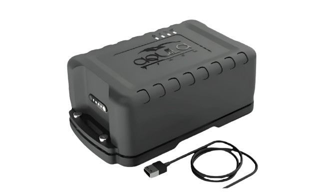

# iTriangle - AT101 4G

El iTriangle AT101 4G es un rastreador GPS compatible con Plaspy, diseñado para el seguimiento discreto de activos a largo plazo. Combina una batería interna de alta capacidad de 10000mAh, un soporte magnético resistente y posicionamiento GNSS multiconstelación para ofrecer monitorización continua de ubicación sin necesidad de cableado externo. Pensado para despliegues en campo, el dispositivo también incorpora detección de movimiento, geocercas y alertas por manipulación para soportar flujos de trabajo prácticos contra el robo y la recopilación constante de telemetría.

Como dispositivo compatible con Plaspy, el AT101 integra sus actualizaciones de ubicación y alertas de eventos en los flujos de gestión de flotas y activos de Plaspy. Su diseño sin cables, el almacenamiento local en búfer y las capacidades de administración remota lo hacen adecuado para despliegues de baja intervención donde se requiere visibilidad remota, alertas configurables y seguimiento histórico. Esta combinación permite a las operaciones supervisar equipos, envíos y activos temporales desde los paneles de Plaspy con menos mantenimiento en sitio.

## Características principales

- Seguimiento en tiempo real compatible con Plaspy y posicionamiento GNSS multiconstelación para una localización fiable.
- Batería interna de alta capacidad de 10000mAh para despliegues prolongados sin alimentación externa.
- Montaje magnético sin cables para una fijación rápida y discreta sin necesidad de instalación eléctrica.
- Detección de movimiento, geocercas y alertas por manipulación para apoyar casos de uso de seguridad y anti robo.
- Soporte BLE 4.0 para integración con sensores de corto alcance e interacciones locales.
- Gran almacenamiento a bordo con buffering local para preservar registros durante interrupciones de conectividad.
- Soporte OTA y FOTA para configuración remota y actualizaciones de firmware.

## Cómo funciona con Plaspy

El AT101 transmite la ubicación GNSS y la telemetría de eventos a Plaspy, donde los datos se visualizan, almacenan y se pueden accionar. Plaspy procesa puntos de ubicación, activaciones por movimiento y geocercas, y alertas por manipulación para ofrecer mapas en vivo, recorridos históricos y notificaciones configurables. Las capacidades de actualización remota permiten a los administradores gestionar ajustes y firmware desde la plataforma, reduciendo visitas a sitio y manteniendo un comportamiento de dispositivo coherente.

- Transmisión de ubicación y telemetría en vivo a Plaspy para monitoreo en tiempo real.
- Alertas por movimiento y geocerca encaminadas a Plaspy para notificación y escalamiento inmediato.
- Reportes de eventos de manipulación para respaldar flujos de seguridad y respuesta rápida.
- Datos de sensores BLE e interacciones de corto alcance visibles en los paneles de Plaspy.
- El búfer de datos local garantiza la continuidad de los registros y se sincroniza con Plaspy cuando retorna la conectividad.

## Casos de uso típicos

- Seguimiento de equipos de renta y activos temporales que requieren despliegues de baja intervención.
- Monitoreo de activos logísticos, remolques y contenedores para historial de ubicación y movimiento.
- Protección de envíos de alto valor con geocercas y alertas por manipulación integradas a los flujos de despacho.
- Vigilancia de maquinaria estacional y agrícola donde la operación sin cables y la robustez son importantes.
- Programas de seguridad de activos que demandan instalación discreta y notificación fiable de eventos.

## Por qué elegir este rastreador con Plaspy

El AT101 4G es una opción práctica para organizaciones que usan Plaspy cuando la autonomía sin cable, el montaje discreto y la gestión remota son prioritarios. Su combinación de GNSS multiconstelación, autonomía de batería interna y detección de eventos proporciona visibilidad constante para activos no alimentados y equipos de campo. El soporte de actualizaciones remotas y el buffering a bordo reducen la carga operativa y ayudan a mantener la continuidad de datos durante interrupciones temporales de la red.

Integrado en Plaspy, el AT101 alimenta paneles centralizados usados para monitoreo de flota, análisis histórico y alertas, facilitando la correlación de datos de ubicación y eventos entre activos. Si necesita un rastreador de bajo mantenimiento que soporte despliegues discretos y gestión remota de dispositivos, el AT101 es una opción compatible con Plaspy a considerar.

Para más información sobre Plaspy y la gestión de dispositivos compatibles visite el sitio principal de Plaspy https://www.plaspy.com. Las especificaciones del producto, la disponibilidad y los detalles del fabricante pueden cambiar con el tiempo, por lo que le recomendamos verificar la información técnica actual en el sitio oficial de iTriangle https://www.itriangle.net/.
