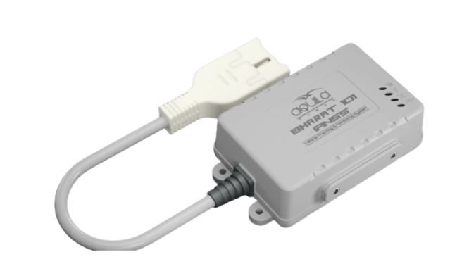

# iTriangle - Bharat101

El Bharat101 es un rastreador GPS compatible con la normativa AIS 140, diseñado y fabricado en India para entornos vehiculares exigentes. Integra posicionamiento GNSS con soporte NavIC, una eSIM integrada, sensores de movimiento a bordo, múltiples opciones de E/S y una carcasa resistente IP65 para ofrecer seguimiento continuo y telemetría de eventos en transporte público, flotas comerciales y otras aplicaciones vehiculares.

Al ser compatible con Plaspy desde su configuración inicial, el Bharat101 se integra directamente en los flujos de trabajo de Plaspy. Puede enviar ubicación, datos de movimiento y eventos a los servicios de Plaspy mientras mantiene registros locales durante interrupciones de conectividad, lo que lo convierte en una opción práctica para operadores que necesitan soporte de navegación local, conectividad celular confiable y telemetría escalable al usar Plaspy como plataforma de seguimiento.

## Principales características

- Rastreador compatible con AIS 140 pensado para entornos de transporte público y vehículos comerciales.
- GNSS integrado con recepción NavIC para mejorar el posicionamiento mediante satélites locales.
- eSIM integrada que ofrece conectividad celular resiliente y transmisión de datos a múltiples servidores.
- Acelerómetro y giroscopio a bordo para detectar movimiento, impactos y eventos de comportamiento de conducción.
- Varias entradas analógicas y digitales, salidas digitales y RS232 para integrar periféricos.
- Soporte OTA/FOTA y métodos de configuración flexibles para gestión remota.
- Carcasa robusta IP65 y almacenamiento a bordo con batería de respaldo para operación continua.

## Cómo funciona con Plaspy

El Bharat101 entrega datos de posición y eventos a los servidores de Plaspy y puede funcionar como una fuente persistente de telemetría para supervisión y reportes de flotas. Su conectividad integrada y la transmisión a múltiples servidores permiten alimentes continuas de ubicación e información de eventos, mientras que el buffer local respalda la continuidad de datos ante pérdidas temporales de red.

- Ubicación en tiempo real y posicionamiento mejorado por NavIC para visualización de rutas y mapas en Plaspy.
- Eventos de movimiento e impacto provenientes de sensores a bordo para alertas de seguridad y análisis de comportamiento del conductor.
- Eventos por entradas digitales y analógicas para encendido, puertas, alarmas y telemetría de sensores analógicos en los paneles de Plaspy.
- Transmisión a múltiples servidores y almacenamiento local para asegurar la disponibilidad y continuidad de los datos.
- Mantenimiento y actualizaciones remotas vía OTA/FOTA para mantener los dispositivos alineados con las implementaciones de Plaspy.

## Casos de uso típicos

- Gestión de flotas y rastreo en tiempo real para autobuses, camiones y vehículos comerciales ligeros.
- Despliegues de transporte público que requieren cumplimiento AIS 140 y hardware resistente.
- Flujos de trabajo antirrobo y bloqueo remoto mediante eventos y salidas digitales.
- Análisis de comportamiento de conducción y reportes de seguridad usando datos del acelerómetro y giroscopio.
- Telemetría remota, incluyendo nivel de combustible y monitoreo de otros sensores analógicos para supervisión operativa.

## Por qué elegir este rastreador con Plaspy

El Bharat101 combina cumplimiento certificado para vehículos y posicionamiento NavIC con conectividad flexible y opciones de E/S, lo que lo hace una opción práctica para organizaciones que operan flotas mixtas y requieren telemetría confiable en Plaspy. Su eSIM integrada y el modelo de transmisión a múltiples servidores ayudan a mantener reportes continuos, mientras que el almacenamiento a bordo y la batería de respaldo ofrecen resiliencia ante cortes de energía o conectividad.

Si desea saber más sobre cómo el Bharat101 puede trabajar con Plaspy, visite https://www.plaspy.com. Las especificaciones del producto, la disponibilidad y los detalles del fabricante pueden cambiar con el tiempo, por lo que es recomendable verificar las especificaciones y la información de cumplimiento más reciente en el sitio oficial del fabricante https://www.itriangle.net/.
