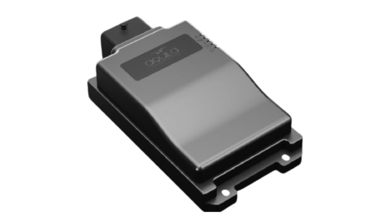

# iTriangle - UX101-AL

El UX101-AL es un rastreador GPS compatible con Plaspy, diseñado para la gestión profesional de flotas. Certificado AIS 140 y desarrollado para entornos difíciles, el UX101-AL combina conectividad celular 4G, posicionamiento GNSS multiconstelación, diagnósticos CAN duales y almacenamiento a bordo para ofrecer seguimiento en tiempo real, telemetría e información accionable del vehículo a través de la plataforma Plaspy.

Diseñado para vehículos comerciales, transporte público e integraciones OEM, el UX101-AL aprovecha la plataforma de firmware aQila Edge para análisis integrados, actualizaciones OTA/FOTA y una comunicación eficiente con la ECU. Con protección IP67, antenas internas BLE/GNSS/GSM y una batería de respaldo de 1000 mAh, este rastreador mantiene la visibilidad y la seguridad de su flota incluso en entornos remotos o con conectividad limitada.

## Características clave

- Rastreador GPS 4G certificado AIS 140, preparado para implementaciones de flotas con requisitos de cumplimiento y soluciones de transporte público.
- Interfaces CAN duales para diagnósticos profundos del vehículo y monitoreo de combustible, cuando estén disponibles los datos CAN del vehículo.
- Carcasa robusta con clasificación IP67 y rango de temperatura operativo extendido \(–40°C a +80°C\) para minería, trabajos pesados y flotas al aire libre.
- Almacenamiento a bordo para hasta 100,000 registros, para garantizar un registro continuo cuando la conectividad de la red no está disponible.
- Firmware aQila Edge con analítica embarcada, actualizaciones remotas OTA/FOTA y configuración remota vía SMS o TCP/IP.
- Acelerómetro y giroscopio integrados para monitoreo del comportamiento del conductor, frenadas bruscas y alertas de impactos para apoyar programas de anti-robo y seguridad.
- eSIM interna y antenas GSM/GNSS/BLE internas para una instalación simplificada y compatibilidad de sensores y beacons Bluetooth.

## Cómo funciona con Plaspy

Cuando se integra con Plaspy, el UX101-AL transmite la ubicación, telemetría CAN y eventos de sensores para ofrecer seguimiento en tiempo real, reproducción histórica y alertas configurables. Plaspy procesa las fijaciones GNSS y los paquetes de telemetría del dispositivo para alimentar mapas en vivo, alertas de geocercas, informes de rendimiento del conductor e informes programados. El registro a bordo y la conectividad 4G respaldada por eSIM aseguran la continuidad de los datos hacia Plaspy incluso con cobertura intermitente.

- Actualizaciones de ubicación en tiempo real y posicionamiento GNSS multiconstelación \(GPS, Galileo, NavIC, BeiDou\) para un seguimiento fiable.
- Telemetría y diagnósticos del vehículo mediante canales CAN duales para monitoreo de combustible, señales del motor y datos de la ECU cuando estén disponibles.
- Comportamiento del conductor y alertas de eventos alimentados por el acelerómetro y el giroscopio \(frenadas bruscas, impactos\) para los paneles telemáticos de Plaspy.
- Registro a bordo de hasta 100,000 registros para conservar el historial de viajes durante interrupciones de la red y carga por lotes a Plaspy.
- Soporte BLE para sensores y beacons Bluetooth—útil para detección de temperatura, carga o proximidad integrada en los flujos de trabajo de Plaspy.
- Configuración remota y gestión de firmware \(SMS, TCP/IP, OTA, FOTA\) mediante aprovisionamiento compatible con Plaspy para un despliegue escalable de flotas.
- Las salidas digitales pueden usarse para implementar flujos de seguridad, inmovilización o control remoto, cuando se configuran en conjuntos de reglas compatibles con Plaspy.

## Resumen técnico

| Conectividad | Celular 4G con soporte eSIM \(certificado AIS 140\) |
| --- | --- |
| Bandas | Específicas por modelo; consulte al fabricante para soporte de bandas regionales |
| Alimentación y batería | Entrada de alimentación 8–36V DC; batería de respaldo interna de 1000 mAh; modo de reposo de ultra bajo consumo &lt;3mA |
| Interfaces | Dual CAN, RS232, 3 entradas analógicas, 7 entradas digitales, 4 salidas digitales |
| GNSS | GPS, Galileo, NavIC, BeiDou \(posicionamiento multiconstelación\) |
| Bluetooth | Antena BLE interna para sensores y beacons |
| Gestión remota | Configuración remota vía SMS, TCP/IP, OTA; FOTA compatible |
| Almacenamiento a bordo | Hasta 100,000 registros para registro offline |
| Sensores | Acelerómetro y giroscopio integrados para detección de movimiento e impactos |
| Conformidad y Durabilidad | Certificado AIS 140; cumplimiento EMI/EMC; IP67 resistente al agua y al polvo; rango operativo –40°C a +80°C |
| Factor de forma | Unidad telemática de grado vehicular, compacto, para instalaciones en flotas comerciales y OEM |

## Casos de uso

- Gestión de flotas y seguimiento en tiempo real para operadores de vehículos comerciales que requieren cumplimiento AIS 140 y telemetría robusta.
- Flujos de anti‑robo y recuperación mediante ubicación, eventos del acelerómetro y salidas digitales para el control del inmovilizador.
- Monitoreo de combustible y mantenimiento preventivo mediante diagnósticos del bus CAN integrados en los informes de Plaspy.
- Transporte público y flotas municipales que requieren posicionamiento GNSS confiable, registro a bordo y actualizaciones de firmware OTA.
- Minería y equipos de gran potencia donde la protección IP67, amplio rango de temperatura y batería interna de respaldo son críticos.

## Por qué elegir este rastreador con Plaspy

El UX101-AL ofrece una combinación equilibrada de cumplimiento, durabilidad y conectividad, lo que lo hace adecuado para despliegues serios de flotas y OEM en Plaspy. Su certificación AIS 140, diagnósticos CAN duales y pila GNSS multiconstelación ofrecen la telemetría y fidelidad de posicionamiento que exige la gestión moderna de flotas. Con el firmware aQila Edge, analítica embebida y capacidad FOTA, el dispositivo reduce las visitas de campo y mantiene el firmware y las configuraciones de la flota sincronizados a través de Plaspy. Elija el UX101-AL con Plaspy cuando necesite un seguimiento en tiempo real confiable, gestión remota escalable y captura de datos resiliente para seguridad, eficiencia y operaciones anti-robo.

