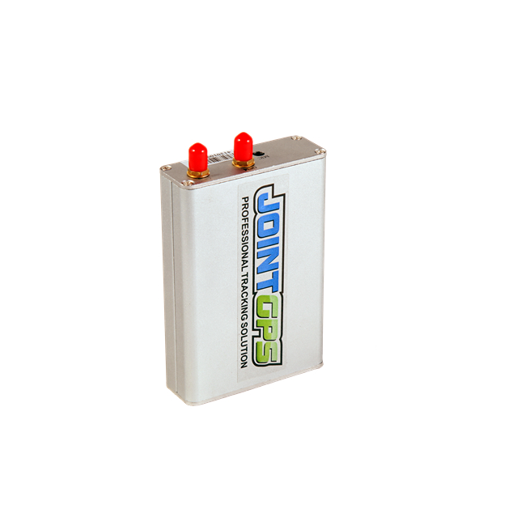

# Jointech - GP4000

El Jointech GP4000 es un rastreador GPS resistente diseñado para la gestión profesional de flotas. Pensado para ofrecer seguimiento confiable en distintos usos —logística, transporte refrigerado, taxis y maquinaria de obra— el GP4000 prioriza la estabilidad comprobada en campo y la telemetría rentable para flotas que operan en múltiples países. Su diseño está orientado a despliegues a largo plazo y a entornos operativos donde la localización contínua y la conectividad robusta son críticas.

Como dispositivo compatible con Plaspy, el GP4000 se integra en los flujos de trabajo de Plaspy para aportar ubicación en tiempo real, notificación de alarmas y visibilidad operativa. La amplia matriz de E/S y la conectividad serial del equipo permiten entregar datos de telemetría y eventos que Plaspy presenta en paneles, alertas e informes. Esa combinación hace que el GP4000 sea una opción relevante para organizaciones que requieren seguimiento integrado, medidas antirrobo y soporte flexible de periféricos dentro de la plataforma Plaspy.

## Aspectos clave

- Rastreador compatible con Plaspy para ubicación en tiempo real, reproducción de rutas y paneles de flota
- Robustez y fiabilidad comprobada en campo con despliegues en más de 55 países
- Amplia matriz de E/S para entradas de telemetría y eventos que admiten sensores de combustible, puertas y alarmas
- Conectividad serial RS232 que facilita la integración con diversos periféricos telemáticos externos
- Alarmas y eventos configurables para antirrobo, geocercas, exceso de velocidad, manipulación y cortes de energía
- Flexible para flujos personalizados, incluyendo escenarios de encendido e inmovilizador cuando se implementa con los periféricos adecuados
- Opción rentable para flotas grandes que requieren hardware duradero y funciones de telemetría prácticas

## Cómo funciona con Plaspy

Al conectarse a Plaspy, el GP4000 envía posiciones, entradas de sensores y eventos de alarma a la plataforma para que los equipos de operaciones puedan monitorear activos, recibir notificaciones y generar reportes. Plaspy consume los datos del rastreador y los expone mediante mapas, notificaciones y registros exportables para supervisión operativa.

- Actualizaciones de ubicación en tiempo real y reproducción de rutas presentadas en Plaspy para una conciencia situacional continua
- Reenvío de alarmas y eventos por incumplimiento de geocerca, exceso de velocidad, manipulación, robo y cortes de energía para habilitar notificaciones rápidas
- Ingesta de telemetría para monitoreo de combustible y sensores auxiliares, de modo que las tendencias de consumo y los eventos de sensor puedan analizarse en Plaspy
- Estado de encendido e indicaciones relacionadas con el inmovilizador reflejadas en los paneles de Plaspy cuando se configuran a través de las E/S del GP4000
- Soporte para integrar pasarelas de sensores externas de modo que telemetría adicional pueda asociarse a los registros del rastreador en Plaspy

## Casos de uso típicos

- Flujos antirrobo y de inmovilización que combinan eventos del GP4000 con alertas y controles de Plaspy
- Monitoreo de rutas en tiempo real y reproducción histórica para operaciones de logística, mensajería y taxis
- Seguimiento de flotas refrigeradas junto con datos de sensores de carga para controlar ubicación y condiciones ambientales
- Seguimiento de maquinaria pesada y vehículos de obra para visibilidad en sitio y reporte de intentos de manipulación
- Gestión de combustible y diagnóstico remoto usando sensores conectados y periféricos seriales para reportes agregados de flota

## Por qué elegir este rastreador con Plaspy

El Jointech GP4000 es una elección práctica para organizaciones que necesitan un rastreador vehicular resistente con un conjunto amplio de entradas y opciones seriales. Su énfasis en la fiabilidad en campo y el soporte de periféricos lo hace apto para flotas mixtas que requieren seguimiento continuo, visibilidad de alarmas e integraciones con dispositivos de terceros. Al integrarlo con Plaspy, los datos del GP4000 se vuelven accionables mediante paneles, alertas e informes que apoyan la toma de decisiones operativas y el cumplimiento normativo.

Para conocer más sobre cómo funciona el GP4000 dentro de Plaspy, visite el sitio principal de Plaspy en https://www.plaspy.com. Las especificaciones del producto, la disponibilidad y los detalles del fabricante pueden cambiar con el tiempo, por lo que le recomendamos verificar las especificaciones y documentación vigentes en el sitio del fabricante https://www.jointcontrols.com/.
