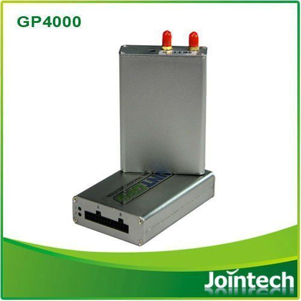

# Jointech - GP 4000

El rastreador GPS Jointech GP-4000 es un dispositivo de seguimiento de vehículos diseñado para la gestión de flotas. Este dispositivo es compatible con tecnología GPS, GSM y GPRS, lo que permite una localización precisa y una comunicación eficiente. Además, el GP-4000 es robusto y resistente, lo que lo hace ideal para su uso en entornos exigentes.

Una de las características destacadas del GP-4000 es su capacidad para realizar seguimiento MDT \(Mobile Data Terminal\), lo que permite la transmisión de datos en tiempo real desde el vehículo a la plataforma de gestión. Esto proporciona información valiosa sobre la ubicación, el estado del vehículo y otros datos relevantes para la gestión de flotas.

Otra característica importante del GP-4000 es su compatibilidad con un sensor de combustible de alta precisión externo. Esto permite monitorear el consumo de combustible de los vehículos de manera precisa y confiable, lo que puede ayudar a reducir costos y optimizar la eficiencia operativa.

El GP-4000 también ofrece una gestión remota a través de GPRS y SMS, lo que permite controlar y administrar los vehículos de forma remota. Además, cuenta con un odómetro incorporado y soporta la comunicación a través de TCP, lo que garantiza una conexión estable y confiable.

En resumen, el rastreador GPS Jointech GP-4000 es una solución confiable y eficiente para la gestión de flotas. Con su capacidad de seguimiento MDT, compatibilidad con sensor de combustible externo y opciones de gestión remota, este dispositivo ofrece un control completo sobre los vehículos y puede ayudar a mejorar la eficiencia operativa y reducir costos.

### Características destacadas:

- Seguimiento MDT en tiempo real
- Compatibilidad con sensor de combustible externo de alta precisión
- Gestión remota a través de GPRS y SMS
- Odómetro incorporado
- Comunicación a través de TCP

