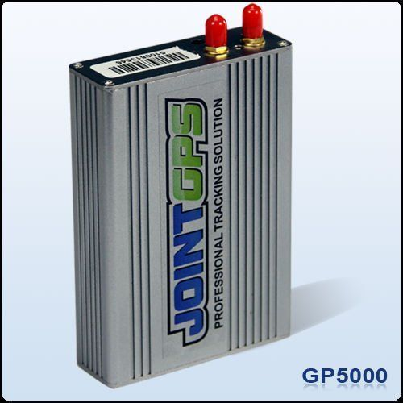

# Jointech - GP 5000

El Jointech GP 5000 es un rastreador GPS compacto diseñado para seguimiento en tiempo real, monitoreo del nivel de combustible y gestión de flotas. Sus características incluyen comunicación por SMS y GPRS (TCP/UDP), alarmas por señales del vehículo, configuración remota y registro de datos a bordo, lo que lo hace adecuado para empresas que requieren visibilidad continua de la ubicación y control operativo. El equipo prioriza un posicionamiento confiable y almacenamiento interno para preservar la información durante las interrupciones de cobertura.

Como dispositivo compatible con Plaspy, el GP 5000 puede enviar datos de ubicación y estado a Plaspy para su monitoreo centralizado y generación de informes. Esta compatibilidad permite a los responsables de flota combinar las capacidades del hardware con las herramientas de Plaspy para visualización, alertas y análisis histórico, ayudando a convertir datos crudos del dispositivo en información operativa accionable.

## Aspectos principales

- Seguimiento de vehículos en tiempo real con posicionamiento GPS a bordo para visibilidad continua
- Monitoreo del consumo de combustible para apoyar el control de costos y el análisis del uso
- Comunicaciones por SMS y GPRS (TCP/UDP) para transmisión de datos a plataformas de monitoreo
- Múltiples alarmas por señales del vehículo y funciones anti robo proactivas para alertas de seguridad
- Configuración y control remotos para ajustar el comportamiento del dispositivo sin acceso físico
- Diseño robusto y compacto con amplio rango de temperatura de operación
- Almacenamiento de datos integrado e informe de recorridos para conservar registros históricos de movimiento

## Cómo funciona con Plaspy

Al integrarse con Plaspy, el GP 5000 entrega actualizaciones de ubicación en vivo y datos de eventos que Plaspy utiliza para monitoreo de flota, alertas e informes. Plaspy procesa los datos del dispositivo y los presenta en paneles e informes adaptados a las necesidades operativas.

- Seguimiento centralizado y visualización en mapa dentro de Plaspy para supervisión de la flota
- Reenvío de eventos y alarmas para que las alertas de seguridad y señales críticas lleguen a los operadores
- Datos de monitoreo de combustible disponibles en los informes de Plaspy para respaldar análisis de consumo
- Información de geocercas e informes de recorrido para control de rutas y auditoría
- Retención histórica de datos y opciones de exportación aprovechando el registro a bordo del dispositivo
- Señales de configuración remota coordinadas a través de Plaspy para ajustar parámetros del equipo a escala

## Casos de uso típicos

- Flotas comerciales que necesitan visibilidad continua de ubicaciones y control de rutas
- Operaciones de entrega y logística que requieren informes de recorrido y registros de kilometraje
- Programas de seguridad vehicular que aprovechan eventos de alarma y funciones anti robo
- Iniciativas de gestión de combustible orientadas a monitorear consumo y reducir costos
- Operaciones en entornos exigentes que precisan hardware resistente y registro estable de datos

## Por qué elegir este rastreador con Plaspy

El GP 5000 combina capacidades prácticas a nivel de dispositivo con las funciones de la plataforma Plaspy para ofrecer una solución integral de rastreo de flotas. Su mezcla de seguimiento en tiempo real, monitoreo de combustible, reportes de alarmas y configuración remota lo hace idóneo cuando las empresas necesitan control a nivel de dispositivo y visibilidad operativa centralizada. El registro de datos y los informes de recorridos del equipo complementan las herramientas de Plaspy para un análisis histórico y cumplimiento más sólido.

Elegir el GP 5000 junto con Plaspy puede simplificar los flujos de trabajo de visibilidad y seguridad al consolidar las señales del dispositivo en paneles y alertas de Plaspy. Aunque los requisitos de implementación varían, las organizaciones que valoran un rastreador con funciones avanzadas y una plataforma de flotas completa encontrarán en esta combinación una opción útil para mejorar el monitoreo, la generación de informes y la conciencia operativa.

Para saber más sobre cómo funciona Plaspy con dispositivos compatibles, visite https://www.plaspy.com. Las especificaciones del producto, disponibilidad y detalles del fabricante pueden cambiar con el tiempo; verifique la información técnica y de soporte más reciente en el sitio oficial del fabricante https://www.jointcontrols.com/.
