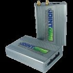

# Jointech - GP 6000

El rastreador GPS Jointech GP-6000 es un dispositivo de seguimiento de vehículos inteligente que incluye un perseguidor GPS, dispositivos externos y software. Este avanzado sistema de seguimiento GPS/GSM/GPRS está diseñado para satisfacer las complejas necesidades de gestión de activos móviles. Una de las características destacadas de este rastreador es su capacidad para soportar hasta 3 sensores diferentes al mismo tiempo, lo que permite adaptarse a los requisitos de aplicación avanzada de los clientes.

El GP-6000 ofrece varias opciones de comunicación, incluyendo TCP, administración remota a través del canal GPRS y administración remota a través del canal SMS. Esto permite una fácil y conveniente supervisión y control del vehículo en tiempo real. Además, este rastreador GPS cuenta con un odómetro incorporado, lo que permite un seguimiento preciso de la distancia recorrida por el vehículo. También ofrece la función de lectura automática de la caja negra, lo que proporciona información valiosa sobre el comportamiento del conductor y los eventos ocurridos durante el viaje.

En resumen, el rastreador GPS Jointech GP-6000 es una solución completa y confiable para la gestión de activos móviles. Con su capacidad de comunicación avanzada, funciones de administración remota y características adicionales como el odómetro incorporado y la lectura automática de la caja negra, este dispositivo ofrece un control total sobre los vehículos y una mayor eficiencia en la gestión de flotas.

### Características destacadas:

- Comunicación a través de TCP
- Administración remota a través del canal GPRS
- Administración remota a través del canal SMS
- Odómetro incorporado
- Lectura automática de la caja negra

