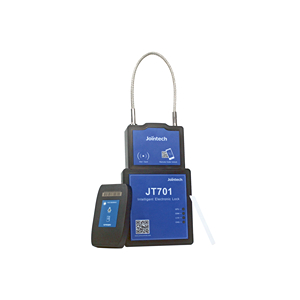

# Jointech - JT701

El JT701 es un candado rastreador inteligente de Jointech que integra posicionamiento GPS con un módulo celular y controles de acceso seguros. Diseñado para la seguridad en transporte, ofrece visibilidad de ubicación junto con monitoreo sensible a manipulaciones y registro de eventos de acceso para contenedores, remolques, furgonetas y camiones. El RFID integrado y el desbloqueo remoto por contraseña sustituyen a las llaves tradicionales y generan un historial auditable de eventos de custodia.

Como dispositivo compatible con Plaspy, el JT701 envía datos de posición, estado y alarmas a Plaspy para monitoreo en tiempo real, notificaciones y registro histórico. Esta integración convierte al JT701 en una opción práctica para operadores que requieren supervisión consolidada de la flota y control seguro de activos en una sola plataforma, facilitando auditorías, acelerando la respuesta ante incidentes y ofreciendo visibilidad operativa continua.

## Aspectos clave

- Candado rastreador compatible con Plaspy que combina posicionamiento GPS y conectividad celular para monitoreo continuo.
- Control de acceso seguro con RFID y desbloqueo remoto por contraseña que genera registros de acceso auditable.
- Detección de manipulación y alarmas por desbloqueo ilícito para proteger activos sellados en tránsito y almacenamiento.
- Diseño de bajo consumo y larga autonomía para soportar despliegues prolongados entre mantenimientos.
- Factor de forma compacto y resistente, adecuado para contenedores, remolques, furgonetas y camiones.
- Registro de historial y reportes de eventos que apoyan trazabilidad y procesos de cumplimiento.

## Cómo funciona con Plaspy

Cuando el JT701 transmite eventos de ubicación y seguridad a través de su enlace celular, Plaspy ingiere esa telemetría y la presenta junto con otros datos de la flota para un monitoreo y reporte unificados. Plaspy muestra la ubicación, eventos de manipulación, el historial de accesos y el estado del dispositivo para que usted pueda gestionar activos y responder a incidentes desde una interfaz única.

- Ubicación y estado en tiempo real en los mapas de Plaspy para visibilidad inmediata de activos.
- Alertas instantáneas por manipulación y desbloqueos ilegales enviadas a través de los canales de notificación de Plaspy.
- Registros de accesos y desbloqueos sincronizados con Plaspy para cadena de custodia y reportes de auditoría.
- Reporte de nivel de batería y salud básica del dispositivo en Plaspy para planificar mantenimientos.
- Correlación de eventos del JT701 con otras telemetrías en Plaspy para una visión operativa más amplia.

## Casos de uso típicos

- Monitoreo de seguridad de contenedores y carga durante tránsito y almacenamiento.
- Seguimiento de flotas de remolques y furgonetas con registro integrado de eventos de acceso.
- Custodia en la cadena de suministro y cumplimiento cuando se requieren auditorías.
- Protección de envíos de alto valor o regulados con alertas inmediatas por manipulación.
- Monitoreo remoto de activos donde la larga vida de batería y el bajo consumo son críticos.

## Por qué elegir este rastreador con Plaspy

El JT701 es una solución centrada en equipos que necesitan control de acceso seguro junto con reportes de ubicación confiables. Sus salidas ricas en eventos de bloqueo y manipulación complementan las capacidades de seguimiento, alerta y reporte de Plaspy, facilitando la aplicación de procedimientos antirobo y el mantenimiento de registros de custodia auditable sin procesos manuales adicionales.

Si busca un rastreador orientado a la seguridad que aporte posición, registros de acceso y datos de alarma a una sola plataforma de gestión de flotas, el JT701 emparejado con Plaspy ofrece una vía práctica para mejorar la conciencia operativa y acelerar la gestión de incidentes. Para más información sobre Plaspy y cómo la compatibilidad con dispositivos como el JT701 puede encajar en sus operaciones visite https://www.plaspy.com. Las especificaciones del producto, la disponibilidad y los datos del fabricante pueden cambiar con el tiempo, por favor verifique la información técnica y las opciones actuales en el sitio del fabricante https://www.jointcontrols.com/ antes de realizar la compra.
