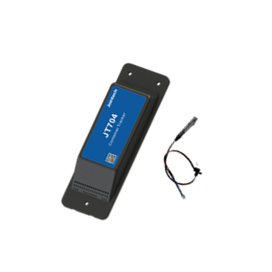

# Jointech - JT704A

El Jointech JT704A es un rastreador GPS compatible con Plaspy, diseñado para el transporte de contenedores y el monitoreo de activos de larga duración. Pensado para una instalación oculta y no invasiva, el JT704A ofrece posicionamiento confiable en múltiples modos \(GPS, BeiDou y LBS\) junto con sensores integrados de luz, temperatura y humedad, proporcionando a los equipos logísticos la ubicación y la telemetría ambiental necesarias para proteger la carga a lo largo de rutas ferroviarias, marítimas transfronterizas y de larga distancia.

La compatibilidad con Plaspy hace que el JT704A sea una opción ideal para la gestión de flotas y operadores de cadena de frío que requieren seguimiento en tiempo real, alertas anti-robo y una vida útil de batería de varios años. Con una gestión de energía inteligente y un diseño de ultra bajo consumo que permite tiempos de espera de hasta tres años, el JT704A reduce los ciclos de mantenimiento y facilita despliegues a gran escala de rastreadores de contenedores dentro de una plataforma de monitoreo basada en Plaspy.

## Aspectos clave

- Rastreador GPS de contenedores compatible con Plaspy, diseñado para el monitoreo de activos de larga duración y para instalación oculta.
- Posicionamiento en múltiples modos: GPS, BeiDou y LBS, para asegurar datos de ubicación resistentes en entornos diversos.
- Telemetría ambiental integrada: detección de luz y monitoreo de temperatura y humedad para visibilidad de la cadena de frío.
- Alimentación de ultra bajo consumo y gestión inteligente de energía permiten hasta tres años en modo de espera para despliegues de flota de bajo mantenimiento.
- Detección de manipulación y apertura de puertas cuando se combina con entradas o sensores externos, compatible con flujos de trabajo anti-robo.
- Formato discreto optimizado para contenedores ferroviarios, marítimos e intermodales.
- Diseñado para modos de seguimiento periódicos y en tiempo real para equilibrar la frecuencia de actualizaciones y la vida de la batería.

## Cómo funciona con Plaspy

El JT704A se integra con Plaspy para alimentar la telemetría de ubicación y ambiental en un panel de monitoreo unificado. Plaspy procesa los datos de posicionamiento multi-modo y lecturas de sensores del rastreador, permitiendo seguimiento en tiempo real, alertas configurables e informes históricos adaptados para flotas de contenedores y logística de cadena de frío. La integración se enfoca en un flujo de datos sin fisuras: las localizaciones, lecturas ambientales y señales de manipulación son analizadas por Plaspy y quedan disponibles para visualización, geocercas y notificaciones automatizadas.

- Actualizaciones de ubicación y telemetría en tiempo real: ubicaciones GPS/BeiDou/LBS, junto con lecturas de temperatura y humedad, enviadas a Plaspy para seguimiento en vivo y archivo histórico.
- Alertas de manipulación y apertura de puertas: la detección de luz y entradas externas pueden activar notificaciones anti-robo cuando se configuran a través de Plaspy.
- Modos de seguimiento periódicos: optimizan los intervalos de actualización para un modo de espera de varios años, manteniendo la visibilidad esencial para la gestión de la flota.
- Telemetría de cadena de frío: los datos de temperatura y humedad respaldan el monitoreo de contenedores refrigerados y los flujos de trabajo de cumplimiento regulatorio en Plaspy.
- Correlación de datos con otras telemetría de la flota: Plaspy puede correlacionar entradas del JT704A con datos de encendido/inmovilizador o monitoreo de combustible de dispositivos montados en vehículos, como parte de una solución de flota integrada.

## Resumen técnico

| Modelo | JT704A |
| --- | --- |
| Fabricante | Jointech |
| Posicionamiento | GPS, BeiDou y LBS \(posicionamiento de múltiples modos\) |
| Conectividad | Celular/LBS \(no especificadas las bandas de red ni las variantes celulares\) |
| Energía y Batería | Gestión de energía inteligente y diseño de ultra bajo consumo; standby de hasta tres años |
| Sensores Integrados | Sensor de luz; monitorización de temperatura y humedad |
| Interfaces | Admite detección de manipulación y apertura de puertas cuando se combina con entradas/sensores externos relacionados |
| Bluetooth | No especificado \(no se listan sensores/beacons Bluetooth\) |
| Gestión Remota | Existen opciones comerciales y soporte del fabricante; consulte para detalles de gestión remota y provisionamiento |
| Formato | Rastreador de contenedores discreto, de instalación oculta, para uso ferroviario, marítimo e intermodal |

## Casos de uso

- Antirrobo de la flota y seguridad de contenedores: instalación discreta y alertas de manipulación protegen cargas de alto valor durante el tránsito.
- Monitoreo de la cadena de frío: telemetría de temperatura y humedad a bordo protege las cargas refrigeradas y proporciona trazabilidad en Plaspy.
- Seguimiento de activos de larga distancia: standby de varios años y reportes periódicos reducen el mantenimiento de parques de contenedores en rutas extensas.
- Logística intermodal y transfronteriza: posicionamiento en múltiples modos garantiza la localización en los segmentos marítimos, ferroviarios e interiores.
- Visibilidad para contenedores especiales y unidades de refrigeración: la detección ambiental y de luz combinada con los datos de ubicación mejora las decisiones operativas.

## Por qué elegir este rastreador con Plaspy

Elegir el Jointech JT704A para la integración con Plaspy aporta un valor específico para operaciones centradas en contenedores. Su combinación de posicionamiento en múltiples modos y sensores ambientales integrados ofrece a los gestores logísticos seguimiento en tiempo real y telemetría sin necesidad de instalaciones invasivas. El diseño de ultra bajo consumo y la autonomía de hasta tres años reducen los ciclos de sustitución de baterías y los costos operativos de toda la flota a lo largo de su vida útil. Al conectarse a Plaspy, los datos del JT704A se vuelven accionables: permiten geocercas, alertas ante posibles manipulaciones o eventos de apertura de puertas y generación de informes de largo plazo para la gestión de la flota y el cumplimiento de la cadena de frío.

Para operaciones que requieren una telemetría de vehículo más amplia, como eventos de encendido, control del inmovilizador o monitoreo de combustible, Plaspy puede correlacionar los datos del contenedor JT704A con otros dispositivos montados en vehículos y sensores Bluetooth para crear una visión completa del estado y movimiento de los activos. Contacte con Jointech o con su representante de Plaspy para discutir opciones de implementación, capacidades de gestión remota y variantes comerciales más adecuadas para su flota y los requisitos regulatorios.

