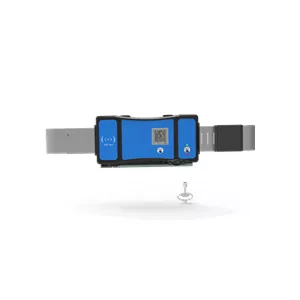

# Jointech - JT705C

El JT705C de Jointech es un candado inteligente con monitoreo de video, diseñado para proporcionar una seguridad integral en la transportación y almacenamiento de bienes valiosos. Este dispositivo combina tecnología de punta con características avanzadas para ofrecer tranquilidad y control total sobre la seguridad de la carga.

Entre las características más destacadas del JT705C se encuentra su capacidad de seguimiento en tiempo real. Gracias a esta función, los usuarios pueden conocer en todo momento la ubicación exacta de sus contenedores o camiones, lo que asegura una visibilidad y control completos durante el viaje de la carga.

Además, este candado incluye una funcionalidad de monitoreo de video remoto. Esta característica permite supervisar a distancia y en cualquier momento el exterior de los contenedores o camiones, facilitando así la vigilancia de los bienes transportados, incluso cuando no se está físicamente presente.

El JT705C también ofrece la posibilidad de desbloqueo remoto en línea y acceso local fuera de línea. Esto significa que se puede gestionar el candado de manera conveniente a distancia, pero también se cuenta con la opción de un desbloqueo rápido y sencillo en el lugar cuando sea necesario.

En términos de seguridad, el JT705C va más allá con su monitoreo de actitud y capacidad de alarma, detectando impactos y vuelcos en tiempo real. Esto agrega una capa extra de protección, asegurando que cualquier accidente o percance se detecte y atienda de inmediato.

La protección contra accesos no autorizados y manipulaciones es una gran preocupación en la seguridad de carga. Por ello, el JT705C está equipado con características que activan alarmas inmediatas en caso de desbloqueo ilegal o manipulación, garantizando así la protección de los bienes contra cualquier acceso o interferencia no autorizados.

Otra característica importante del JT705C es la recolección de evidencia en video activada por eventos personalizados. Esto permite configurar el candado para grabar videos basados en eventos específicos, facilitando la recolección de pruebas valiosas para análisis y propósitos de documentación.

El JT705C es ideal para una amplia gama de aplicaciones, incluyendo el transporte de bienes valiosos, la supervisión de activos aduaneros y el control de riesgos financieros en la cadena de suministro. Sus características y funcionalidades avanzadas lo convierten en la opción perfecta para empresas e individuos que priorizan la seguridad y protección de su carga.

Elige el JT705C de Jointech, el candado inteligente con monitoreo de video, y obtén la tranquilidad de saber que tus activos valiosos están protegidos en todo momento.

