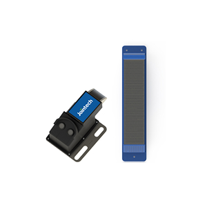

# Jointech - JT706

El Jointech JT706 es un rastreador GPS de perfil bajo diseñado para el monitoreo de contenedores y el transporte seguro de mercancías. Pensado para montarse de forma discreta en las rejillas de ventilación de los contenedores, el JT706 combina posicionamiento híbrido con sensado ambiental continuo para ofrecer datos persistentes de ubicación y condiciones en contenedores refrigerados y secos, envíos intermodales y cargas bajo supervisión aduanera. Su formato oculto reduce el riesgo de manipulación y permite mantener visibilidad continua sobre el movimiento y el estado a bordo.

Como dispositivo compatible con Plaspy desde el primer momento, el JT706 puede transmitir fijaciones de ubicación y telemetría ambiental directamente a la plataforma Plaspy. Esta integración brinda a los equipos logísticos visibilidad centralizada para monitoreo de flotas, alertas automáticas, informes históricos y flujos de trabajo que apoyan medidas antirobo y cumplimiento normativo. Por eso el JT706 es relevante para operadores que requieren inteligencia a nivel de contenedor dentro de una visión más amplia de flota y cadena de suministro.

## Características principales

- Rastreador compatible con Plaspy que ofrece monitoreo continuo de ubicación y condiciones para contenedores
- Posicionamiento híbrido con GPS y LBS para mejorar la cobertura en zonas con visibilidad limitada de satélites
- Telemetría continua de temperatura y humedad interna para supervisar carga refrigerada y perecedera
- Detección de estado de puertas e indicadores inteligentes de carga vacía o llena para mayor seguridad y control operativo
- Montaje de bajo perfil y oculto diseñado para encajar en puntos de ventilación del contenedor y reducir manipulaciones
- Alertas oportunas y datos de condición para revisiones históricas, manejo de alarmas y gestión remota
- Ideal para trayectos de larga distancia, entornos intermodales y cargas bajo supervisión aduanera para reducir pérdidas y cumplir normativas

## Cómo funciona con Plaspy

Al conectarse a Plaspy, el JT706 envía posición y telemetría ambiental a la plataforma para que usted pueda visualizar el movimiento del contenedor, monitorear eventos de apertura de puertas y reaccionar ante desviaciones de temperatura o humedad. Plaspy integra las fijaciones de ubicación con las lecturas de los sensores y presenta esos datos combinados para supervisión operativa, alertas e informes.

- Actualizaciones en tiempo real de ubicación y telemetría para seguimiento en tramos por carretera, ferrocarril y mar
- Eventos de apertura y cierre de puertas reportados a Plaspy para alertas antirobo y registros de acceso
- Alimentación de temperatura y humedad interna para detectar desviaciones en la refrigeración y riesgos de la carga
- Indicadores inteligentes de carga vacía o llena que facilitan la planificación logística y chequeos de inventario
- Revisión histórica de datos y manejo de alarmas a nivel de plataforma para cumplimiento y análisis

## Casos de uso habituales

- Monitoreo antirobo de contenedores con alertas instantáneas ante accesos no autorizados
- Supervisión de carga refrigerada para proteger productos perecederos durante el transporte
- Supervisión aduanera y generación de informes de cumplimiento con registros verificables de ubicación y condiciones
- Visibilidad multimodal e intermodal en tramos por mar, ferrocarril y carretera
- Logística de larga distancia donde el montaje oculto y la telemetría continua reducen el riesgo de pérdidas

## Por qué elegir este rastreador con Plaspy

El JT706 es una solución focalizada para operadores que requieren monitoreo discreto y resistente de contenedores, integrado en una plataforma de gestión de flotas más amplia. Su combinación de posicionamiento híbrido y sensado ambiental continuo proporciona la visibilidad a nivel de contenedor que complementa la telemática de vehículos y las operaciones en sitio gestionadas en Plaspy. Para organizaciones que manejan cargas refrigeradas, mercancías de alto valor o envíos supervisados por aduanas, el JT706 ayuda a detectar incidentes de forma temprana y a respaldar respuestas orientadas por flujos de trabajo.

Learn more about how Plaspy can centralize container and fleet insights on the main website https://www.plaspy.com. Product specifications, availability, and manufacturer details can change over time, so please verify current specifications and installation guidance on the manufacturer's official website https://www.jointcontrols.com/.
