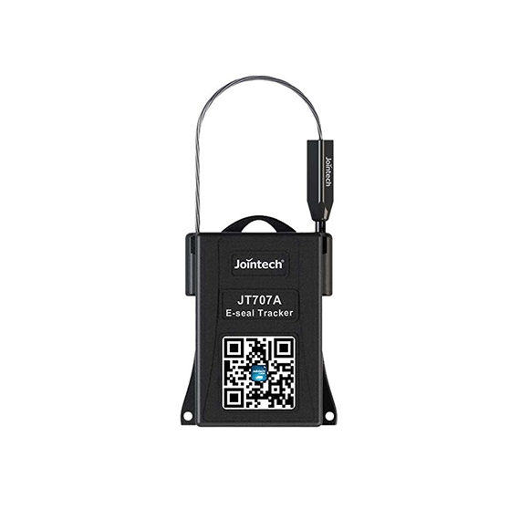

# Jointech - JT707A

# JT707A Intelligent GPS Seal Tracker

El JT707A es un rastreador GPS compatible con Plaspy diseñado específicamente para el sellado de mercancías y la seguridad de la cadena de suministro. Al combinar seguimiento en tiempo real basado en GNSS con monitoreo seguro del sello, el JT707A ofrece telemetría de ubicación continua y alertas instantáneas de manipulación y apertura del sello para que los equipos logísticos puedan detectar accesos no autorizados a lo largo de envíos por carretera, ferrocarril y transfronterizos.

El dispositivo admite opciones de batería recargable y desechable para adaptarse a envíos de corta duración o al monitoreo de activos a largo plazo, e se integra con flujos de gestión de flotas y supervisión aduanera a través de plataformas de gestión remota. Cuando se utiliza con Plaspy, el JT707A mejora la visibilidad, agiliza la auditoría con registros de eventos y reproducción, y fortalece los procedimientos de anti-robo y respuesta ante manipulaciones para contenedores, furgonetas, camiones y paquetes.

## Puntos clave

- Rastreador GPS compatible con Plaspy que combina telemetría de ubicación y monitoreo seguro del sello para una protección de la carga de extremo a extremo.
- Seguimiento en tiempo real y notificaciones instantáneas de manipulación y apertura del sello para respaldar una respuesta rápida a incidentes y flujos de trabajo anti robo.
- Opciones de alimentación flexibles con configuraciones de batería recargable y desechable para adaptarse a despliegues de corto y largo plazo.
- Intervalos de reporte configurables y alertas de geocerca que reducen el tráfico de datos sin sacrificar un historial de eventos apto para auditoría.
- Instalación no invasiva y rápida para un despliegue rápido en flotas de contenedores, remolques, furgonetas y paquetes logísticos.
- Registro de eventos y reproducción histórica que simplifican el cumplimiento, la supervisión aduanera y la generación de informes de cadena de custodia.
- Diseñado para entornos de logística y expedición de mercancías donde el estado fiable del sello y la ubicación son esenciales.

## Cómo funciona con Plaspy

El JT707A envía fijaciones de ubicación GNSS y telemetría del estado del sello a plataformas de seguimiento. Cuando se integra con Plaspy, esos flujos de datos se mapean en el panel de control y el motor de alertas de Plaspy, de modo que los equipos de operaciones pueden monitorear los envíos en tiempo real, recibir notificaciones automáticas y revisar una trazabilidad auditable de los eventos.

- Actualizaciones de ubicación y telemetría en tiempo real entregadas a Plaspy para mantener una conciencia situacional continua.
- Detección de manipulación y apertura del sello con alertas inmediatas para activar los protocolos de seguridad y notificaciones móviles.
- Intervalos de reporte configurables para equilibrar la duración de la batería y la resolución de rastreo en los tableros de Plaspy.
- Alertas de geocerca y registro de eventos disponibles en Plaspy para cumplimiento, revisiones aduaneras y análisis de incidentes.
- Reproducción histórica de ubicaciones y eventos del sello para apoyar auditorías y gestión de reclamaciones.

## Resumen técnico

| Modelo | JT707A |
| --- | --- |
| Conectividad | Informes de ubicación basados en GNSS para seguimiento en tiempo real y telemetría |
| Bandas | No especificado en la descripción del producto |
| Alimentación y batería | Opciones de batería recargable y desechable \(seleccione por implementación\) |
| Interfaces | Monitoreo seguro del sello y detección de manipulación; intervalos de reporte configurables y eventos de geocerca |
| GNSS | Posicionamiento GNSS para reporte continuo de ubicación |
| Bluetooth | No especificado en la descripción del producto |
| Gestión remota | Gestión remota a través de la plataforma de seguimiento Jointech; compatible con Plaspy para monitorización y alertas centralizadas |
| Formato | Rastreador de sellos compacto diseñado para contenedores, furgonetas/camiones, paquetes logísticos y unidades de carga |

## Casos de uso

- Seguridad de contenedores en envíos internacionales y transfronterizos: supervisar la integridad y ubicación del sello durante el tránsito.
- Protección de remolques y cargas en camión: alertas en tiempo real cuando se rompe un sello o se detecta manipulación, permitiendo una rápida respuesta ante incidentes.
- Monitoreo de paquetes y envíos de alto valor: combinar telemetría GNSS y estado del sello para reducir riesgos de robo y desvíos.
- Operaciones logísticas y de expedición de mercancías: registros centralizados de eventos y reproducción histórica para apoyar auditorías e inspecciones aduaneras.
- Fletamento de corta duración y transporte multimodal: use la opción de batería desechable para envíos de una sola etapa y recargable para rutas recurrentes.

## Por qué elegir este rastreador con Plaspy

Elegir el JT707A como rastreador GPS compatible con Plaspy aporta valor específico para los equipos de seguridad de la cadena de suministro y gestión de flotas. Su telemetría de ubicación basada en GNSS y el monitoreo seguro del sello reducen la exposición a robos y manipulaciones, al tiempo que mantienen un historial de auditoría completo que se integra directamente en las herramientas de alertas e informes de Plaspy. Las opciones de energía flexibles hacen que el JT707A sea práctico tanto para envíos puntuales como para el monitoreo de activos a largo plazo, y su instalación no invasiva facilita un despliegue rápido en toda la flota.

Cuando se utiliza junto con Plaspy, el JT707A complementa sistemas de telemetría más amplios, permitiendo a los operadores correlacionar eventos del sello con la ubicación del vehículo, el historial de rutas y otras señales de la flota. También funciona en conjunto con otros dispositivos compatibles con Plaspy \(por ejemplo, módulos de encendido o inmovilizador, monitoreo de combustible o sensores Bluetooth proporcionados por separado\) para crear una visión integral de seguridad y operaciones sin depender de una solución de punto único.

## Notas de integración y despliegue

El despliegue está diseñado para ser directo: conecte el JT707A en el punto de sellado, configure los intervalos de reporte para que coincidan con la estrategia de batería y conecte el dispositivo a Plaspy para tableros centralizados, reglas de geocerca y alertas automatizadas. Para flotas grandes o envíos frecuentes, aproveche las funciones de agrupación y reporte de Plaspy para escalar el monitoreo y la respuesta a incidentes a lo largo de rutas y clientes.

