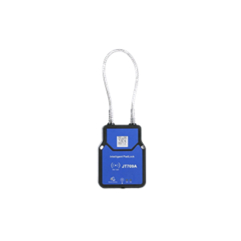

# Jointech - JT709A

El JT709A Smart Electronic Lock es un dispositivo de seguridad para activos diseñado especialmente para proteger envíos de carga de larga duración combinando posicionamiento y control de acceso. Integra posicionamiento triple mediante BeiDou, GPS y LBS, junto con métodos de acceso locales como Bluetooth y RFID, para ofrecer datos de localización y eventos resistentes a manipulaciones en contenedores sellados, remolques y otros activos de alto valor. El JT709A está pensado para la logística industrial, con protección robusta IP67, larga autonomía en standby y una vida mecánica preparada para ciclos frecuentes de apertura.

Como el JT709A envía continuamente telemetría de posición y eventos, es una solución natural para usuarios de Plaspy que requieren visibilidad en tiempo real y una cadena de custodia auditable. Plaspy puede recibir las actualizaciones de ubicación del JT709A, los eventos de apertura y manipulación, así como el estado de batería, para ofrecer monitoreo, alertas e informes sobre una flota o conjunto de activos asegurados. Esto hace que el JT709A sea valioso en operaciones que necesitan control físico de acceso integrado con seguimiento en un solo dispositivo.

## Puntos clave

- Cerradura electrónica y rastreador GPS compatible con Plaspy para seguimiento en tiempo real e historial seguro de activos sellados
- Posicionamiento triple con BeiDou, GPS y LBS para mantener actualizaciones de ubicación en distintos entornos de transporte
- Múltiples métodos de acceso, incluyendo escaneo por código vía Bluetooth y acceso por tarjeta RFID, para flujos de trabajo flexibles en sitio
- Construcción robusta con grado IP67 y diseño resistente a manipulaciones para proteger la carga y reducir el riesgo de robo
- Arquitectura de muy bajo consumo con autonomía en espera superior a seis meses para reducir la frecuencia de mantenimiento
- Durabilidad mecánica superior a 20,000 ciclos de apertura para uso intensivo en operaciones logísticas
- Telemetría de eventos que incluye apertura, manipulación y estado de batería para respaldar reportes de seguridad y operativos

## Cómo funciona con Plaspy

Plaspy recibe las posiciones y el flujo de eventos del JT709A y pone esa información a disposición en paneles, informes y herramientas de alertas, permitiendo que los equipos monitoreen activos sellados durante el tránsito y almacenamiento. La integración ofrece supervisión operativa sin reemplazar la telemática vehicular existente, al enfocarse en la seguridad de activos y la cadena de custodia.

- Ubicación en tiempo real e historial de posiciones para ver movimientos y líneas de tiempo
- Notificaciones de apertura y manipulación capturadas desde acceso por Bluetooth y RFID para activar alertas
- Informes de batería y salud del dispositivo para planificar mantenimiento y reducir visitas imprevistas
- Geocercas y alertas basadas en reglas para detectar aperturas no autorizadas o movimientos inesperados
- Rutas de auditoría e informes de cadena de custodia para cumplimiento y revisión de incidentes
- Manejo de comandos de apertura remota cuando la operación remota esté configurada y permitida

## Casos de uso típicos

- Sellado de contenedores y monitoreo anti robo para envíos internacionales e intermodales
- Seguridad de puertas de remolques y almacenes donde se requiere un registro auditable de desellado y control de acceso
- Flujos de trabajo de supervisión e inspección aduanera que necesitan historial de ubicación preciso y registros de apertura
- Tránsito de mercancías de alto valor donde sellos robustos y de larga duración reducen mantenimientos y mejoran la capacidad de respuesta
- Operaciones logísticas que buscan disminuir visitas innecesarias verificando el estado del sello de forma remota

## Por qué elegir este rastreador con Plaspy

El JT709A combina el control de acceso a nivel de activo con posicionamiento robusto y telemetría de eventos, ofreciendo a las organizaciones una solución enfocada en la seguridad de la carga y el seguimiento de la cadena de custodia. Su larga autonomía y diseño resistente reducen la carga operativa, mientras que los eventos de apertura y manipulación enriquecen los informes y las alertas de Plaspy para una respuesta más rápida ante incidentes.

Para equipos que requieren sellado integrado, historial de ubicación preciso y métodos de acceso en sitio, el JT709A aporta un valor práctico cuando se utiliza con Plaspy. El dispositivo complementa estrategias más amplias de gestión de flota y activos al suministrar telemetría de seguridad y visibilidad de ubicación confiable donde el control de activos sellados es crítico.

Learn more about Plaspy on the main website https://www.plaspy.com. Product specifications, availability, and manufacturer details can change over time, so verify current specifications and documentation with the manufacturer at https://www.jointcontrols.com/.
