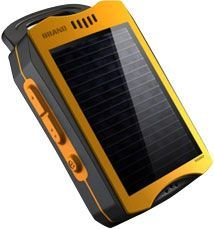

# Jointech - JT 600

El rastreador GPS JT600 de Jointech es una solución de seguimiento solar que ofrece una duración de batería excepcional. Con su capacidad de trabajar más de 3 meses sin necesidad de recarga en el modo de trabajo de SMS, es ideal para aplicaciones que requieren un seguimiento prolongado sin interrupciones.

Una de las ventajas clave del JT600 es su uso de energía solar y su resistencia al agua, lo que lo hace adecuado para su uso en entornos exteriores. Además, su tiempo de espera de hasta dos meses garantiza un seguimiento continuo sin la necesidad de recargar con frecuencia.

El JT600 cuenta con una serie de características destacadas que lo convierten en una opción confiable para el seguimiento GPS. Ofrece comunicación TCP / UDP / SMS y seis modos de trabajo diferentes, lo que permite una flexibilidad en la configuración y el uso del dispositivo. Además, cuenta con 64 geo-cercas y una cerca temporal, lo que facilita la delimitación de áreas específicas y la generación de alertas cuando el dispositivo entra o sale de estas áreas.

Otras características notables del JT600 incluyen la capacidad de redireccionar llamadas y realizar seguimiento de teléfonos móviles, varias alarmas como la alarma de entrada / salida de cerca, la alarma de cerca temporal, SOS y alarma de bajo consumo, y una linterna LED y señal de SOS estándar internacional. Además, cuenta con una señal de GSM / GPS y una batería de alimentación.

En resumen, el rastreador GPS JT600 de Jointech es una opción confiable y duradera para aplicaciones de seguimiento que requieren una larga duración de la batería y resistencia al agua. Con sus características destacadas y su capacidad de energía solar, es una solución versátil para una variedad de necesidades de seguimiento.

