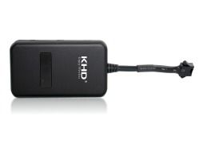

# KHD - KG100

El KHD KG100 es un rastreador GPS profesional diseñado para el seguimiento de vehículos y motocicletas. Combina posicionamiento por GPS o GLONASS con comunicación inalámbrica GSM para ofrecer reportes de ubicación y notificaciones de eventos fiables. El fabricante destaca su alta sensibilidad de recepción y el soporte de comunicación hacia servidores backend mediante GPRS/GSM o SMS, lo que permite seguimiento en tiempo real, reproducción histórica de rutas, geocercas y funciones de control remoto.

Como dispositivo compatible con Plaspy, el KG100 puede enviar datos de ubicación y eventos a la plataforma de flotas de Plaspy para su monitoreo y generación de informes. Dado que el KG100 admite comunicación con plataformas de seguimiento personalizadas desde equipos de escritorio y dispositivos móviles, se integra de forma natural con Plaspy para ofrecer visibilidad de los movimientos de los vehículos, alertas de geocercas, reproducción de historial y flujos de trabajo de comandos remotos, lo que lo convierte en una opción práctica para organizaciones que requieren una integración sencilla con la plataforma.

## Aspectos clave

- Diseñado específicamente para el seguimiento de vehículos y motocicletas con un enfoque profesional
- Posicionamiento por GPS o GLONASS con énfasis en alta sensibilidad de recepción
- Comunica con servidores backend mediante GPRS o GSM y puede usar SMS para mensajes
- Ofrece seguimiento en tiempo real, reproducción histórica de rutas, geocercas y funciones de control remoto
- Funciona con plataformas de seguimiento personalizadas desde entornos de escritorio y smartphones
- Flexible para integrarse en sistemas de gestión de flotas de terceros, incluido Plaspy

## Cómo funciona con Plaspy

Al utilizarse con Plaspy, el KG100 envía datos de posición y eventos al backend de Plaspy, donde se procesan para paneles, alertas e informes. Plaspy consume esos datos para mostrar mapas en vivo, reproducir historiales y generar alertas operativas que permitan a los encargados de flota tomar medidas oportunas.

- Mostrar actualizaciones de ubicación en tiempo real en los mapas de Plaspy para visibilidad continua
- Reproducir rutas históricas y eventos de parada para análisis e informes
- Configurar geocercas en Plaspy y recibir alertas cuando se crucen los límites
- Enviar comandos de control remoto mediante flujos de trabajo de Plaspy cuando el KG100 admita esas acciones
- Consolidar múltiples dispositivos KG100 en paneles de monitoreo de flota y en informes programados

## Casos de uso típicos

- Flotas de vehículos empresariales que requieren supervisión centralizada de ubicaciones
- Seguimiento de motocicletas y vehículos pequeños para seguridad y control de rutas
- Gestión de vehículos de alquiler con reproducción de historial y aplicación de geocercas
- Operaciones de reparto y logística que requieren seguimiento en vivo y revisión de rutas
- Flujos de trabajo de seguridad y recuperación de activos mediante geocercas y funciones de control remoto

## Por qué elegir este rastreador con Plaspy

El KG100 es una opción sólida para organizaciones que buscan un rastreador vehicular o para motocicletas sencillo de integrar con una plataforma de flotas moderna. Su combinación de capacidades de posicionamiento, opciones de comunicación con el backend y funciones como geocercas y reproducción de rutas lo hacen adecuado para tareas habituales de gestión de flotas. Integrar el KG100 con Plaspy ofrece a los equipos una única interfaz para visibilidad en vivo, alertas y análisis histórico sin necesidad de desarrollar una plataforma a medida.

Dado que el KG100 es compatible con plataformas de seguimiento habituales y admite configuración desde PC y móviles, resulta una opción práctica para flotas que valoran la interoperabilidad y la integración simple. Plaspy puede ayudarle a convertir los datos del dispositivo en información operativa, además de proporcionar los paneles e informes necesarios para la supervisión diaria de la flota.

Para saber más sobre cómo Plaspy funciona con rastreadores vehiculares como el KHD KG100, visite https://www.plaspy.com. Las especificaciones del producto, su disponibilidad y los datos del fabricante pueden cambiar con el tiempo, por lo que le recomendamos verificar las especificaciones actuales y la documentación oficial en el sitio del fabricante http://www.khd.hk.
