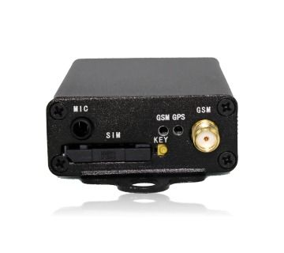

# KHD - KG300

El KHD KG300 es un rastreador GNSS diseñado para el seguimiento y monitoreo de vehículos, así como para aplicaciones de publicidad a bordo. Combina comunicación celular con posicionamiento por GPS o GLONASS para ofrecer información de ubicación fiable y reportes de eventos. El KG300 puede enviar datos a servidores backend mediante GPRS/GSM y también operar por SMS para alertas y comandos sencillos, lo que lo hace adecuado para diversas necesidades de seguimiento vehicular.

Como dispositivo compatible con Plaspy, el KG300 puede alimentar la plataforma de gestión de flotas con datos de ubicación y eventos para visualización, alertas e informes operativos. Su capacidad para reportar emergencias, cruces de geocercas y transmitir información programada lo convierte en una opción práctica para organizaciones que desean centralizar la supervisión de su flota, monitorear rutas publicitarias o automatizar notificaciones basadas en eventos.

## Características principales

- Rastreo de vehículos por GNSS con soporte para GPS y GLONASS
- Comunicación celular mediante GPRS/GSM y soporte por SMS para reportes al backend
- Reportes en tiempo real de alertas de emergencia y eventos de geocerca
- Funciones de programación y reportes temporizados para monitoreo de rutas recurrentes
- Diseñado para monitoreo vehicular y para casos de uso de publicidad en vehículos
- Integración flexible con plataformas personalizadas desde PC o smartphone

## Cómo funciona con Plaspy

El KG300 puede enviar mensajes de ubicación y eventos a Plaspy, donde esos datos se ingieren para monitoreo y análisis. Una vez conectado, Plaspy ofrece vistas de tablero, alertas e informes que transforman los mensajes crudos del dispositivo en información operativa útil para operadores y administradores de flota.

- Ubicación en vivo y reproducción histórica para vehículos individuales y grupos
- Alertas de geocerca y notificaciones de cruces de límites gestionadas a través de Plaspy
- Notificaciones de emergencia y eventos visibles en los flujos de alertas y paneles de Plaspy
- Reportes programados y monitoreo de rutas para apoyar operaciones recurrentes
- Visibilidad a nivel de flota sobre cumplimiento de rutas, tiempos de inactividad y asignación de activos
- Soporte para casos de uso de publicidad en vehículos, rastreando rutas y cumplimiento de horarios

## Casos de uso típicos

- Gestión de flotas para vehículos comerciales y flotas de servicio
- Monitoreo de vehículos utilizados para publicidad en ruta y verificación de itinerarios
- Seguridad y respuesta rápida donde se requieren alertas de emergencia
- Seguimiento de rutas programadas para entregas, servicios de transporte y shuttles
- Supervisión de vehículos de alquiler y compartidos con reportes y alertas básicas

## Por qué elegir este rastreador con Plaspy

El KG300 combina posicionamiento GNSS práctico con opciones flexibles de reporte celular, lo que lo hace adecuado para organizaciones que necesitan seguimiento vehicular sencillo y reportes de eventos. Al conectarlo a Plaspy, los datos del dispositivo forman parte de una plataforma gestionada que soporta alertas, informes y supervisión operativa sin requerir cambios profundos en los flujos de trabajo existentes.

Dado que el KG300 se comunica mediante canales backend estándar y admite configuraciones de plataforma personalizadas usando dispositivos comunes, es una opción sensata para equipos que desean consolidar el seguimiento en Plaspy manteniendo una implementación y gestión relativamente simples. Plaspy puede mapear los mensajes entrantes del KG300 en paneles de flota, reglas de geocerca y reportes programados para convertir las señales del dispositivo en información operativa útil.

Si desea conocer más sobre cómo el KHD KG300 puede integrarse con Plaspy, visite https://www.plaspy.com para explorar las funciones de la plataforma y las opciones de compatibilidad. Las especificaciones del producto, la disponibilidad y los detalles del fabricante pueden cambiar con el tiempo, por lo que verifique las especificaciones y la documentación actuales con el fabricante en http://www.khd.hk.
