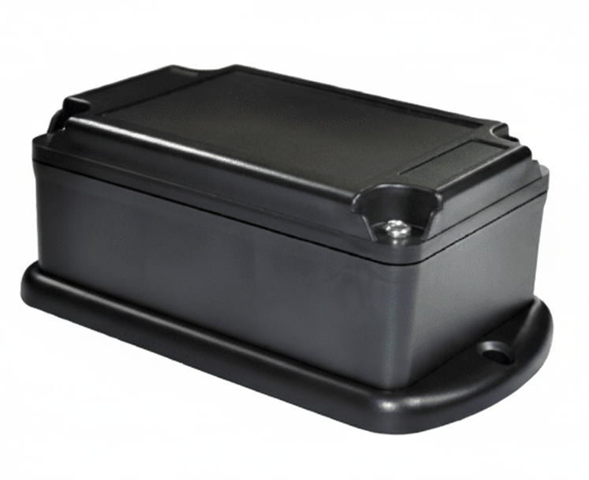

# Laipac - Kamel S

El Kamel S es un rastreador GPS compacto y autónomo diseñado para el monitoreo encubierto y prolongado de activos con o sin alimentación eléctrica. Pensado para uso exterior, combina posicionamiento GNSS y conectividad 4G LTE con una batería Li‑Ion polimérica de alta capacidad y una carcasa con clasificación IP68, ofreciendo visibilidad de ubicación confiable para remolques, contenedores, maquinaria de construcción y equipos en alquiler.

Como localizador compatible con Plaspy, el Kamel S aporta flujos de ubicación constantes y telemetría de movimiento al panel centralizado de la plataforma. Su configuración de reportes y detección de eventos lo hace adecuado para gestores de flotas que requieren seguimiento de bajo mantenimiento, alertas accionables e informes consolidados en Plaspy sin alterar los procesos de gestión de activos.

## Aspectos destacados

- Rastreador compatible con Plaspy para seguimiento en tiempo real y supervisión de flotas centralizada
- Conectividad 4G LTE combinada con posicionamiento GNSS para actualizaciones continuas de ubicación
- Batería Li‑Ion polimérica de larga duración para operación extendida en activos sin alimentación
- Resistencia al agua IP68 y carcasa robusta para entornos exteriores exigentes
- Opciones de montaje con imán o instalación permanente para colocación encubierta o a largo plazo
- Detección integrada de movimiento y sensor G para alertas por movimiento, remolque y eventos
- Informes configurables por intervalo de tiempo y distancia recorrida para soportar registros de kilometraje

## Cómo funciona con Plaspy

Al integrarse con Plaspy, el Kamel S transmite ubicaciones GNSS y telemetría de movimiento a la plataforma para brindar visibilidad casi en tiempo real. Plaspy procesa los reportes del dispositivo, convierte los eventos de los sensores en alertas y centraliza dispositivos, grupos y rutas históricas para que su equipo pueda supervisar activos, aplicar geocercas y gestionar excepciones desde un único panel.

- Actualizaciones de ubicación y telemetría en tiempo real para mantener la conciencia situacional
- Alertas por eventos como remolque, violaciones de geocercas y otros disparadores basados en movimiento
- Informes configurables de kilometraje y distancia recorrida para apoyar en la utilización y facturación
- Consolidación de flujos de ubicación del Kamel S con gestión por grupos y rutas históricas
- Notificaciones e informes centralizados para optimizar la supervisión operativa

## Casos de uso típicos

- Recuperación encubierta de activos y monitoreo antirrobo para remolques y equipos remolcados
- Seguimiento de maquinaria en obras de construcción donde se requiere larga autonomía y diseño resistente
- Control de utilización y facturación por distancia en equipos de alquiler y arrendamiento
- Monitoreo de despliegue rápido para contenedores y activos utilizados de forma intermitente
- Protección prolongada de inventario remoto o de activos sin alimentación eléctrica

## Por qué elegir este rastreador con Plaspy

El Kamel S es una opción práctica para organizaciones que necesitan un rastreo discreto y de bajo mantenimiento integrado con una plataforma de flotas centralizada. Su equilibrio entre larga duración de batería, protección robusta y opciones de montaje flexibles encaja en escenarios donde el acceso físico continuado a los activos es limitado o se prefiere una colocación encubierta. Integrar el Kamel S con Plaspy incorpora esos datos de ubicación y eventos en una única vista operativa, reduciendo el esfuerzo necesario para monitorear activos distribuidos y responder a incidentes.

Si desea saber más sobre cómo Plaspy puede utilizar los datos del Kamel S para mejorar la visibilidad de activos y los informes de flota visite https://www.plaspy.com. Las especificaciones del producto, la disponibilidad y los detalles del fabricante pueden cambiar con el tiempo, por lo que verifique la información técnica y de despliegue actual con el fabricante en https://laipac.com/.
