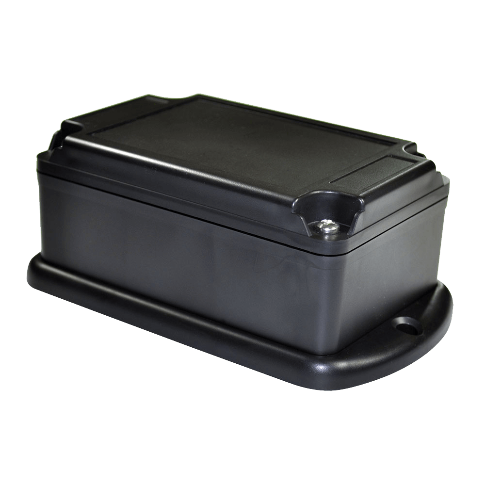

# Laipac - Kamel S - NA

El Laipac Kamel S - NA es un rastreador GPS compacto y versátil pensado para mejorar la visibilidad y la gestión de activos portátiles y equipos rastreados. Emplea conectividad 4G LTE combinada con posicionamiento GNSS para ofrecer actualizaciones de ubicación en tiempo real, e integra funciones como informes por intervalo de tiempo y distancia recorrida, alertas de remolque, exceso de velocidad y violaciones de geocerca. El equipo cuenta con resistencia al agua IP68 y está diseñado para un despliegue rápido sin instalación, lo que lo hace adecuado para una amplia variedad de escenarios de seguimiento de activos.

Como dispositivo compatible con Plaspy, el Kamel S - NA puede enviar datos de ubicación y eventos a las herramientas de gestión de flotas y activos de Plaspy para soportar flujos de trabajo de monitoreo, generación de informes y alertas. Usted puede aprovechar las funciones de reporte y notificaciones del rastreador dentro de Plaspy para obtener mejores métricas de utilización, aplicar políticas operativas y recibir avisos oportunos sobre movimientos de activos o eventos de límite, todo desde la plataforma de Plaspy.

## Características principales

- Conectividad 4G LTE con GNSS para rastreo de ubicación en tiempo real
- Informes por intervalo de tiempo y por distancia para monitorear patrones de uso
- Alertas de remolque, exceso de velocidad y violaciones de geocerca para notificaciones inmediatas
- No requiere instalación, conveniente para fijación y redeploy rápido
- Resistencia al agua IP68 para uso en entornos exteriores exigentes
- Batería de polímero de iones de litio de larga duración para operación prolongada en campo
- Compatible con plataformas de monitoreo, incluida integración con Plaspy para administración centralizada

## Cómo funciona con Plaspy

Al integrarse con Plaspy, el Kamel S - NA aporta datos continuos de posición y eventos que Plaspy presenta en paneles, mapas e informes para dar visibilidad operativa a su equipo. Plaspy ingiere las alertas y los datos de reporte del dispositivo para que usted pueda centralizar el monitoreo de flotas y activos mixtos.

- Visibilidad de ubicación en tiempo real en los mapas de Plaspy para los activos rastreados
- Informes programados y bajo demanda por intervalo y distancia para evaluar la utilización
- Notificaciones inmediatas en Plaspy por remolque, exceso de velocidad y eventos de geocerca
- Registros históricos de eventos y reproducción para investigaciones y revisiones operativas
- Monitoreo y agrupamiento a nivel de flota para gestionar múltiples unidades Kamel S simultáneamente
- Reglas de alerta y frecuencia de reportes personalizables en Plaspy según sus necesidades operativas

## Casos de uso típicos

- Seguimiento de equipos en alquiler o préstamo para controlar uso y devoluciones
- Monitoreo de activos portátiles e inventario que se trasladan entre sitios
- Despliegues temporales donde se prefieren rastreadores de fijación rápida sobre instalaciones permanentes
- Seguimiento de equipos de campo y exteriores que se benefician de la protección IP68
- Análisis de utilización de flota y activos mediante informes por intervalo y distancia

## Por qué elegir este rastreador con Plaspy

El Kamel S - NA es una opción práctica cuando necesita un rastreador portátil y robusto que pueda desplegarse con rapidez y ofrecer métricas claras de uso. Sus funciones de reporte y tipos de alertas coinciden con los flujos de trabajo habituales de gestión de flotas y activos, y combinar el dispositivo con Plaspy ayuda a transformar datos crudos de ubicación y eventos en información operativa accionable.

Plaspy actúa como la capa de plataforma para centralizar alertas, ejecutar informes consistentes y monitorear activos en tiempo real, lo que hace a la solución combinada especialmente adecuada para equipos que requieren visibilidad sin instalaciones complejas. Para detalles sobre especificaciones actuales y conjuntos de funciones consulte al fabricante y valore cómo las capacidades del rastreador se ajustan a sus necesidades de seguimiento y reporte.

Learn more about Plaspy and how compatible devices like the Laipac Kamel S - NA can fit into your tracking workflows at https://www.plaspy.com. Product specifications, availability, and manufacturer details may change over time, so please verify current specifications and features on the official Laipac site https://laipac.com/.
