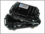

# Laipac - MicroConvert

El MicroCovert de Laipac es un dispositivo de localización GPS diseñado especialmente para rastrear, localizar y recuperar activos sin motor en operaciones encubiertas. Este dispositivo cuenta con un estuche resistente, duradero, a prueba de agua, golpes y polvo, lo que lo hace ideal para su uso en condiciones adversas. Su instalación es sencilla, solo es necesario conectar el MicroCovert a cualquier superficie metálica y estará listo para su uso.

Laipac ofrece dos versiones del dispositivo de localización GPS MicroCovert: la Versión 8A y la Versión 21A. La Versión 8A cuenta con una batería de 8Ah que proporciona hasta un mes de seguimiento GPS con una carga completa de energía. Por otro lado, la Versión 21A cuenta con una batería de 21Ah que permite hasta seis meses de seguimiento GPS con una carga máxima de energía.

El MicroCovert es una solución simple y asequible para empresas y usuarios que desean asegurarse de que sus activos no motorizados estén siempre seguros y en su lugar adecuado. Utilizando sistemas de seguimiento GPS, GSM y GPRS, el MicroCovert informa con precisión la posición de los activos no conectados a través del sitio web de LocationNow, donde se pueden monitorear y gestionar las 24 horas del día, los 7 días de la semana. Además, se enviará una notificación instantánea por correo electrónico, teléfono o información de contacto de la empresa si algún activo sin alimentación registrado se mueve de su posición designada. El MicroCovert también ofrece seguimiento GPS en tiempo real y registra continuamente la ubicación de los activos sin motor en línea día a día, brindando tranquilidad al prevenir robos y proteger los activos.

El MicroCovert se presenta en dos modelos, ambos fáciles de instalar. El primer modelo, la Versión 8A, cuenta con una batería recargable que proporciona hasta un mes de seguimiento GPS con una carga completa de energía. El segundo modelo, la Versión 21A, cuenta con una batería recargable que proporciona hasta seis meses de seguimiento GPS con una carga completa de energía. Ambos modelos se pueden conectar fácilmente a cualquier superficie metálica en el activo gracias a sus montajes magnéticos incorporados.

### Características destacadas:

- GSM / GPRS para cobertura mundial.
- Receptor GPS SiRF 4 con servicio AGPS de 48 canales.
- Capacidad de Geo-Cerca con entrada/salida de alarma de la cerca.
- Acelerómetro axial de 3 ejes para informar sobre movimiento e impacto.
- Modo de suspensión para prolongar la duración de la batería.
- Actualizaciones de posición en tiempo real basadas en intervalos de tiempo y distancia.
- Informe de kilometraje y alerta de exceso de velocidad.
- Batería de polímero de litio recargable de grado industrial de 8Ah y 21Ah.
- Estanco al agua \(IP44\), resistente a golpes, a prueba de polvo y carcasa.
- Imanes de tierras raras para permitir la fijación a cualquier superficie metálica \(80 lbf\).

### Especificaciones:

- Versión 8A: 100 × 145 × 60 mm.
- Versión 21A: 95 × 190 × 65 mm.
- Versión 8A: 1.15 lbs.
- Versión 21A: 1.90 lbs.
- Medidas de la caja de regalo: 197 \(ancho\) x 187 \(alto\) x 74 \(profundidad\) mm.
- Solo disponible para montaje magnético.

