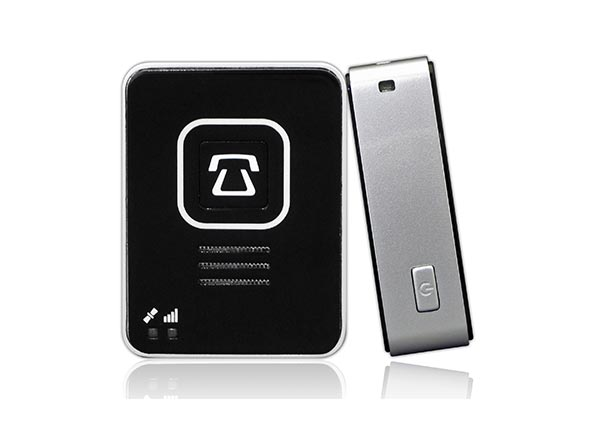

# Laipac - S911 Lola

El S911 Lola de Laipac es un sistema móvil Personal de Respuesta a Emergencias \(mPERS\) que utiliza tecnología de localización GPS para localizar y recuperar a las personas en situaciones de emergencia. Este pequeño y portátil localizador GPS personal combina capacidades de teléfono celular para proporcionar una comunicación bidireccional instantánea entre el dispositivo S911 Lola y el receptor designado. El S911 Lola es ideal en situaciones donde la asistencia no está fácilmente disponible o cuando el usuario está en riesgo debido a estar solo.

El S911 Lola es del tamaño de un arranque o de una puerta de apertura a distancia de un coche y se puede llevar en un llavero, bolsillo, mochila o bolso. También se puede usar en un cinturón, correa o muñequera con accesorios opcionales. Este rastreador GPS personal está equipado con un botón de pánico SOS que proporciona una conexión directa a un número de teléfono predeterminado. Al presionar el botón de pánico SOS durante 3 segundos, el dispositivo S911 Lola enviará instantáneamente un mensaje de texto y alertas al número de teléfono de contacto de emergencia predeterminado, proporcionando la ubicación del dispositivo, la hora y la fecha de la alerta de pánico.

El S911 Lola ofrece protección y seguridad para el usuario, brindando tranquilidad en todo momento. Además, se puede monitorear en tiempo real a través de LocationNow.com. Ya sea que esté de compras, caminando, viajando o de vacaciones, el S911 Lola siempre lo mantendrá protegido.

### Características destacadas:

- Receptor AGPS de alto rendimiento para aplicaciones en exteriores e interiores.
- Notificación de posición en tiempo real basada en tiempo y distancia.
- Registro de lugares y eventos cuando se encuentra fuera del área de cobertura.
- Altavoz del teléfono para llamadas de emergencia.
- Alertas de geovallas.
- Alertas de caída y cancelación de falsas alarmas.
- Alertas de velocidad.
- Recordatorios audibles de medicación.
- Hasta 30 horas de funcionamiento por carga.
- Modos de suspensión y seguimiento de activos disponibles para un uso prolongado.

### Especificaciones:

- Dimensiones: 5,4 x 4,0 x 1,6 cm.
- Peso: 44,3 g.
- Batería de polímero de litio de 900mAh.
- Puerto de carga micro USB.
- Ranura para tarjeta micro SIM.
- Cordón con abrazadera desmontable.
- Adaptador USB/CC.

