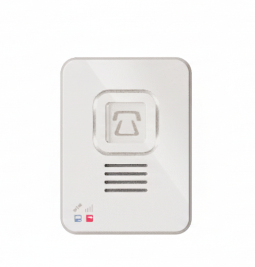

# Laipac - S911 LOLA S

La S911 LOLA S es un sistema móvil compacto de respuesta personal de emergencia diseñado para brindar seguridad personal en tiempo real y monitoreo remoto. Con soporte para reportes GNSS confiables sobre 4G LTE, la Lola S ofrece seguimiento continuo en tiempo real, un botón SOS dedicado y comunicación por voz bidireccional para que cuidadores, despachadores o centros de monitoreo puedan localizar y comunicarse con el usuario de inmediato durante una emergencia. Su detección integrada de caídas, los registros automáticos de estado y las alertas de geocerca la convierten en una opción práctica para programas que requieren conciencia situacional rápida y fiable.

Como dispositivo compatible con Plaspy, la S911 LOLA S puede enviar datos de ubicación, estado y eventos a los paneles y flujos de trabajo de Plaspy. Esa compatibilidad permite a las organizaciones consolidar la telemetría de seguridad personal junto con otros activos en Plaspy, habilitando alertas unificadas, reportes históricos y supervisión operativa sin fragmentar el monitoreo entre sistemas distintos.

## Características principales

- Informes de ubicación GNSS en tiempo real a través de 4G LTE para actualizaciones de posición oportunas
- Botón de emergencia SOS dedicado para señalización inmediata de alarmas
- Comunicación por voz bidireccional que permite el contacto directo entre el usuario y el respondedor
- Detección automática de caídas basada en fuerzas G para identificar eventos de "man down"
- Registros automáticos programados y recordatorios de medicación para apoyar la atención diaria
- Creación de geocercas con alertas por violación para supervisar zonas seguras
- Varias opciones de accesorios como correas de muñeca, cordones y fundas de cinturón para diferentes formas de uso

## Cómo funciona con Plaspy

Al integrarse con Plaspy, la S911 LOLA S actúa como un rastreador compatible que aporta flujos de posición y eventos a su entorno de monitoreo existente. Plaspy puede recibir coordenadas GNSS y eventos del dispositivo para que los equipos vean ubicaciones en vivo, disparen alertas y conserven un historial consolidado para revisión de incidentes y generación de reportes.

- Ubicaciones en vivo y actualizaciones con sello de tiempo aparecen en los mapas de Plaspy para visibilidad operativa
- Los eventos SOS se capturan y enrutan hacia las reglas de alerta de Plaspy para notificar a los respondedores de forma inmediata
- Los eventos de detección de caídas y los registros automáticos se registran para revisión de incidentes y seguimiento
- Las violaciones de geocerca y los recordatorios programados generan notificaciones que se integran con los flujos de trabajo existentes
- Los metadatos de eventos y el historial de actividad quedan disponibles para reportes y análisis post incidente

## Casos de uso típicos

- Cuidado de adultos mayores y supervisión de memoria con alertas de caída y recordatorios de estado
- Protección de trabajadores solitarios donde SOS y voz bidireccional facilitan una respuesta rápida
- Seguridad en campus para la protección de estudiantes y personal con geocercas y notificaciones de pánico
- Protección personal de VIP y primeros respondedores que requieren localización discreta y llamadas de emergencia
- Seguridad de personal de campo, como agentes inmobiliarios o personal de visita, que necesitan opciones portátiles de pánico y comunicación

## Por qué elegir este rastreador con Plaspy

La S911 LOLA S es adecuada para organizaciones que buscan una solución sencilla de monitoreo de seguridad personal integrada dentro de una plataforma de telemetría o gestión de activos más amplia. Sus funciones de seguridad fundamentales, incluidas SOS, detección de caídas y comunicación por voz, proporcionan la conciencia situacional que los equipos necesitan, mientras que la compatibilidad con Plaspy permite gestionar esos eventos junto con otros activos en una sola vista operativa.

Si desea saber más sobre cómo Plaspy puede incorporar dispositivos de seguridad personal como la S911 LOLA S en sus flujos de monitoreo e informes, visite https://www.plaspy.com. Las especificaciones del producto, la disponibilidad y los detalles del fabricante pueden cambiar con el tiempo, por lo que le recomendamos verificar las especificaciones actuales y las opciones de accesorios en el sitio oficial de Laipac en https://laipac.com/.
