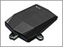

# Laipac - StarFinder AIRE

El rastreador GPS StarFinder AIRE de Laipac es un dispositivo compacto y elegante con un diseño económico y fácil de instalar. Este dispositivo de seguimiento GPS funciona en motocicletas, scooters, vehículos todo terreno, embarcaciones, cajeros automáticos y otros activos. Proporciona tranquilidad a los propietarios de activos, ya que envía alertas automáticas directamente a su teléfono móvil en caso de que su vehículo se mueva o se levante de su posición original. También ofrece un seguimiento rápido de la ubicación del vehículo en línea. 

Algunas de las características destacadas del StarFinder AIRE incluyen alerta de cercado geográfico, sensor de movimiento, alerta de velocidad y la posibilidad de configurar todos los demás parámetros de monitoreo a través del aire, lo que brinda una total libertad de monitoreo remoto. Además, cuenta con GSM/GPRS para cobertura mundial, receptor GPS de 48 canales con soporte WAAS y EGNOS, capacidad de geocerca con entrada/salida de alarma, G-Sensor para informar sobre movimiento e impacto, actualizaciones de posición en tiempo real basadas en intervalos de tiempo y distancia, informe de kilometraje y alerta de exceso de velocidad, alerta de desconexión de la corriente principal y 3 puertos I/O. También cuenta con una batería de polímero de litio recargable de grado industrial de 900 mAh y es resistente al agua, a los golpes y al polvo \(IP67\).

El StarFinder AIRE es un localizador de IO de bajo costo y alto rendimiento, ideal para rastrear y controlar todo tipo de máquinas compactas. Puede proporcionar horas de trabajo del motor para empresas de alquiler de maquinaria y proteger su inversión al localizar el activo dentro y fuera de las geocercas permitidas. Además, cuenta con relés internos para controlar las salidas. Si desea obtener más información sobre este producto, puede comunicarse con el departamento de ventas de Laipac.

### ESPECIFICACIONES:

- Dimensiones: 7,4 x 10,4 x 2,3 cm
- Peso: 180 g
- Batería de reserva interna: 900 mAh Li-Ion Polímero
- Rango de tensión de alimentación: 9V - 36VDC
- Antena GPS externa opcional
- Cable de programación USB micro

