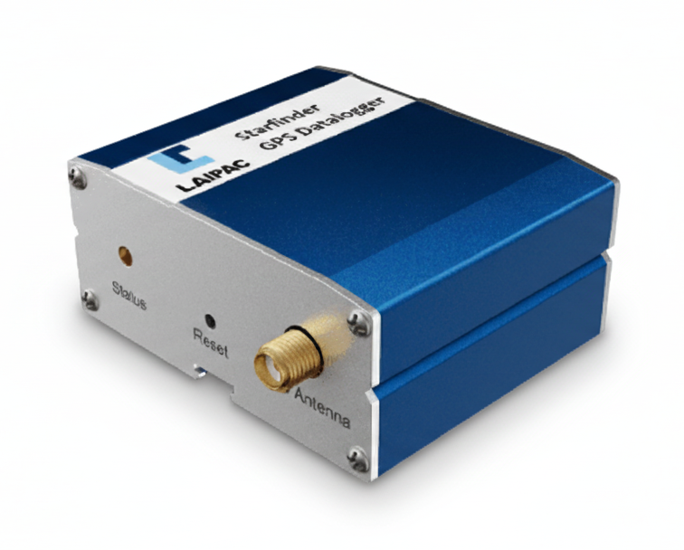

# Laipac - Starfinder Datalogger

El Starfinder Datalogger es un rastreador GPS y datalogger diseñado para mapeo profesional, telemetría e integraciones con radios. Entrega datos de posicionamiento NMEA en tiempo real a través de salidas cableadas mientras registra de forma persistente bitácoras de waypoints para un análisis fiable posterior a la misión. El equipo está optimizado para flujos de trabajo que requieren captura precisa de puntos de ruta, seguimiento en tiempo real estable y conexiones sencillas a radios, computadoras o sistemas de recolección de datos.

Como dispositivo compatible con Plaspy, el Starfinder ofrece formatos de datos y registros que se integran directamente con los flujos de trabajo de Plaspy para monitoreo en vivo y reproducción histórica. Su combinación de salida NMEA en vivo y registro local de waypoints lo hace útil para usuarios de Plaspy que necesitan visibilidad en tiempo real y pistas archivadas para mapeo, informes o revisiones posteriores a la misión.

## Puntos clave

- Salida NMEA compatible con Plaspy para seguimiento en tiempo real e ingestión de puntos de ruta
- Interfaces cableadas dobles para conexión directa a radios, computadoras y recolectores de datos
- Registro persistente de waypoints a bordo para análisis posterior y archivo
- Cobertura GNSS global para soportar aplicaciones de mapeo y telemetría en todo el mundo
- Amplio rango de tolerancia de alimentación para instalaciones en autos, camiones y maquinaria pesada
- Diseñado para integración en vivo y grabación local simultánea, ideal para flujos de telemetría

## Cómo funciona con Plaspy

El Starfinder Datalogger se integra en los flujos de trabajo de Plaspy alimentando sus transmisiones NMEA en vivo a los puntos de ingestión de Plaspy y permitiendo la importación de los registros de waypoints para análisis históricos. Esto permite a los operadores combinar la conciencia situacional en tiempo real con el mapeo y los informes posteriores al evento dentro de Plaspy.

- Proporciona actualizaciones de ubicación en tiempo real a Plaspy mediante flujos NMEA estándar
- Suministra registros persistentes de waypoints que pueden subirse a Plaspy para reproducción y mapeo
- Se integra junto con herramientas de telemetría y monitoreo de flotas para consolidar reportes en los paneles de Plaspy
- Habilita la conciencia situacional en sistemas vinculados por radio y recolección de datos de campo cuando se usa como fuente NMEA
- Facilita auditorías operativas y análisis históricos al conservar pistas registradas para cumplimiento y revisión

## Casos de uso típicos

- Proyectos GIS que requieren flujos de posición en vivo y procesamiento de waypoints después de la misión
- Investigación científica de campo donde se necesita captura precisa de waypoints y archivo
- Seguimiento de flotas y control de transporte usando transmisiones en tiempo real y registros históricos
- Instalaciones en maquinaria pesada y vehículos que se benefician de una alta tolerancia de alimentación y registro persistente
- Sistemas de telemetría e integraciones con radios que requieren una fuente GNSS externa para etiquetado de ubicación

## Por qué elegir este rastreador con Plaspy

El Starfinder Datalogger es una opción práctica para organizaciones que usan Plaspy cuando la prioridad es una salida NMEA confiable y archivado seguro de waypoints. Sus interfaces cableadas y su modelo de registro persistente simplifican la integración con radios, recolectores de datos y sistemas anfitriones que alimentan Plaspy, reduciendo la dependencia de vías basadas en red y manteniendo la visibilidad de ubicación y los historiales que muchas operaciones requieren.

Learn more about Plaspy and how compatible devices like the Starfinder Datalogger can be used in fleet monitoring and mapping solutions at https://www.plaspy.com. Product specifications, availability, and manufacturer documentation can change over time, so verify current technical details and support information on the manufacturer site https://laipac.com/.
