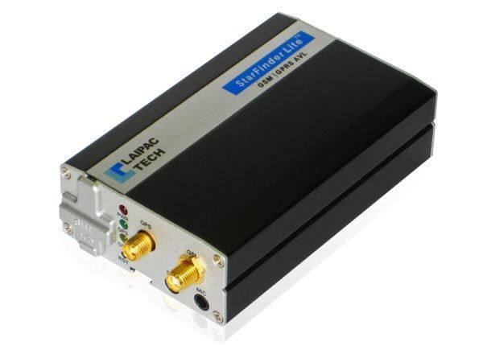

# Laipac - StarFinder LITE

El rastreador GPS StarFinder Lite de Laipac es un dispositivo compacto y eficiente que proporciona seguimiento en tiempo real de vehículos y activos móviles. Basado en la tecnología GSM/GPRS y GPS, este dispositivo ofrece una amplia gama de características que permiten a los clientes obtener información y reportes sobre la velocidad, posición, rumbo, amillaramiento, alerta de remolque, alerta de velocidad, alerta de colisión, botón de pánico, geo-cercas, control remoto de motores de vehículos, ventanas y cerraduras, registrador de datos integrado, y mucho más. El StarFinder Lite es ideal para todo tipo de vehículos privados o de empresa.

El StarFinder Lite está equipado con un conjunto completo de características que no solo proporcionan la ubicación de los activos móviles, sino también reportes, alertas, geo-cercas, registrador de datos, diagnóstico del vehículo en movimiento, estado de alimentación principal, opciones de bloqueo de energía remota, y arranque y parada del motor a distancia. La instalación y activación del dispositivo son rápidas y sencillas siguiendo los pasos del manual del StarFinder Lite. Este sistema de vigilancia es muy útil para empresas y aplicaciones comerciales como el control de vehículos privados, gestión de flotas, gestión de taxis, gestión de ambulancias, vehículos de construcción y gestión de equipos estacionarios, supervisión de autobuses escolares, entre otros. También puede ser muy práctico para usuarios finales que necesiten un registrador de datos para uso personal. El StarFinder Lite garantiza que todos los activos se puedan localizar rápidamente en caso de que no estén donde se supone que deben estar.

### Características destacadas:

- Cobertura mundial GSM/GPRS
- Receptor GPS con WAAS y EGNOS
- 2 entradas digitales, 3 salidas digitales, 1 entrada analógica
- Registrador de datos con capacidad para más de 15,000 puntos de interés
- Altavoz y micrófono integrados
- Botón de pánico para llamadas de emergencia
- Alertas de geo-cercas
- Alertas de velocidad
- Alerta principal de desconexión de alimentación
- Alerta del G-Sensor

### Especificaciones técnicas:

- Dimensiones: 9.7 x 5.9 x 2.6 cm
- Peso: 900 g
- Rango de tensión de alimentación: 8V - 36VDC
- Batería de reserva de 900mAh
- Puerto USB para configuración
- Cables del arnés con I/O y switches
- Incluye antenas de teléfono móvil y GPS

