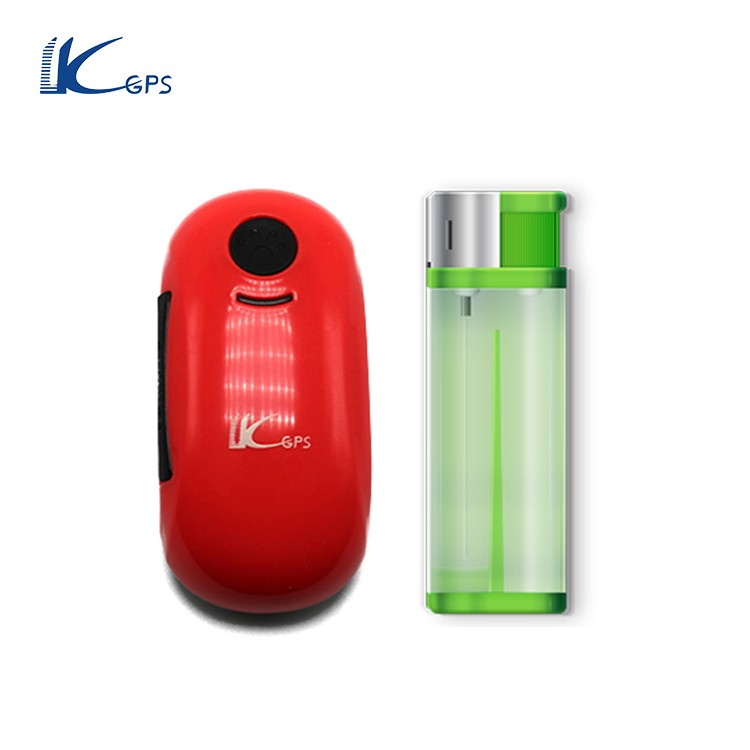

# LK-GPS - LK100

El rastreador GPS LK100 de KJ-GPS es una excelente opción para aquellos que desean mantener a sus mascotas seguras y protegidas. Con su función de seguimiento en tiempo real, podrás localizar a tu mascota en cualquier momento y desde cualquier lugar utilizando tu teléfono móvil o la plataforma web. Además, este rastreador GPS es compatible con la tecnología de servicio basado en la ubicación \(A-GPS\), lo que significa que incluso en lugares subterráneos o túneles, podrás obtener la ubicación de tu mascota mediante AGPS.

Otra característica destacada del LK100 es su capacidad para verificar el historial de rutas en la plataforma web. Podrás revisar y reproducir el historial de rutas del dispositivo en un período de hasta un año. Esto te brinda una visión completa de los movimientos de tu mascota a lo largo del tiempo.

El LK100 también cuenta con un botón de alarma SOS, que te permite enviar un mensaje de ayuda a todos los números de teléfono autorizados y a la plataforma web en caso de emergencia. Además, este rastreador GPS tiene un modo de ahorro de energía, que entra en modo de espera cuando no hay vibración durante 5 minutos y vuelve al modo de funcionamiento cuando detecta vibración.

Otras características destacadas del LK100 incluyen la posibilidad de escuchar el sonido alrededor del rastreador a través del teléfono móvil, la compatibilidad con el mapa de Google en dispositivos móviles, la configuración de una geo-cerca para restringir los movimientos del dispositivo y recibir alertas cuando se excede el límite establecido, y la capacidad de comunicación unidireccional con el rastreador a través del teléfono móvil.

Con una batería de 1000mAh, el LK100 ofrece hasta 10 días de tiempo de espera. Además, pesa solo 55g, lo que lo hace cómodo y conveniente para su uso en mascotas.

### Características destacadas:

- Seguimiento en tiempo real
- Comunicación unidireccional
- Geo-cerca
- Historial de rutas
- Localización AGPS
- Alerta de vibración/desplazamiento/batería baja

### Especificaciones técnicas:

- Red: GSM y GPRS
- Banda/mHz: 850/900/1800/1900
- Chip GSM: MTK6261
- Chip GPS: Ublox 7
- Sensibilidad GPS/dBm: -159
- Precisión GPS/m: 5

