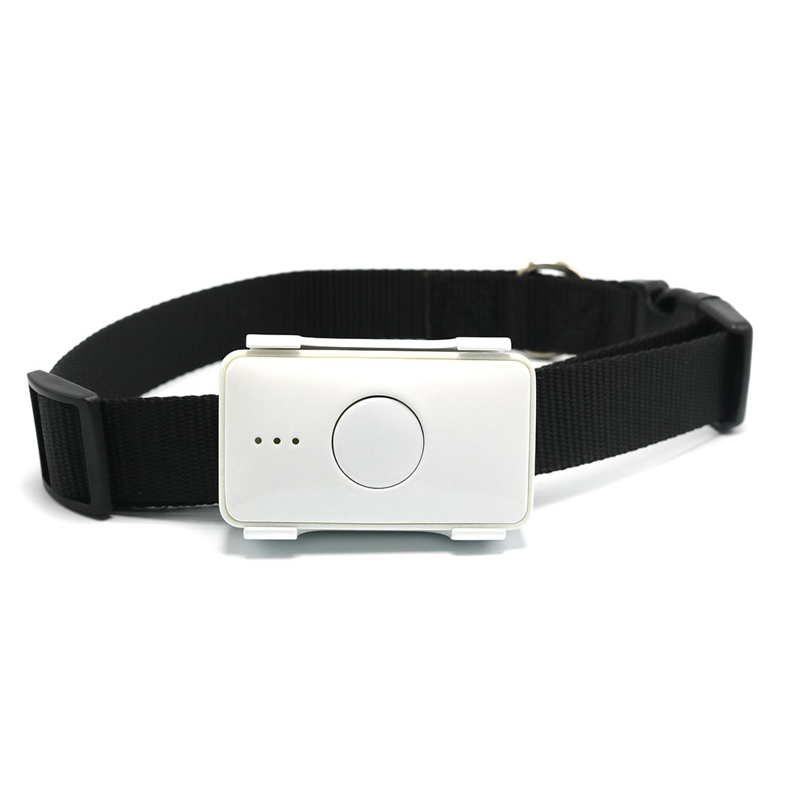

# LK-GPS - LK105B

El LK-GPS LK105B es un rastreador GPS compacto y pequeño pensado para ayudar a los dueños de mascotas a localizar perros y gatos con facilidad. Combina posicionamiento GPS y LBS para ofrecer actualizaciones continuas de ubicación, permite el seguimiento en tiempo real desde un smartphone o la plataforma web, y cuenta con funciones como reproducción del historial de ubicaciones, monitoreo de voz alrededor del dispositivo y un botón de alarma SOS para emergencias.

Como el LK105B entrega actualizaciones frecuentes de ubicación, reproducción de historial y notificaciones por alarma, es un candidato práctico para integrarse con Plaspy. Plaspy puede mostrar la ubicación del dispositivo en mapas, registrar el historial de rutas y emitir alertas y notificaciones de movimiento para que los dueños y gestores de pequeños activos obtengan visibilidad constante y avisos rápidos cuando ocurran eventos.

## Características principales

- Seguimiento de ubicación en tiempo real apto para mascotas y objetos personales pequeños
- Actualizaciones de ubicación con frecuencia de hasta cada 5 segundos para una visibilidad casi en tiempo real
- Precisión GPS en el orden de metros para facilitar la localización exacta
- Botón de alarma SOS que notifica a contactos autorizados y a la plataforma de seguimiento
- Monitoreo de voz y capacidad de comunicación bidireccional mediante un teléfono móvil
- Diseño compacto resistente al agua y comportamiento de ahorro de energía para el uso diario

## Cómo funciona con Plaspy

Al emparejarse con Plaspy, el LK105B transmite información de ubicación y eventos a la plataforma para que usted pueda monitorear la actividad en un mapa unificado y utilizar las herramientas de la plataforma para gestionar alertas e historial. Plaspy procesa las actualizaciones de posición del rastreador y las presenta junto a otros activos rastreados para una supervisión centralizada.

- Ver la ubicación en vivo en el mapa de Plaspy para obtener conciencia situacional rápida
- Acceder a rutas históricas y reproducir movimientos para revisar actividad pasada
- Recibir y gestionar alertas SOS y de movimiento a través de los canales de notificación de Plaspy
- Crear alertas tipo geocerca y monitorear entradas y salidas de zonas definidas
- Usar las funciones de informes y exportación en Plaspy para analizar tendencias de ubicación a lo largo del tiempo

## Casos de uso típicos

- Rastrear mascotas de la familia para localizar rápidamente un animal perdido o que se haya alejado
- Supervisar animales en guarderías o residencias para control y tranquilidad
- Colocar en objetos valiosos o equipos portátiles para apoyar su recuperación
- Brindar ubicación discreta para seguridad personal y registros de registro
- Registrar el historial de movimiento para revisiones de comportamiento o registros operativos

## Por qué elegir este rastreador con Plaspy

El LK105B combina características prácticas enfocadas en mascotas con un hardware compacto que se adapta al día a día. Sus actualizaciones en tiempo real, función SOS y reproducción de historial encajan bien con las capacidades de Plaspy para visualización en mapas, alertas e informes, lo que lo convierte en una opción sensata para dueños de mascotas y proyectos de monitoreo de activos a pequeña escala.

Si desea un rastreador ligero que aporte datos consistentes de posición y eventos a una plataforma de monitoreo única, el LK105B es una alternativa compatible a considerar. Para obtener más información sobre Plaspy y cómo puede presentar y gestionar los datos del LK105B visite https://www.plaspy.com. Las especificaciones del producto y su disponibilidad pueden cambiar con el tiempo, por lo que le recomendamos verificar los detalles técnicos actuales y la documentación oficial con el fabricante en https://www.lk-gps.com.
