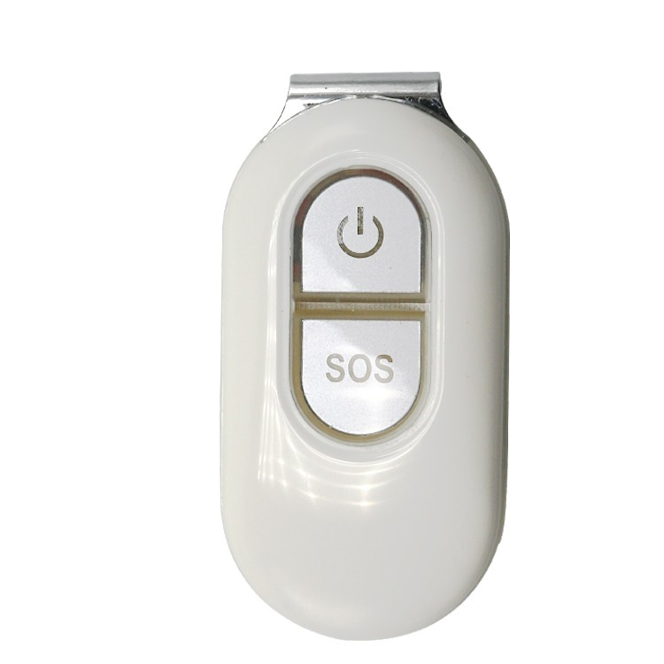

# LK-GPS - LK106

El LK106 es un rastreador GPS 4G compacto diseñado para ofrecer monitorización fiable de ubicación en tiempo real en un equipo pequeño e impermeable. Integra antenas GPS y GSM, ranura para tarjeta SIM, botón de emergencia SOS y es compatible tanto con aplicaciones móviles como con plataforma web. Está pensado para uso discreto sobre la persona o en pequeños activos cuando se requiere reporte continuo de posición y notificaciones de emergencia.

Como dispositivo compatible con Plaspy, el LK106 se integra con la plataforma para proporcionar seguimiento en vivo, reporte de eventos y alertas a través de las interfaces web y móviles de Plaspy. Su soporte para reporte de datos y respaldo por SMS lo convierte en una opción práctica para usuarios de Plaspy que necesitan monitoreo de seguridad personal, protección antirrobo y supervisión remota básica sin un gran formato.

## Características principales

- Rastreador GPS 4G compatible con Plaspy para actualizaciones de posición en vivo y reporte de eventos
- Diseño compacto, liviano e impermeable, apto para dispositivos vestibles y colocación discreta
- Antenas GPS y GSM integradas y ranura para SIM para datos móviles con respaldo por SMS
- Botón de emergencia SOS que puede generar alertas de ubicación inmediatas
- Hasta 7 días de autonomía en espera, según frecuencia de reporte y condiciones de red
- Geocercas, alertas por movimiento y activación por impacto para mayor conciencia situacional

## Cómo funciona con Plaspy

Cuando lo conecte a Plaspy, el LK106 envía datos de ubicación y eventos a su cuenta de Plaspy, donde posiciones, alertas y el estado del dispositivo se muestran en paneles y notificaciones. Plaspy centraliza los mensajes entrantes del rastreador para que los operadores puedan establecer reglas, recibir alertas oportunas y revisar el historial de ubicaciones desde las interfaces móvil y web.

- Actualizaciones de ubicación en tiempo real e historial de posiciones visibles en los paneles de Plaspy
- Notificaciones de alarma SOS dirigidas a las alertas de Plaspy y a los contactos asignados
- Eventos de entrada y salida de geocercas enviados a las reglas de Plaspy para notificaciones automatizadas
- Alertas por movimiento y por activación por impacto entregadas a Plaspy para respuesta rápida
- Reporte del nivel de batería y alertas de batería baja disponibles en Plaspy para una gestión proactiva del dispositivo

## Casos de uso típicos

- Seguimiento de seguridad personal para niños, personas mayores o trabajadores solos con soporte SOS
- Monitorización antirrobo discreta para bolsos, equipaje y pequeños objetos de valor
- Seguridad del viajero y conciencia situacional durante traslados o viajes remotos
- Supervisión de pequeños activos que requieren protección impermeable y liviana
- Supervisión temporal de personal donde se necesita ubicación y alertas rápidas

## Por qué elegir este rastreador con Plaspy

El LK106 es una solución enfocada para organizaciones e individuos que requieren rastreo discreto y confiable de personas o pequeños activos dentro del ecosistema Plaspy. Su diseño compacto e impermeable, junto con conectividad 4G, función SOS y alertas configurables, lo hacen ideal para flujos de trabajo de seguridad y antirrobo donde la visibilidad continua y la respuesta rápida son prioritarias.

Para detalles completos sobre especificaciones y disponibilidad actuales, visite Plaspy para conocer más sobre la compatibilidad de la plataforma y los flujos de trabajo soportados en https://www.plaspy.com. Las especificaciones del producto y las ofertas del fabricante pueden cambiar con el tiempo, por lo que le recomendamos verificar la información técnica más reciente y los detalles de compatibilidad en el sitio oficial de LK GPS en https://www.lk-gps.com.
