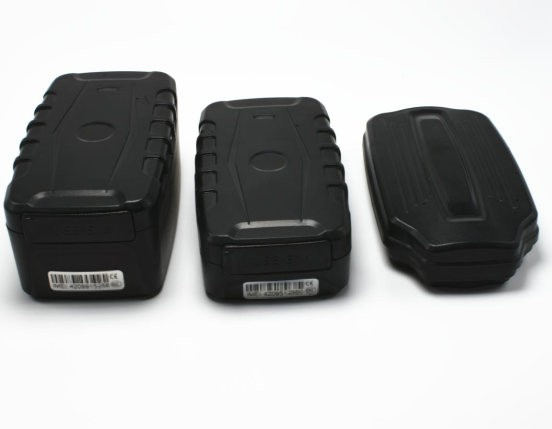

# LK-GPS - LK209 A/B/C

El LK209 A/B/C es un rastreador GPS magnético diseñado para el seguimiento prolongado de vehículos y el monitoreo de activos. Disponible en tres variantes de batería (A 5000 mAh, B 10000 mAh, C 20000 mAh), la serie ofrece autonomías extendidas que permiten reportes de posición y registro de rutas durante días o semanas con una sola carga. Su carcasa resistente y su imán permiten una colocación discreta en autos, camiones, contenedores y una amplia variedad de activos móviles.

Como dispositivo compatible con Plaspy, el LK209 transmite posición GNSS y telemetría de eventos por enlace celular hacia Plaspy, donde se muestran mapas en vivo, reproducción del historial y notificaciones. Esa compatibilidad convierte al LK209 en una opción práctica para operadores de flotas y administradores de activos que requieren largas autonomías, montaje no invasivo y telemetría esencial —como geocercas, movimiento y eventos de batería baja— accesible desde la plataforma Plaspy.

## Aspectos destacados

- Rastreador GPS magnético compatible con Plaspy para seguimiento continuo en tiempo real y reproducción de historial.
- Tres opciones de batería para ajustarse a distintos intervalos de reporte y ofrecer días o semanas de operación.
- Montaje magnético y carcasa robusta para colocación discreta y no invasiva en superficies ferrosas.
- Alertas orientadas a flotas, incluyendo geocercas, exceso de velocidad, detección de movimiento e impacto, y advertencias de desprendimiento.
- Fallback GSM para mantener reportes cuando la recepción GPS es limitada.
- Diseño de bajo consumo y comportamiento de suspensión configurable para reducir mantenimiento y alargar los ciclos de despliegue.
- Hardware escalable apto para despliegues masivos y flotas de alquiler, con diseño amigable para OEM.

## Cómo funciona con Plaspy

Al desplegarse, el LK209 envía fijaciones de posición y notificaciones de evento a través de su enlace celular hacia Plaspy, donde esos datos se incorporan y se presentan en mapas, paneles e informes. Este flujo de trabajo brinda a los operadores visibilidad continua y la capacidad de actuar sobre los eventos reportados por el dispositivo.

- Actualizaciones de ubicación en tiempo real y visualización de rutas disponibles dentro de Plaspy para supervisión operativa.
- Eventos de detección de movimiento e impacto generan marcadores y alertas para una investigación rápida.
- Violaciones de geocerca y notificaciones de exceso de velocidad se integran directamente en los flujos de alertas de Plaspy.
- Advertencias de batería baja y de dispositivo desprendido aparecen en Plaspy para facilitar la programación de mantenimiento o la recuperación.
- Reproducción de historial e informes de viaje que permiten análisis posteriores y auditoría para cumplimiento y desempeño.
- El reporte por fallback GSM ayuda a mantener conciencia posicional en áreas con recepción GPS degradada.

## Casos de uso típicos

- Gestión de flotas de autos, camionetas y camiones que requieren alta autonomía y registro de rutas.
- Seguimiento logístico y de contenedores donde la colocación magnética permite fijación no permanente.
- Monitoreo de flotas de alquiler y leasing para recuperación, control de uso y cumplimiento de geocercas.
- Protección de activos remotos como equipos almacenados o activos fuera de la red que necesitan larga vida en espera.
- Soluciones de seguridad para vehículos personales que se benefician de una colocación discreta y acceso al historial de rutas.

## Por qué elegir este rastreador con Plaspy

Combinar el LK209 A/B/C con Plaspy ofrece una solución directa para organizaciones que priorizan larga duración de batería, montaje discreto y la telemetría básica necesaria para visibilidad de flota. El dispositivo entrega los datos de ubicación y eventos que Plaspy necesita para ofrecer seguimiento en vivo, alertas e historial de rutas sin mantenimiento frecuente ni instalaciones invasivas.

Para despliegues que requieren escala o personalización puntual, la serie LK209 está diseñada teniendo en cuenta consideraciones OEM y operación de bajo consumo para minimizar el mantenimiento. Si su proyecto requiere telemetría adicional u opciones de accesorios más allá de la unidad estándar, verifique las configuraciones disponibles con el fabricante para confirmar que satisfacen sus requisitos.

Para obtener más información sobre el uso de la serie LK209 con Plaspy visite https://www.plaspy.com. Las especificaciones del producto, disponibilidad y detalles del fabricante pueden cambiar con el tiempo, por lo que le recomendamos confirmar la información técnica actual en el sitio oficial del fabricante https://www.lk-gps.com.
