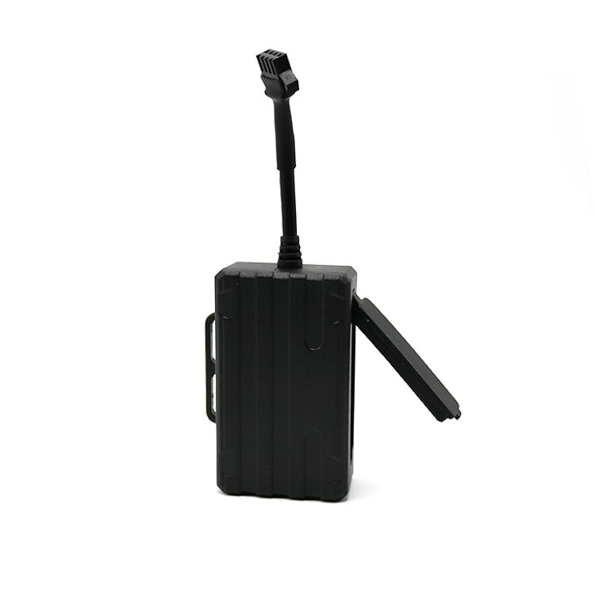

# LK-GPS - LK210

El LK210 es un rastreador GPS para vehículos compacto, con cableado, diseñado para una instalación discreta y un seguimiento en tiempo real confiable y compatible con Plaspy. Con antenas integradas de GPS y GSM, el LK210 ofrece protección práctica contra el robo y visibilidad continua de la ubicación para automóviles, motocicletas, camiones y otros vehículos. Su formato reducido y el despertar por vibración lo hacen especialmente adecuado para montajes encubiertos donde la monitorización constante y una recuperación rápida son prioridades.

El LK210 se integra con plataformas web \(B/S\) y móviles \(Android e iOS\) para gestión de flotas, telemetría y alertas. Los operadores y propietarios pueden ver la ubicación en tiempo real, recibir alarmas de movimiento o golpes y verificar la capacidad de batería restante a través de la plataforma. Cuando se utiliza junto con Plaspy, el LK210 pasa a formar parte de una solución de rastreo escalable que admite flujos de anti-robo, supervisión de rutas y operaciones diarias de la flota.

## Aspectos clave

- Rastreador GPS compatible con Plaspy — integración sencilla con Plaspy para un rastreo en tiempo real centralizado.
- Diseño compacto con cableado y antenas GPS y GSM integradas para una instalación discreta en coches, motos y camiones.
- Detección de vibración y modo de despertar por golpe para detectar movimientos o impactos y activar alertas oportunas.
- Funciones de alarma anti-pérdida y notificaciones de movimiento para mejorar las probabilidades de recuperación de vehículos robados o extraviados.
- Accesible vía web \(B/S\) y aplicaciones móviles nativas \(Android/iOS\) para seguimiento en vivo, telemetría y verificación de estado.
- Soporte de comandos por SMS para una gestión y configuración remotas cuando no hay conectividad de datos.
- Diseño compatible con OEM, apto para producción en masa y personalización para operadores de flotas y empresas de alquiler.

## Cómo funciona con Plaspy

El LK210 envía la posición GPS y el estado del dispositivo vía GSM a la plataforma compatible con Plaspy, donde los datos se consolidan para el seguimiento en tiempo real, alertas e informes históricos. Plaspy consume la telemetría transmitida por el LK210 para que los gestores de flota y los propietarios de vehículos puedan monitorizar movimientos, configurar geocercas y recibir notificaciones de alarmas inmediatas cuando se detecte vibración o impacto.

- Actualizaciones de ubicación y telemetría en tiempo real enviadas a Plaspy para cartografía, enrutamiento y supervisión en vivo.
- Alertas de vibración/golpe y alarmas anti-pérdida entregadas como notificaciones push o eventos de la plataforma en Plaspy.
- Estado de la batería y capacidad restante visibles en la interfaz de Plaspy para apoyar la planificación de mantenimiento.
- Respaldo de comandos por SMS para configuración y consultas cuando el servicio de red de datos es limitado o cuando los administradores prefieren controles por SMS.
- Diseño orientado a la integración — Plaspy puede correlacionar los datos de rastreo del LK210 con otras fuentes de telemetría \(por ejemplo, sensores Bluetooth o telemetría de combustible de hardware compatible\) para obtener una visión operativa más completa.

## Resumen técnico

| Conectividad | Celular GSM \(antena GSM integrada\) y posicionamiento GNSS \(antena GPS integrada\) |
| --- | --- |
| Bandas | No especificado en la descripción del fabricante |
| Potencia & Batería | Alimentación del vehículo por cable con reporte de batería interna; la capacidad de batería restante está disponible a través de la plataforma |
| Interfaces | Instalación por cable para montaje en vehículo; interfaz de comandos SMS para configuración y consultas remotas |
| GNSS | Receptor GPS con antena integrada \(el fabricante indica capacidad GPS\) |
| Bluetooth | No especificado en la descripción del fabricante |
| Gestión remota | Monitoreo vía web \(B/S\) y aplicaciones móviles \(Android, iOS\); comandos SMS soportados para configuración y consultas |
| Factor de forma | Rastreador compacto y de bajo perfil diseñado para instalación encubierta en motocicletas, coches y camiones |

## Casos de uso

- Antirrobo y recuperación de la flota — montaje discreto y detección de vibraciones o golpes que ayudan a detectar movimientos no autorizados y acelerar la recuperación.
- Monitoreo de flotas de alquiler — seguimiento en tiempo real y acceso a la plataforma permiten a los operadores de alquiler supervisar el uso y la ubicación de los vehículos.
- Supervisión de logística y reparto — seguir el cumplimiento de la ruta, monitorizar paradas y mantener visibilidad continua para operaciones de última milla.
- Protección de motocicletas y vehículos eléctricos — su tamaño compacto y las alertas por vibración son ideales para despliegues en dos ruedas y EV compactos.
- Seguimiento encubierto de activos — instalación de bajo perfil para recuperación discreta de vehículos de alto valor y equipos.

## Por qué elegir este rastreador con Plaspy

El LK210 ofrece un equilibrio pragmático entre fiabilidad, simplicidad y compatibilidad con Plaspy para organizaciones e individuos que requieren seguridad de vehículos y gestión de flotas confiables sin complicaciones innecesarias. Dado que admite acceso web y móvil y cuenta con capacidad de comandos por SMS, el dispositivo se adapta a distintas condiciones de conectividad y a las preferencias operativas. Los gestores de flotas obtienen un rastreador GPS sencillo, optimizado para telemetría y flujos de anti-robo, mientras que los propietarios privados se benefician de visibilidad continua de la ubicación y notificaciones de alarmas rápidas.

Elegir el LK210 para una implementación con Plaspy significa optar por una unidad compacta, compatible con OEM, que se instala fácilmente y reporta la telemetría esencial necesaria para las operaciones diarias. Para flotas que requieren capacidades ampliadas, como monitoreo de combustible, control de ignición o funciones de inmovilizador remoto, Plaspy puede combinar la ubicación y los datos de alarma del LK210 con sensores y hardware compatibles adicionales en la misma plataforma para ofrecer una solución integrada.

