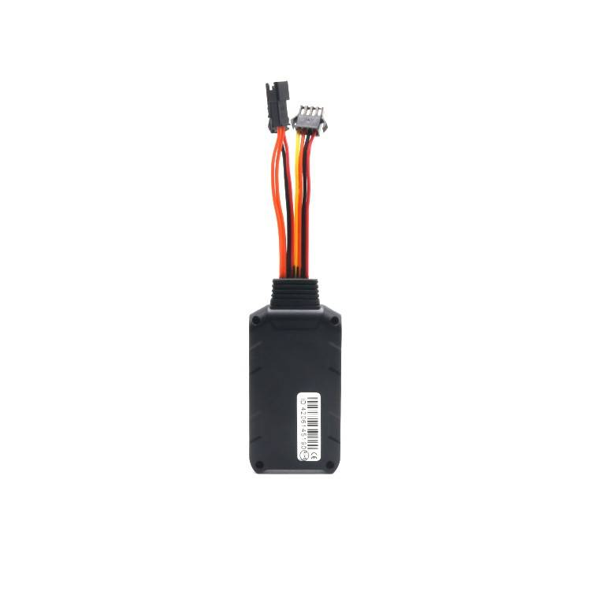

# LK-GPS - LK300

El LK300, a menudo referido como LK300-2G en la documentación del fabricante, es un rastreador GPS compacto diseñado para ofrecer seguimiento confiable en tiempo real y protección antirrobo en automóviles, motocicletas, camiones y equipos de exterior. Integra antena GPS y conectividad GSM en un formato reducido pensado para montajes discretos, dispone de activación por vibración para detectar movimiento y permite acceso desde múltiples plataformas para monitorizar estado y ubicación del dispositivo.

Este modelo es compatible con Plaspy y puede emparejarse para aportar ubicación en vivo, telemetría básica y alertas de manipulación a un flujo de trabajo centralizado en Plaspy. Esa compatibilidad hace del LK300 una opción práctica para operadores que necesitan visibilidad sencilla de vehículos y activos en Plaspy, tanto para unidades individuales como para flotas mixtas, sin añadir complejidad innecesaria.

## Características principales

- Integración compatible con Plaspy para seguimiento y reportes centralizados en tiempo real
- Diseño compacto y discreto con antenas GPS y GSM integradas
- Activación por choque o vibración para detectar movimiento y soportar alertas antirrobo
- Acceso desde web y móvil para ver ubicación y estado del dispositivo
- Configuración y consultas rápidas por SMS para ajustes remotos
- Construcción robusta y resistente al agua, adecuada para equipos de exterior y uso intensivo
- Opción costoefectiva para monitoreo de flotas y supervisión operativa

## Cómo funciona con Plaspy

Una vez instalado y configurado, el LK300 envía ubicación y estado del dispositivo a los servicios de back end que Plaspy recibe y muestra dentro de la cuenta de usuario. Plaspy consolida posiciones entrantes, eventos de manipulación y el estado básico del equipo para que los operadores puedan supervisar activos, responder alertas y revisar movimientos históricos desde un único tablero o desde las aplicaciones móviles compatibles.

- Actualizaciones de ubicación en tiempo real visibles en Plaspy para conciencia situacional inmediata
- Alertas de vibración y manipulación dirigidas a Plaspy para activar notificaciones y respuestas
- Estado del dispositivo, como capacidad restante de batería, reportado en Plaspy para planificación de mantenimiento
- Configuración y consulta de parámetros por SMS disponible para ajustes remotos cuando sea necesario
- La integración soporta flujos de trabajo de flota en Plaspy, incluyendo visibilidad de rutas, alertas de geocerca y revisión de incidentes

## Casos de uso típicos

- Monitoreo antirrobo de motocicletas y scooters con montaje discreto y alertas de manipulación
- Gestión de flotas para logística y reparto, mejorando visibilidad de rutas y despacho
- Seguimiento de maquinaria de construcción y equipos pesados en entornos remotos o exigentes
- Transporte de larga distancia y rutas de camiones para actualizaciones de ubicación constantes y seguridad
- Servicios de renta y uso compartido de vehículos para control de geocercas y notificaciones de movimiento no autorizado

## Por qué elegir este rastreador con Plaspy

El LK300 ofrece un conjunto de funciones centradas en las necesidades habituales de seguimiento de flotas y activos. Su reducido tamaño, antenas integradas y detección por vibración lo hacen adecuado para instalaciones discretas en vehículos y equipos donde la visibilidad continua y las alertas antirrobo son prioritarias. Al enviar ubicación, eventos de manipulación y estado del dispositivo a Plaspy, el rastreador facilita decisiones operativas oportunas e informes consolidados sin una configuración excesiva.

Para organizaciones que confían en Plaspy para la supervisión centralizada, el LK300 representa una opción práctica y económica para añadir seguimiento en tiempo real y capacidad antirrobo a vehículos y equipos. Para más información sobre Plaspy y cómo se usan los dispositivos compatibles en la plataforma visite https://www.plaspy.com. Las especificaciones del producto y la disponibilidad pueden cambiar con el tiempo, por lo que conviene verificar los detalles técnicos actuales y las variantes regionales en el sitio del fabricante https://www.lk-gps.com.
