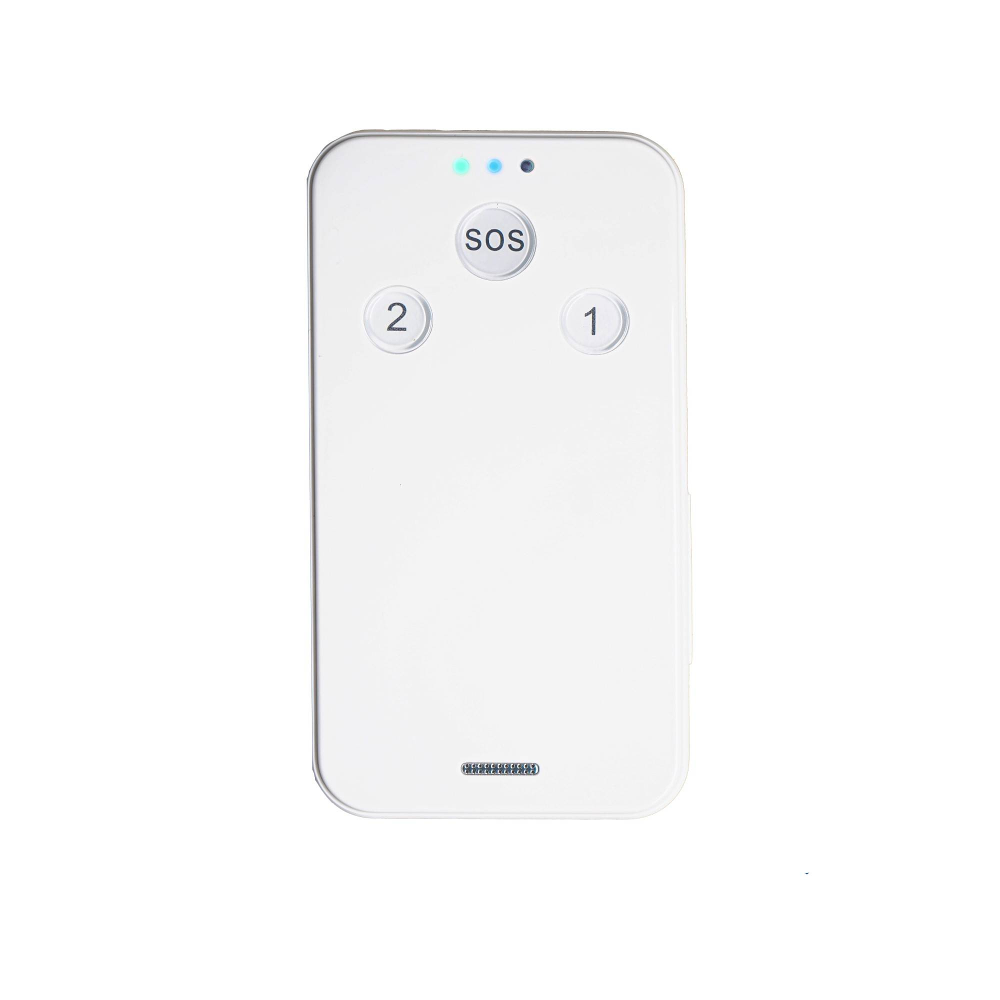

# LK-GPS - LK610-B

El LK610-B es un rastreador GPS wearable compacto, comercializado en algunas variantes como LK610-NB. Diseñado para la seguridad personal y el uso diario, este terminal de posicionamiento con tarjeta SIM ofrece actualizaciones de ubicación continuas mediante GPS y LBS con asistencia AGPS. El dispositivo incluye un botón de emergencia SOS, llamadas bidireccionales y modos configurables de envío de ubicación para facilitar la monitorización confiable de niños, estudiantes y personal en movimiento.

Como dispositivo compatible con Plaspy, el LK610-B integra sus señales de ubicación y alertas de seguridad en la plataforma de monitoreo de Plaspy para una implementación y supervisión sencillas. Los cuidadores y administradores pueden ver la ubicación en tiempo real, recibir notificaciones de geocercas y seguridad, y revisar reproducciones históricas a través de las interfaces web y móviles de Plaspy, incorporando la comodidad del dispositivo wearable en un flujo de trabajo de monitoreo preparado para empresas.

## Características principales

- Rastreador GPS wearable compatible con Plaspy para rastreo en tiempo real y supervisión de la ubicación de niños, estudiantes y personal
- Botón de emergencia SOS que envía alertas inmediatas con la ubicación actual a contactos preconfigurados
- Llamadas bidireccionales para comunicación de voz directa entre cuidadores y la persona que porta el dispositivo
- Múltiples modos de envío de ubicación, incluyendo programado, en tiempo real y punto fijo, para equilibrar visibilidad y frecuencia de reporte
- Diseño compacto y resistente al agua, adecuado para uso escolar, actividades al aire libre y viajes
- Geocercas y notificaciones de seguridad como entrada/salida, batería baja y desplazamiento disponibles a través de Plaspy
- Configuración simple basada en SIM con opciones de configuración por SMS para puesta en marcha rápida en campo

## Cómo funciona con Plaspy

El LK610-B envía fijaciones de ubicación obtenidas por GPS y LBS (con soporte AGPS) según el modo de envío configurado en el rastreador, y Plaspy recibe y normaliza esos datos para mapeo, generación de informes y enrutamiento de alertas. Plaspy presenta mapas en vivo, reproducción histórica y gestión centralizada de alarmas para que organizaciones y cuidadores puedan responder a incidentes y mantener supervisión operativa.

- Rastreo en tiempo real y envíos programados de ubicación para visibilidad continua y reproducción histórica
- Las alertas SOS activan notificaciones inmediatas a contactos predefinidos con coordenadas y marcas de tiempo
- Gestión centralizada de alarmas para eventos de geocerca, entrada y salida, batería baja y alertas de desplazamiento
- La capacidad de voz bidireccional permite a los cuidadores verificar situaciones directamente con la persona que porta el dispositivo mientras la información de ubicación está disponible en Plaspy
- Configuración del dispositivo y monitoreo de estado mediante comandos SMS o ajustes desde la plataforma para habilitar reportes de datos y control administrativo

## Casos de uso típicos

- Seguridad escolar y monitoreo de estudiantes, incluyendo rutas de ida y vuelta al colegio y alertas de zonas del campus
- Cuidado de niños y personas mayores, donde las alertas SOS, las llamadas bidireccionales y las advertencias de desplazamiento aumentan la conciencia situacional
- Seguridad de personal y trabajadores de campo para protección de trabajadores que actúan solos y monitoreo de registros durante tareas móviles
- Actividades al aire libre y viajes, donde un dispositivo wearable resistente al agua ofrece conciencia continua de la ubicación
- Despliegues temporales y protección básica de activos cuando se necesita un rastreador compacto basado en SIM

## Por qué elegir este rastreador con Plaspy

Combinar el LK610-B con Plaspy ofrece una forma directa de incorporar el rastreo personal wearable al entorno de monitoreo de su organización. Las funciones de botón SOS, llamadas bidireccionales y geocerca del dispositivo se integran directamente en los flujos de alertas, mapeo e informes de Plaspy, ayudando a equipos y cuidadores a gestionar incidentes desde una única interfaz. Su configuración basada en SIM y la posibilidad de configuración por SMS facilitan la puesta en marcha rápida en campo, mientras que el diseño compacto y resistente al agua fomenta el uso diario constante.

Para saber más sobre cómo Plaspy funciona con dispositivos compatibles como el LK610-B visite https://www.plaspy.com. Las especificaciones del producto, la disponibilidad y los datos del fabricante pueden cambiar con el tiempo, por lo que debe verificar la información técnica actual en el sitio oficial del fabricante https://www.lk-gps.com.
