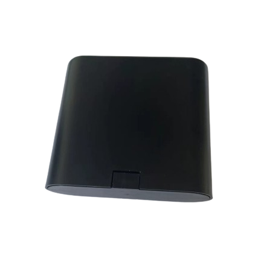

# LK-GPS - LK680

El LK680 es un rastreador GPS compacto y resistente a manipulaciones, diseñado para el monitoreo confiable y prolongado de bicicletas eléctricas, motocicletas y flotas compartidas de micromovilidad. Combina posicionamiento GNSS probado con conectividad celular y reportes configurables para ofrecer seguimiento en tiempo real, alertas por geocercas y notificaciones de batería, todo dentro de una carcasa robusta y a prueba de agua que facilita su ocultamiento.

Como dispositivo compatible con Plaspy desde el primer momento, el LK680 puede enviar actualizaciones de posición, reportes de movimiento y el estado de la batería directamente a la plataforma Plaspy. Esa compatibilidad lo convierte en una opción práctica para operadores que requieren visibilidad continua, monitoreo anti robo y supervisión de flotas sin integraciones complejas.

## Principales características

- Compatibilidad inmediata con Plaspy para integración y monitoreo fluido de flotas.
- Posicionamiento GNSS preciso para seguimiento exacto y registro de rutas.
- Conectividad celular con frecuencia de subida configurable para equilibrar rapidez de respuesta y autonomía.
- Gran rendimiento en espera gracias a una batería recargable integrada, adecuada para despliegues prolongados.
- Diseño compacto, resistente a manipulaciones y hermético para montajes discretos en vehículos ligeros.
- Alertas por movimiento y vibración además de notificaciones de batería baja para facilitar respuestas oportunas.
- Soporte de geocercas para generar alertas cuando los vehículos entren o salgan de zonas definidas.

## Cómo funciona con Plaspy

Al integrarse con Plaspy, el LK680 aporta datos continuos de ubicación y eventos que alimentan los mapas, alertas e informes de Plaspy. Plaspy procesa las actualizaciones del rastreador y las muestra en pantallas de monitoreo en vivo, flujos de notificaciones y registros históricos para que los operadores puedan actuar ante incidentes de robo, desviaciones de ruta y señales de mantenimiento.

- Actualizaciones de ubicación en tiempo real y telemetría para monitoreo en mapas y reproducción de rutas.
- Alertas de movimiento y vibración enviadas a Plaspy para una respuesta rápida ante intentos de robo.
- Reportes de eventos de geocerca para hacer cumplir límites virtuales y notificar a los operadores.
- Avisos de batería baja enviados a Plaspy para facilitar la planificación de recargas o mantenimiento.
- Las herramientas de informes e historial en Plaspy utilizan los datos del LK680 para generar registros de actividad y resúmenes operativos.

## Casos de uso comunes

- Gestión de flotas compartidas de bicicletas eléctricas y micromovilidad con control centralizado de ubicación y estado de batería.
- Protección y recuperación ante robos para bicicletas y vehículos ligeros mediante alertas de movimiento y seguimiento en tiempo real.
- Implementaciones a largo plazo donde la prolongada duración en espera reduce los ciclos de mantenimiento.
- Monitoreo operativo de cumplimiento de rutas y aplicación de geocercas en flotas pequeñas.
- Tranquilidad para propietarios y operadores gracias a la visibilidad remota de la ubicación y el estado de los vehículos.

## Por qué elegir este rastreador con Plaspy

El LK680 es una opción práctica para organizaciones que necesitan un rastreo discreto y durable para activos de dos ruedas y flotas ligeras de micromovilidad. Su equilibrio entre precisión de posicionamiento, reportes configurables y larga autonomía en espera ayuda a reducir la carga operativa, al tiempo que proporciona la telemetría esencial que Plaspy requiere para el monitoreo y las alertas. Integrar unidades LK680 en Plaspy permite a gerentes de flota y propietarios centralizar los datos de ubicación, automatizar notificaciones y generar informes históricos sin desarrollos personalizados extensos.

Si desea saber más sobre cómo Plaspy puede utilizar dispositivos LK680 para seguimiento y gestión de flotas, visite el sitio web de Plaspy en https://www.plaspy.com. Las especificaciones del producto, la disponibilidad y los datos del fabricante pueden cambiar con el tiempo, por lo que se recomienda verificar la información técnica actual en el sitio del fabricante https://www.lk-gps.com.
