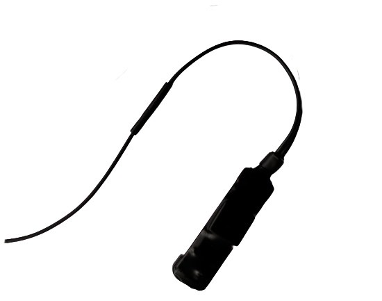

# LK-GPS - LK710-CatM

El LK710‑CatM es un rastreador GPS compacto y resistente al agua compatible con Cat‑M, diseñado para implementaciones fiables compatibles con Plaspy en la gestión de flotas y programas de seguridad de vehículos. Con una antena integrada GPS y GSM, una carcasa IP68 y un tamaño compacto, el LK710‑CatM se instala discretamente en coches, motocicletas, bicicletas eléctricas y vehículos de alquiler, proporcionando seguimiento en tiempo real y telemetría básica a los tableros y aplicaciones móviles de Plaspy.

Diseñado para uso en vehículos comerciales y personales, el LK710‑CatM soporta controles remotos de corte y reanudación del aceite del motor \(funciones de inmovilizador\) para reforzar flujos anti‑robo. El seguimiento en tiempo real a través de aplicaciones para Android e iOS o acceso desde navegador \(B/S\), la configuración por SMS y la información de la capacidad de batería restante hacen de este dispositivo una opción práctica para operadores que necesitan hardware compatible con Plaspy, sencillo de instalar, mantener y gestionar.

## Aspectos clave

- Localizador GPS compatible con Plaspy que ofrece seguimiento continuo en tiempo real para la gestión de flotas y consultas de ubicación bajo demanda.
- Carcasa impermeable y resistente IP68 y formato compacto para una instalación en vehículos duradera y discreta.
- Diseño con antena integrada GPS y GSM simplifica la instalación y mejora la fiabilidad de la señal en aplicaciones vehiculares.
- Controles remotos de corte y reanudación del aceite del motor \(inmovilizador\) para flujos anti‑robo basados en inmovilización y desactivación controlada del vehículo.
- Acceso en vivo en plataformas Android, iOS y navegador \(B/S\), además de configuración por SMS para diagnósticos remotos ligeros.
- Informes de la capacidad de batería restante para que Plaspy monitorice la salud del dispositivo y planifique mantenimientos.
- Fabricación OEM y soporte continuo de firmware y atención al cliente para mantener la telemetría y la conectividad al día.

## Cómo funciona con Plaspy

El LK710‑CatM transmite datos de posición y estado a través de redes móviles Cat‑M hacia los servidores de Plaspy para visualización inmediata, alertas e informes históricos. Plaspy procesa las coordenadas GPS, el estado de la batería y los eventos de control del rastreador para que los gestores de flota puedan monitorizar vehículos en tiempo real y actuar ante disparadores anti‑robo u operativos. La configuración puede realizarse por SMS para una instalación remota rápida; las interfaces móviles y de navegador permiten a despachadores y conductores acceder a los mismos datos de Plaspy en tiempo real.

- Actualizaciones de ubicación y telemetría en tiempo real entregadas a los tableros y apps de Plaspy.
- Control remoto del inmovilizador: los eventos de corte y reanudación del aceite del motor se envían a Plaspy para acciones anti‑robo y trazabilidad.
- Informes de salud del dispositivo, incluida la capacidad de batería restante, visibles en Plaspy para mantenimiento preventivo.
- Configuración remota ligera y consultas por SMS para diagnósticos y configuraciones de bajo coste.
- Integración con sistemas de navegación de vehículos y flujos de trabajo de la flota de Plaspy para la gestión de rutas y el monitoreo de entregas.

## Resumen técnico

| Modelo | LK710‑CatM |
| --- | --- |
| Conectividad | Conectividad móvil Cat‑M \(LTE‑M\) |
| Bandas | El fabricante no especificó bandas exactas; pueden aplicar variantes regionales |
| Alimentación y batería | Informa sobre la capacidad de batería restante; no se especifican detalles de respaldo de batería |
| Interfaces | Corte y reanudación remotos del aceite del motor \(inmovilizador\). Otros I/O no especificados |
| GNSS | Antena GPS integrada para posicionamiento; no se especifica soporte GNSS adicional |
| Bluetooth | No especificado |
| Gestión remota | Seguimiento en tiempo real a través de Android/iOS y navegador \(B/S\). Configuración por SMS y consultas. El fabricante ofrece firmware y soporte al cliente. |
| Formato | Unidad compacta montada en vehículo con carcasa impermeable IP68, adecuada para coches, motocicletas y bicicletas eléctricas |

## Casos de uso

- Gestión de flotas: seguimiento en tiempo real y supervisión de rutas para vehículos de entrega y flotas comerciales ligeras que utilizan Plaspy.
- Antirrobo e inmovilización: corte y reanudación remotos del aceite del motor para evitar usos no autorizados y apoyar flujos de recuperación.
- Vehículos de alquiler y micromovilidad: instalación discreta en coches de alquiler, motocicletas y bicicletas eléctricas para control de ubicación y conciliación de facturación.
- Monitoreo de entregas de última milla: actualizaciones de ubicación en tiempo real para Plaspy que permiten verificar el servicio y gestionar la ETA.
- Protección de activos en general: posicionamiento persistente e informes de batería para vehículos almacenados al aire libre o utilizados en condiciones adversas.

## Por qué elegir este rastreador con Plaspy

Para operadores que buscan un rastreador GPS confiable compatible con Plaspy con controles prácticos de anti‑robo, el LK710‑CatM equilibra hardware robusto e integración sencilla. Su conectividad Cat‑M y antenas integradas reducen la complejidad de instalación, mientras que la protección IP68 y un perfil compacto aseguran fiabilidad a largo plazo en entornos exigentes. Los usuarios de Plaspy obtienen seguimiento en tiempo real consistente, visibilidad de telemetría y la capacidad de actuar ante eventos del inmovilizador \(corte/reanudación del aceite del motor\) desde la misma plataforma que utilizan para la planificación de rutas y la supervisión de la flota.

Como el LK710‑CatM admite múltiples modos de acceso — Android, iOS, navegador y SMS — se adapta a flotas mixtas y despliegues ligeros donde la simplicidad, la telemetría centralizada y el soporte continuo de firmware son importantes. Ya sea implementando medidas anti‑robo, optimizando la utilización de la flota o añadiendo rastreadores discretos a activos de alquiler y micromovilidad, este dispositivo compatible con Plaspy ofrece una base confiable para el rastreo de vehículos y la continuidad operativa.

