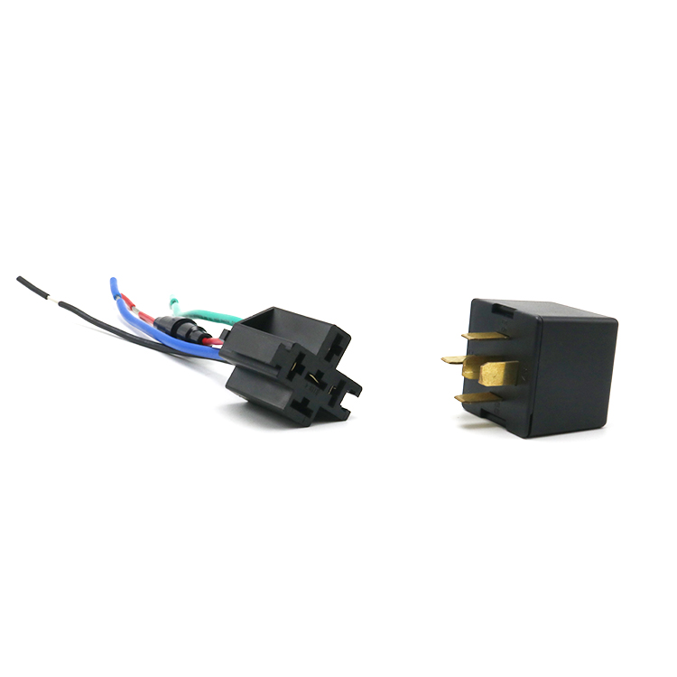

# LK-GPS - LK720

El LK720 es un rastreador CatM compacto y de alto rendimiento diseñado para la supervisión discreta de vehículos y activos. Pensado para automóviles, motocicletas, flotas de alquiler y aplicaciones OEM u ODM, el LK720 ofrece posicionamiento GNSS continuo, conectividad celular CatM y un relé integrado para el corte remoto de combustible o aceite. Su conjunto de funciones está orientado a reportes de ubicación fiables, respuestas prácticas ante robos y supervisión operativa cotidiana.

Como dispositivo compatible con Plaspy, el LK720 transmite ubicación, estado y eventos necesarios para que Plaspy brinde visibilidad en tiempo real y alertas. Construido para condiciones de cobertura y ambientales exigentes, con diseño de consumo optimizado y protección impermeable, el equipo ayuda a garantizar que los usuarios de Plaspy reciban actualizaciones oportunas para rastreo, respuesta ante incidentes y monitoreo operativo.

## Características principales

- Conectividad celular CatM para rastreo en tiempo real y telemetría resiliente en zonas con cobertura limitada.
- Relé integrado para corte remoto de combustible o aceite que facilita flujos de trabajo de inmovilización y recuperación.
- Posicionamiento GNSS continuo con precisión típica del fabricante de alrededor de 5 m para reportes de ubicación confiables.
- Alarma por impacto y vibración, además de geocercas, para generar alertas inmediatas ante colisiones o movimientos no autorizados.
- Configuración por SMS y aplicación Android iOS para control sencillo del dispositivo y comprobaciones de estado.
- Diseño compacto, ligero y robusto con protección impermeable, apto para instalaciones en vehículos y motocicletas.
- Opciones amigables para OEM y ODM para implementaciones con marca propia en despliegues comerciales.

## Cómo funciona con Plaspy

Al conectarse a Plaspy, el LK720 envía coordenadas GNSS, actualizaciones de estado y activadores de eventos a la plataforma para que administradores de flota y propietarios puedan monitorear activos en tiempo real, recibir alertas y revisar la actividad histórica. Plaspy agrega esas señales en paneles, notificaciones e informes que apoyan la supervisión operativa y las respuestas de seguridad.

- Las actualizaciones de ubicación en tiempo real aparecen en los paneles de Plaspy para visibilidad continua de vehículos y activos.
- Las alarmas por impacto y vibración, así como los eventos de geocerca, se reenvían a Plaspy para alertas instantáneas y manejo de incidentes.
- El estado del relé y las acciones de inmovilizador pueden gestionarse desde Plaspy para apoyar intervenciones remotas cuando sea necesario.
- Los reportes de estado del dispositivo y del voltaje de entrada ayudan a Plaspy a detectar problemas de alimentación y marcar dispositivos para mantenimiento.
- El posicionamiento por estación base está disponible como respaldo para mantener continuidad de ubicación en entornos con GNSS limitado.

## Casos de uso típicos

- Gestión de flotas pequeñas y medianas que requieren rastreo en tiempo real y supervisión de rutas.
- Protección contra robos mediante eventos de alarma y inmovilización remota por relé para facilitar la recuperación.
- Monitoreo de vehículos de alquiler para hacer cumplir límites, detectar impactos y reducir pérdidas.
- Rastreo de motocicletas y vehículos personales cuando se prefiere un dispositivo compacto y discreto.
- Despliegues OEM y comerciales que necesitan un rastreador personalizable y compatible con la agregación de Plaspy.

## Por qué elegir este rastreador con Plaspy

El LK720 es una opción práctica para organizaciones que requieren un dispositivo de pequeño tamaño con conectividad celular resistente y capacidad antirrobo sencilla. Su combinación de posicionamiento GNSS continuo, control de relé y reporte de eventos lo hace idóneo para los flujos de trabajo de Plaspy que priorizan alertas oportunas, intervenciones remotas y visibilidad consolidada de la flota. En despliegues donde la robustez ambiental y la eficiencia energética son importantes, el LK720 ofrece un equilibrio entre durabilidad y funcionalidad.

Integrar el LK720 con Plaspy permite a los equipos centralizar rastreo, alertas e informes históricos en una sola plataforma, aprovechando las funciones de relé y alarma del dispositivo para control de seguridad y operaciones. Para especificaciones detalladas e información de producto actualizada visite el sitio del fabricante en https://www.lk-gps.com. Para saber más sobre cómo Plaspy funciona con rastreadores compatibles como el LK720 visite https://www.plaspy.com. Tenga en cuenta que las especificaciones del producto y la disponibilidad pueden cambiar, por lo que es recomendable verificar la documentación oficial del fabricante.
