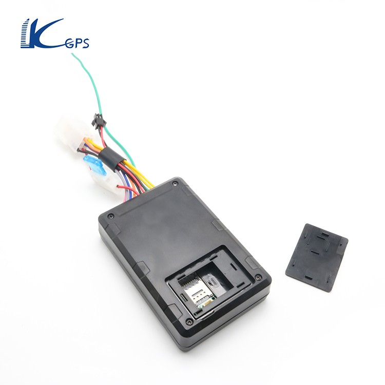

# LK-GPS - LK770

El rastreador GPS LK770 de KJ-GPS es una excelente opción para aquellos que buscan un dispositivo confiable y fácil de usar para rastrear vehículos. Con su tamaño compacto y antena GPS y GSM incorporadas, este rastreador se puede instalar fácilmente en cualquier automóvil o motocicleta.

Una de las características destacadas del LK770 es su capacidad de seguimiento en tiempo real, lo que le permite conocer la ubicación exacta de su vehículo en todo momento. Además, este rastreador también cuenta con una función de geovalla, que le permite establecer límites geográficos y recibir notificaciones cuando su vehículo ingrese o salga de estas áreas predefinidas.

Otra característica útil del LK770 es su capacidad para cortar y reanudar el suministro de combustible y electricidad del automóvil de forma remota. Esto puede ser especialmente útil en caso de robo o uso no autorizado del vehículo. Además, el rastreador también cuenta con una alarma de vibración, que le notificará si se detecta algún movimiento no autorizado en su vehículo.

El LK770 es compatible con redes 2G/4G, lo que garantiza una conexión estable y confiable en todo momento. También es compatible con la aplicación de seguimiento para teléfonos Android y Apple, lo que le permite acceder fácilmente a la información de ubicación y la capacidad de la batería restante a través de la aplicación.

En resumen, el rastreador GPS LK770 de KJ-GPS es una opción confiable y fácil de usar para rastrear vehículos. Con su amplia gama de funciones, incluyendo seguimiento en tiempo real, geovalla y capacidad de corte remoto de combustible y electricidad, este rastreador brinda tranquilidad y seguridad a los propietarios de vehículos.

### Características destacadas:

- Tamaño compacto y fácil instalación
- Seguimiento en tiempo real
- Función de geovalla
- Corte y reanudación remota de combustible y electricidad
- Alarma de vibración
- Compatible con redes 2G/4G
- Compatible con aplicaciones de seguimiento para teléfonos Android y Apple

### Especificaciones técnicas:

- Red: GSM y GPRS
- Banda/mHz: 850/900/1800/1900
- Chip GSM: MTK2503
- Chip GPS: MTK2503
- Sensibilidad GPS/dBm: -159
- Precisión GPS/m: 5

