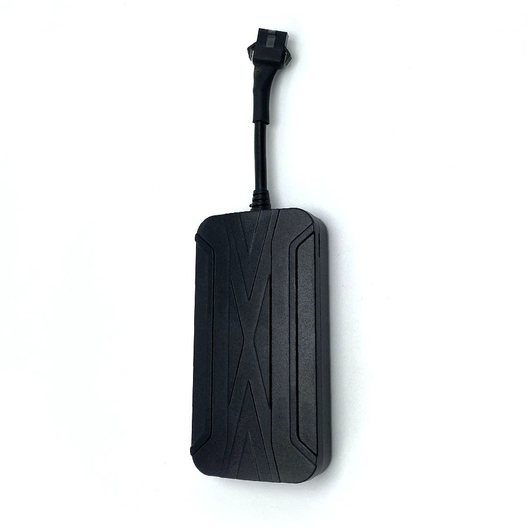

# LK-GPS - LK960

El rastreador GPS para automóviles con cable LK960 de KJ-GPS es un dispositivo confiable y versátil diseñado para automóviles y motocicletas. Con sus características y funcionalidades avanzadas, proporciona capacidades mejoradas de seguridad y seguimiento para sus vehículos.

Una de las características clave del LK960 es su función de alarma SOS, que le permite enviar una señal de socorro de emergencia en caso de cualquier circunstancia imprevista. Además, también ofrece la capacidad de cortar el combustible y la electricidad del automóvil de forma remota, brindando una capa adicional de seguridad.

El LK960 admite redes 2G y 4G, lo que garantiza una conexión estable y confiable para el seguimiento y monitoreo en tiempo real. Opera dentro de un amplio rango de voltaje de 10-100v, lo que lo hace compatible con una variedad de vehículos.

Con el LK960, puede rastrear fácilmente la ubicación de su vehículo utilizando SMS o el modo de plataforma. La plataforma ofrece una variedad de funciones que incluyen alarma de acceso a la cerca electrónica, alarma de robo por demolición, alarma de vibración, alarma de apagado de energía, alarma de desplazamiento y alarma de exceso de velocidad. Estas características le ayudan a mantenerse informado sobre cualquier acceso no autorizado o actividades sospechosas relacionadas con su vehículo.

La plataforma también admite el armado y desarmado remoto, el corte y recuperación remotos de combustible, la función de relleno de datos GPS, la detección del estado ACC y el cambio de múltiples mapas. Esto le permite tener un control total sobre su vehículo y acceder al seguimiento de ubicación GPS en tiempo real.

El LK960 está equipado con indicadores LED que muestran el estado de la alimentación, GPS y GSM, lo que le brinda una forma rápida y fácil de verificar el estado del dispositivo de un vistazo.

En general, el rastreador GPS para automóviles con cable LK960 de KJ-GPS es un dispositivo confiable y lleno de funciones que ofrece capacidades mejoradas de seguridad y seguimiento para sus vehículos. Ya sea que tenga un automóvil o una motocicleta, este rastreador es una herramienta valiosa para garantizar la seguridad de sus activos valiosos.

### Características destacadas:

- Función de alarma SOS
- Corte de combustible y electricidad del automóvil de forma remota
- Alarma de vibración
- Compatible con redes 2G/4G
- Amplio rango de voltaje \(10-100v\)
- Modo SMS/Plataforma para consulta de ubicación
- Alarma de acceso a la cerca electrónica
- Alarma de robo por demolición
- Alarma de apagado de energía
- Alarma de desplazamiento
- Alarma de exceso de velocidad
- Armado y desarmado remoto
- Corte y recuperación remotos de combustible
- Función de relleno de datos GPS
- Detección del estado ACC
- Cambio de múltiples mapas
- Subida en tiempo real y punto de inflexión
- Seguimiento de ubicación GPS en tiempo real
- Indicadores LED para estado de alimentación, GPS y GSM

