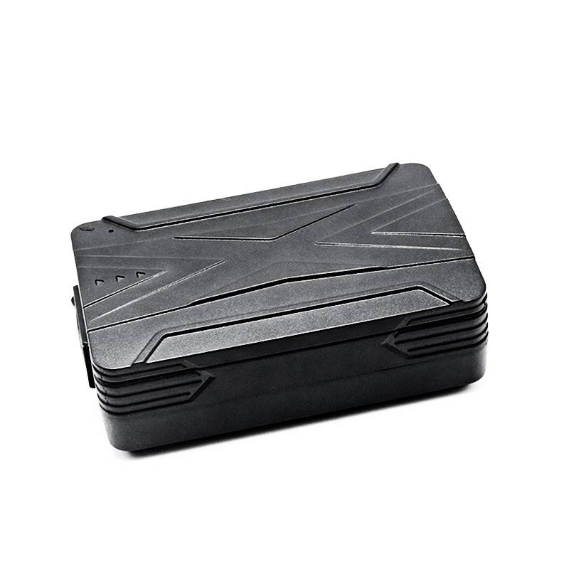

# LK-GPS - LK970A/B/C

El LK970A/B/C de LK GPS es un rastreador magnético 4G pensado para operaciones de larga duración, montaje discreto y despliegues prolongados en campo. Integra posicionamiento GPS y GSM con conectividad 4G y opciones de batería recargable de alta capacidad para ofrecer actualizaciones de ubicación continuas, alertas configurables y reproducción de historial, ideal para monitoreo de flotas y activos.

Como dispositivo compatible con Plaspy, la familia LK970 se integra con la plataforma de Plaspy para proporcionar seguimiento en tiempo real, reenvío de alertas y revisión de trazas históricas dentro de un panel centralizado. Su equilibrio entre autonomía, carcasa magnética segura y telemática proactiva lo convierte en una opción práctica cuando se requieren baja mantención, localización permanente y una instalación discreta.

## Aspectos destacados

- Compatibilidad nativa con Plaspy para visibilidad centralizada de la flota e incorporación rápida.
- Posicionamiento GPS más GSM con conectividad celular 4G para actualizaciones de ubicación confiables.
- Varias opciones de baterías recargables de alta capacidad para soportar despliegues prolongados.
- Carcasa robusta con imán para montaje discreto en chasis u otras superficies metálicas.
- Alertas configurables y reproducción de historial para apoyar flujos operativos y anti-robo.
- Caché offline y recuperación tras zonas sin cobertura que suben eventos cuando se restablece la conectividad.
- Funciones de optimización de energía para extender el modo espera y reducir intervalos de mantenimiento.

## Cómo funciona con Plaspy

Cuando está conectado a Plaspy, el LK970 envía datos de ubicación y eventos a una vista única que despachadores y gestores de flota pueden usar para monitorear activos, recibir notificaciones y revisar movimientos pasados. Plaspy ingiere la telemetría y los paquetes de alerta del dispositivo, habilitando reglas configurables, reportes y supervisión operativa adaptada a cada flota.

- Actualizaciones de ubicación en tiempo real entregadas a Plaspy para visualización en mapa y monitoreo en vivo.
- Alertas como entrada y salida de geocerca, movimiento, batería baja, impacto y manipulación reenviadas a Plaspy para notificaciones.
- Reproducción de historial e informes de trazas en Plaspy para reconstrucción de rutas y análisis de incidentes.
- La recuperación tras zonas sin cobertura sube automáticamente posiciones y eventos almacenados en caché cuando vuelve la conectividad.
- Plaspy puede exponer entradas adicionales cuando una variante del rastreador o la instalación las ofrece; confirme la disponibilidad de entradas/salidas y soporte de sensores con el proveedor para requerimientos específicos.

## Casos de uso típicos

- Vehículos de alquiler y compartidos que requieren rastreo discreto entre rentas sin necesidad de cableado.
- Maquinaria pesada y remolques que se benefician de larga autonomía de batería y montaje magnético.
- Contenedores y cargas de alto valor donde el montaje discreto y la recuperación tras zonas sin cobertura reducen huecos en los datos.
- Operaciones de flota comercial que necesitan visibilidad centralizada, alertas e informes históricos.
- Flujos anti-robo que dependen de notificaciones de manipulación, movimiento e impactos para respuesta rápida.

## Por qué elegir este rastreador con Plaspy

La serie LK970A/B/C combina resistencia en campo y un factor de forma discreto con las capacidades de la plataforma Plaspy para ofrecer un monitoreo de activos y flotas sencillo y efectivo. Su carcasa magnética y las diferentes opciones de batería son útiles en despliegues donde minimizar el mantenimiento y mantener una instalación discreta son prioridades, mientras que Plaspy aporta las herramientas centralizadas para alertas, reportes y supervisión operativa.

Para saber más sobre cómo los modelos LK970 funcionan con Plaspy y si satisfacen las necesidades de su flota, visite Plaspy en el sitio principal https://www.plaspy.com. Las especificaciones, disponibilidad y datos del fabricante pueden cambiar con el tiempo, por lo que confirme la información técnica actual con LK GPS en su sitio oficial https://www.lk-gps.com.
