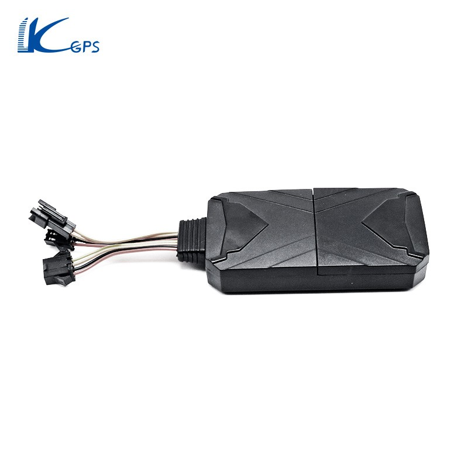

# LK-GPS - LK980

El LK-GPS LK980 es un rastreador GPS compacto y versátil, pensado principalmente para el seguimiento de automóviles. Su tamaño reducido y las antenas GPS y GSM integradas permiten una instalación discreta dentro del vehículo. El LK980 es compatible con aplicaciones móviles en Android y iOS y también ofrece acceso mediante plataformas web, lo que facilita monitorear la ubicación del vehículo y el nivel de batería restante.

Como dispositivo compatible con Plaspy, el LK980 puede integrarse en los flujos de trabajo de monitoreo de flotas y vehículos para entregar actualizaciones de posición en tiempo real y alertas de eventos. Su conectividad 4G y sus alarmas integradas —como batería baja, vibración, extracción y exceso de velocidad— lo hacen una opción práctica para organizaciones y propietarios particulares que requieren visibilidad constante e historial de rutas en una plataforma central como Plaspy.

## Puntos clave

- Diseño compacto para colocación discreta en autos particulares y vehículos de flota
- Antenas GPS y GSM integradas para reportes de ubicación sin accesorios externos
- Conectividad 4G para comunicación rápida con plataformas de seguimiento
- Acceso desde aplicaciones móviles y plataformas web para monitoreo en campo y en oficina
- Alarmas por batería baja, vibración, extracción y exceso de velocidad para mejorar la seguridad
- Seguimiento histórico de rutas y funcionalidad de vista de calle en el mapa para contexto y revisión
- Larga autonomía en espera y consultas desde múltiples plataformas para monitoreo flexible

## Cómo funciona con Plaspy

Al integrarse con Plaspy, el LK980 envía información de ubicación y eventos a un entorno de monitoreo centralizado, de modo que los equipos puedan rastrear vehículos, revisar historiales y gestionar alertas desde un solo lugar. Plaspy puede mostrar los datos del rastreador junto con otros dispositivos de la flota para ofrecer supervisión operativa y generación de informes.

- Las actualizaciones de ubicación en tiempo real aparecen en los mapas de Plaspy para monitoreo en vivo y despacho
- Las alertas del dispositivo como batería baja, vibración, extracción y exceso de velocidad pueden redirigirse a los flujos de alertas y notificaciones de Plaspy
- Los datos históricos de rutas del LK980 son visibles en Plaspy para revisión y análisis de viajes
- La funcionalidad de vista de calle ayuda a los operadores a confirmar posiciones del vehículo en su contexto local
- El acceso desde múltiples plataformas permite que los equipos consulten y visualicen los datos del LK980 desde distintos dispositivos a través de Plaspy

## Casos de uso típicos

- Propietarios de autos particulares que desean ubicación en tiempo real y alertas básicas de seguridad de forma discreta
- Operadores de flotas pequeñas y medianas que buscan un rastreador económico para supervisión vehicular
- Servicios de alquiler y vehículos compartidos que requieren historial de rutas y funciones disuasorias ante robos
- Aplicaciones con larga autonomía en espera, donde los reportes intermitentes y la continuidad de funcionamiento son importantes
- Escenarios donde se necesita acceso desde app móvil y web para monitoreo remoto

## Por qué elegir este rastreador con Plaspy

El LK980 combina un perfil físico compacto con un conjunto de funciones adecuado a los requisitos habituales de seguimiento de vehículos. Su conectividad 4G y los distintos tipos de alertas facilitan una supervisión ágil, mientras que el historial de rutas y la vista de calle aportan contexto útil para los equipos operativos. Para organizaciones que ya usan Plaspy, el LK980 representa una opción eficiente para añadir visibilidad a nivel vehicular sin introducir una gestión de dispositivos compleja.

Dado que las descripciones públicas suelen destacar tamaño, conectividad, alarmas y acceso a plataformas, el LK980 conviene cuando esas características se alinean con sus necesidades operativas. Plaspy puede consolidar los datos del rastreador en paneles, alertas e informes para ayudar en la supervisión de la flota y el monitoreo rutinario.

Para obtener más información sobre cómo Plaspy puede funcionar con rastreadores de vehículos como el LK980 visite https://www.plaspy.com. Las especificaciones del producto y las funciones disponibles pueden cambiar con el tiempo, por lo que verifique los detalles y la compatibilidad actual en el sitio del fabricante https://www.lk-gps.com.
